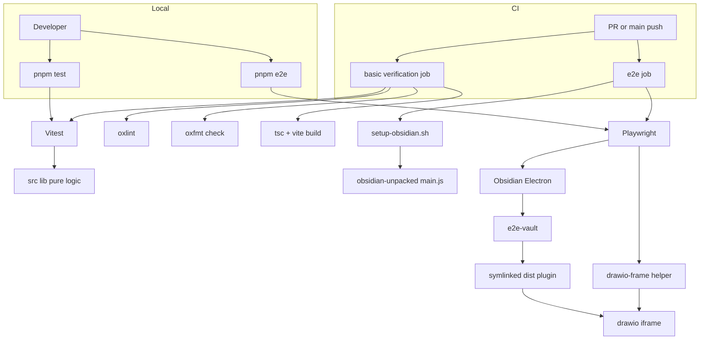
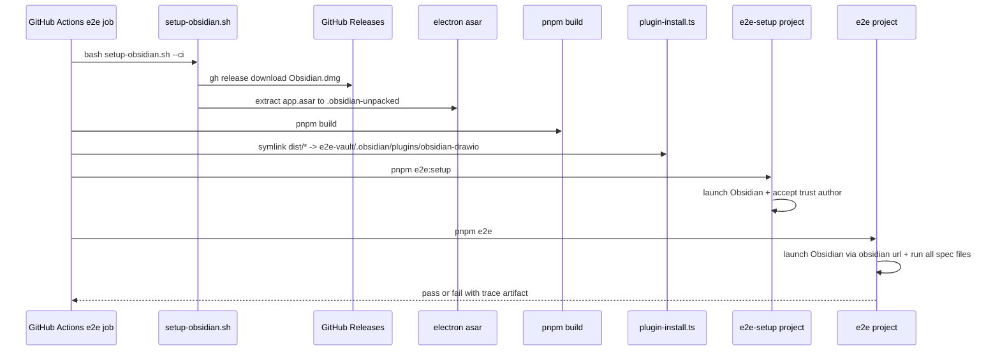
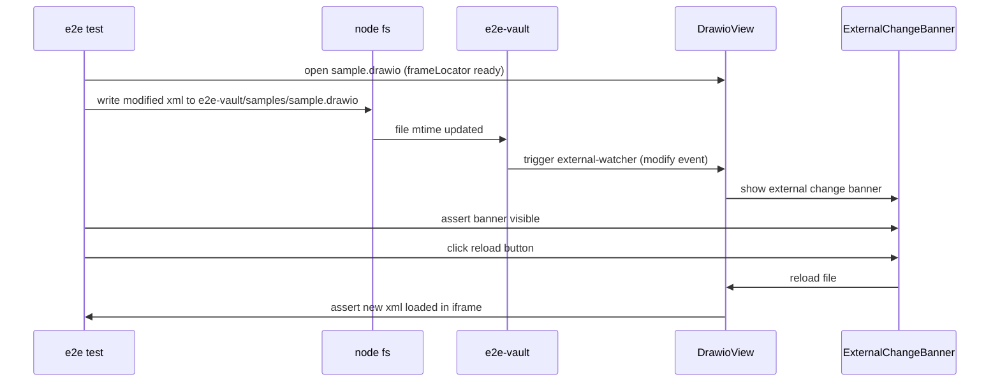

# Design: automated-testing

## Overview

obsidian-drawio プラグインの 5 つの実装済 spec に対して、**vitest による Unit Test 基盤**、**Playwright + Electron による E2E Test 基盤**、**GitHub Actions による 2 段構成 CI** を導入する。

**Purpose**: 既存ロジックの回帰防止と Community Plugin 申請向けの品質エビデンスを、ローカルと CI の双方で同じコマンドで取得できるようにする。
**Users**: プラグイン開発者 (ローカル `pnpm test` / `pnpm e2e`)、PR レビュアー (GitHub Checks)、将来の Community Plugin 審査担当。
**Impact**: `package.json` に test 関連 scripts と devDependencies を追加、`vitest.config.ts` / `playwright.config.ts` / `scripts/setup-obsidian.sh` / `e2e-vault/` / `tests/` / `.github/workflows/ci.yml` を新設。既存実装 (`src/` 配下) は test ファイル追加と必要最小限の export 公開のみで、振る舞いの変更は行わない。

### Goals

- 純粋ロジック層 (XML / PNG / SVG / postMessage envelope / settings migrate / theme resolve / diff / external watcher の純粋部分) を vitest で検証
- 実機 Obsidian 上で 3 形式の load-save / iframe handshake / theme 追従 / 外部変更 reload の代表シナリオを Playwright で検証
- PR と main push の双方で、基本検証 (lint / format / typecheck / test / build) と E2E を並列実行する CI gate を成立させる

### Non-Goals

- drawio webapp 内部のパレット・図形操作などの深いシナリオテスト
- Linux / Windows runner での E2E 実行
- Visual regression / コードカバレッジ目標
- 既存実装の API / 振る舞い変更 (test 起因で発覚した不具合は別 spec の修正)

## Boundary Commitments

### This Spec Owns

- `vitest.config.ts` および `*.test.ts` ファイル群 (Unit Test の構成と実装)
- `playwright.config.ts`、`scripts/setup-obsidian.sh`、`e2e-vault/` フィクスチャ、`tests/` 配下 (E2E の基盤・helper・spec)
- `.github/workflows/ci.yml` (2 段構成 CI)
- `package.json` の test 関連 scripts (`test`, `test:watch`, `e2e:setup`, `e2e:cleanup`, `e2e`) と devDependencies (`vitest`, `@playwright/test`, `electron`, `@electron/asar`)
- README の Testing セクション (実行手順 / 前提 / 範囲外の明示)

### Out of Boundary

- 既存 `src/` の実装ロジック自体の変更 (test 用に export を追加する extension point は除く、それも最小限)
- vendor/drawio submodule 内部
- Obsidian Electron 本体の挙動・配布・ライセンス
- Community Plugin Registry 申請プロセス
- GitHub branch protection / required check 設定 (workflow を提供するところまで; リポジトリ管理者が UI で有効化)

### Allowed Dependencies

- 既存 `src/` の **公開 API** (export された pure function) を unit test 対象として import 可
- 既存 `dist/main.js` ビルド成果物を E2E 用に symlink 配置
- `vendor/drawio` を `dist/drawio/` 経由 (build 済) で間接参照
- 標準 Node.js API (`node:fs`, `node:path`, `node:os`, `node:child_process`)
- `@playwright/test`, `electron`, `@electron/asar`, `vitest` 系 devDependencies のみ

依存方向: `tests/e2e/*` → `tests/helpers/*` → `dist/*` (build 済成果物) + `e2e-vault/`。`tests/*` から `src/*` への直接 import は禁止 (E2E は build 済成果物のみを対象にする)。Unit test (`src/**/*.test.ts`) は `src/*` を直接 import してよいが `vendor/drawio` / `electron` / `obsidian` の実体は import しない (型のみ)。

### Revalidation Triggers

以下の変更が既存 spec で発生した場合、本 spec の test は再確認が必要:

- `src/lib/drawio-protocol.ts` の `DrawioInbound*` / `DrawioOutbound*` 型シグネチャ変更 → Req 2.4 の test を更新
- `src/lib/settings.ts` の `DrawioSettings` スキーマ変更 → Req 2.5 の test と `migrateSettings` 期待値を更新
- `src/lib/drawio-formats/*` の export 変更 → Req 2.1〜2.3 の test を更新
- `manifest.json` の `id` / `minAppVersion` 変更 → `e2e-vault/.obsidian/community-plugins.json` 更新
- iframe DOM 構造 (例: `iframe[data-drawio]` 属性) の変更 → `tests/helpers/drawio-frame.ts` 更新
- `vendor/drawio` のメジャーバージョン更新 → E2E 全シナリオを re-baseline

## Architecture

### Architecture Pattern & Boundary Map



**Architecture Integration**:

- **Selected pattern**: Two-tier test infrastructure (in-process unit + out-of-process E2E)。両 tier が独立に走り、CI でも並列に独立 Check を出す。
- **Domain boundaries**: Unit Test は **pure logic 層のみ** に責任、E2E は **Obsidian runtime と統合した振る舞い** に責任。両者の責任が混ざらないよう「Unit から `obsidian` / `electron` を import 禁止」「E2E から `src/` 直 import 禁止」のルールで物理分離。
- **Existing patterns preserved**: 既存 Vite + Oxc tooling、pnpm script 構成、vendor/drawio submodule の build-time コピー方式は変更なし。
- **New components rationale**: vitest は Vite 設定共有のため、Playwright は Electron 公式サポートのため、`setup-obsidian.sh` は Obsidian 抽出ロジックを CI / local 双方で再利用するため。
- **Steering compliance**: `tech.md` の Testing 節 ("未導入") を本 spec で更新する前提。`structure.md` のディレクトリ規約に従い `src/` は実装、`tests/` は E2E、unit test は src 配置で対応。

### Technology Stack

| Layer | Choice / Version | Role in Feature | Notes |
|-------|------------------|-----------------|-------|
| Unit Test Runner | vitest ^3 | `src/**/*.test.ts` を Node 環境で実行 | `mergeConfig` で Vite 設定再利用 |
| E2E Test Runner | @playwright/test ^1.55 | Electron 起動 / iframe 操作 / trace | `_electron` API 使用 |
| Electron Runtime | electron ^35 | Playwright が起動する Electron | Obsidian.app 抽出と整合するメジャーバージョン |
| Asar Extractor | @electron/asar ^3.4 | Obsidian.app からの `app.asar` 展開 | `setup-obsidian.sh` から `npx` 呼び出し |
| CI Runner (Basic) | GitHub Actions ubuntu-latest | lint / format / test / build | `pnpm/action-setup` + `actions/setup-node` |
| CI Runner (E2E) | GitHub Actions macos-latest | Obsidian バイナリ抽出 + Playwright | `gh release download` で Obsidian `.dmg` 取得 |
| Package Manager | pnpm (既存) | dependency / script | `pnpm-lock.yaml` 既存 |

詳細な選定 trade-off は `research.md` Architecture Pattern Evaluation / Design Decisions を参照。

## File Structure Plan

### Directory Structure

```
obsidian-drawio/
├── package.json                                # 修正: scripts + devDependencies
├── vitest.config.ts                            # 新規: vitest 設定 (Vite mergeConfig)
├── playwright.config.ts                        # 新規: Playwright 設定 (e2e-setup + e2e projects)
├── scripts/
│   └── setup-obsidian.sh                       # 新規: Obsidian バイナリ抽出 (local + --ci)
├── e2e-vault/                                  # 新規: フィクスチャ vault (commit)
│   ├── .obsidian/
│   │   ├── community-plugins.json              # plugin id 事前登録
│   │   ├── core-plugins.json                   # 必要な core plugin 列挙
│   │   ├── app.json                            # vault 設定 (trust 済状態)
│   │   └── appearance.json                     # 初期テーマ
│   ├── samples/
│   │   ├── empty.drawio                        # 平文 mxfile (最小)
│   │   ├── compressed.drawio                   # pako 圧縮 mxfile
│   │   ├── sample.drawio.svg                   # SVG content 属性付き
│   │   └── sample.drawio.png                   # PNG zTXt mxfile 付き
│   └── README.md                               # フィクスチャ更新ルール
├── src/                                        # 既存実装 (test 共置のみ追加)
│   └── lib/
│       ├── drawio-formats/
│       │   ├── drawio-xml.test.ts              # 新規: Req 2.1
│       │   ├── drawio-png.test.ts              # 新規: Req 2.2
│       │   └── drawio-svg.test.ts              # 新規: Req 2.3
│       ├── drawio-protocol.test.ts             # 新規: Req 2.4
│       ├── settings.test.ts                    # 新規: Req 2.5
│       ├── theme-bridge.test.ts                # 新規: resolveBridgeTheme 検証 (純粋部分)
│       └── external-watcher.test.ts            # 新規: Req 2.6 (echo suppression / debounce 純粋判定部)
├── tests/                                      # 新規: E2E 配下
│   ├── e2e-setup/
│   │   ├── setup.ts                            # Obsidian 初回起動 + trust author
│   │   └── cleanup.ts                          # workspace.json 等のリセット
│   ├── e2e/
│   │   ├── plugin-activation.spec.ts           # Req 4.1
│   │   ├── drawio-iframe-init.spec.ts          # Req 4.2
│   │   ├── three-formats-roundtrip.spec.ts     # Req 4.3
│   │   ├── theme-follow.spec.ts                # Req 4.4
│   │   └── external-sync-reload.spec.ts        # Req 4.5
│   └── helpers/
│       ├── obsidian-launch.ts                  # _electron.launch ラッパ + appPath/vaultPath 解決
│       ├── plugin-install.ts                   # dist → e2e-vault/.obsidian/plugins/ symlink
│       ├── drawio-frame.ts                     # frameLocator + waitForReady + postMessage 観測
│       └── vault-fs.ts                         # node:fs 経由の vault 内ファイル書き換え helper
├── .github/
│   └── workflows/
│       └── ci.yml                              # 新規: basic + e2e の 2 job 並列 workflow
├── README.md                                   # 修正: Testing セクション追加
└── .gitignore                                  # 修正: .obsidian-unpacked/, e2e-vault/.obsidian/workspace.json 等を除外
```

### Modified Files

- `package.json` — `scripts.test`, `test:watch`, `e2e:setup`, `e2e:cleanup`, `e2e` を追加。`devDependencies` に `vitest`, `@playwright/test`, `electron`, `@electron/asar` を追加
- `README.md` — Testing セクション (Unit / E2E のローカル実行手順、前提条件、Out of scope の明示) を追加
- `.gitignore` — `.obsidian-unpacked/`, `e2e-vault/.obsidian/workspace.json`, `playwright-report/`, `test-results/`, `coverage/` を追加
- `src/lib/external-watcher.ts` — 純粋判定部 (echo 判定 / debounce 判定) を export として切り出す最小 refactor が必要な場合のみ実施 (理想は本体は変えず private 関数を `__test__` 名前空間で公開)。既存 API 変更ゼロで unit test できるか実装時に再評価し、不可能な場合のみ最小公開を追加

## System Flows

### E2E 起動フロー (CI macOS job 例)



**Key decisions**: setup を独立 Playwright project 化することで、trust author 突破の 1 回性を担保し、`e2e` project は副作用なしの test 実行に集中する。`pnpm build` は basic job では typecheck 用、e2e job ではプラグイン成果物配置用と二役。

### 外部変更 reload E2E シナリオ (Req 4.5)



**Key decisions**: echo suppression を確実に回避するため `vault-fs` helper は書き込み前に `await sleep(echoSuppressionMs + buffer)` を挟む。bypass のために `recentSelfWrites` API を expose しない (テストのため本番コードを汚さない)。

## Requirements Traceability

| Requirement | Summary | Components | Interfaces | Flows |
|-------------|---------|------------|------------|-------|
| 1.1 | `pnpm test` 1 回実行 | Unit Test Runner | `package.json` scripts | — |
| 1.2 | `pnpm test:watch` watch | Unit Test Runner | `package.json` scripts | — |
| 1.3 | `*.test.ts` / `*.spec.ts` パターン | vitest config | `vitest.config.ts` test.include | — |
| 1.4 | obsidian / vendor / Electron 直依存回避 | Unit Test 範囲規約 | 依存方向ルール | — |
| 1.5 | build 成果物非依存 | vitest config | `vitest.config.ts` | — |
| 2.1 | XML round trip | `drawio-xml.test.ts` | `readDrawioXml`, `writeDrawioXml` | — |
| 2.2 | PNG zTXt round trip | `drawio-png.test.ts` | `readDrawioPng`, `writeDrawioPngWithMxfile` | — |
| 2.3 | SVG content / mxfile 子要素 | `drawio-svg.test.ts` | `readDrawioSvg`, `writeDrawioSvgWithMxfile` | — |
| 2.4 | postMessage envelope shape | `drawio-protocol.test.ts` | `DrawioInbound*` / `DrawioOutbound*` 型 | — |
| 2.5 | `migrateSettings` | `settings.test.ts` | `migrateSettings(raw)` | — |
| 2.6 | external diff / 衝突判定 | `external-watcher.test.ts`, `theme-bridge.test.ts` (resolveBridgeTheme), `simpleLineDiff` (DiffModal の純粋部分) | echo / debounce / diff 純粋関数 | — |
| 2.7 | obsidian 直依存は E2E に委譲 | README + boundary 規約 | — | — |
| 3.1 | local Obsidian 抽出 | `setup-obsidian.sh` | shell args | E2E 起動フロー |
| 3.2 | CI Obsidian DMG 取得 | `setup-obsidian.sh --ci` | `gh release download` | E2E 起動フロー |
| 3.3 | plugin symlink | `plugin-install.ts` | `installPluginIntoVault()` | E2E 起動フロー |
| 3.4 | フィクスチャ vault | `e2e-vault/` | filesystem layout | — |
| 3.5 | iframe locator | `drawio-frame.ts` | `getDrawioFrame(page)` | 外部変更 reload シナリオ |
| 3.6 | `pnpm e2e --ui` | Playwright config | `playwright.config.ts` | — |
| 3.7 | submodule / build 不在検出 | `setup-obsidian.sh` + Playwright globalSetup | shell precondition | E2E 起動フロー |
| 3.8 | cleanup | `tests/e2e-setup/cleanup.ts` | `e2e:cleanup` script | — |
| 4.1 | プラグイン有効化 | `plugin-activation.spec.ts` | `getDrawioFrame`, settings tab locator | — |
| 4.2 | iframe init / load | `drawio-iframe-init.spec.ts` | `drawio-frame.waitForReady` | — |
| 4.3 | 3 形式 round trip | `three-formats-roundtrip.spec.ts` | `vault-fs.readSample`, frameLocator | — |
| 4.4 | テーマ追従 | `theme-follow.spec.ts` | settings tab locator + iframe attr 検証 | — |
| 4.5 | 外部変更 reload | `external-sync-reload.spec.ts` | `vault-fs.writeExternal`, banner locator | 外部変更 reload シナリオ |
| 4.6 | trace / screenshot artifact | `playwright.config.ts` | `use.trace: 'on-first-retry'`, `use.screenshot: 'only-on-failure'` | — |
| 5.1 | PR 並列実行 | `ci.yml` | `on.pull_request` | E2E 起動フロー |
| 5.2 | main push 並列実行 | `ci.yml` | `on.push.branches: [main]` | E2E 起動フロー |
| 5.3 | basic job 順序 | `ci.yml` jobs.basic | `steps` 列挙 | — |
| 5.4 | e2e job 順序 | `ci.yml` jobs.e2e | `steps` 列挙 | E2E 起動フロー |
| 5.5 | fail 時に workflow fail | GitHub Actions 既定挙動 | — | — |
| 5.6 | 独立 Check | `ci.yml` | jobs を `needs` で繋がない | — |
| 5.7 | cache | `ci.yml` | `actions/cache` for pnpm + Obsidian unpacked | — |
| 5.8 | artifact upload | `ci.yml` jobs.e2e | `actions/upload-artifact` on failure | — |
| 6.1 | README Unit 手順 | `README.md` Testing 節 | — | — |
| 6.2 | README E2E 手順 | `README.md` Testing 節 | — | — |
| 6.3 | scripts 登録 | `package.json` | `scripts.*` | — |
| 6.4 | 前提不足エラー | `setup-obsidian.sh`, `obsidian-launch.ts` | shell preflight + JS preflight | — |
| 7.1 | macOS のみ E2E 明記 | README | — | — |
| 7.2 | drawio webapp 内部 out 明記 | README | — | — |
| 7.3 | obsidian API 直依存 unit 対象外 | README + boundary 規約 | — | — |
| 7.4 | 既存 spec API 不変 | boundary 規約 | — | — |

## Components and Interfaces

| Component | Domain/Layer | Intent | Req Coverage | Key Dependencies (P0/P1) | Contracts |
|-----------|--------------|--------|--------------|--------------------------|-----------|
| Unit Test Runner | Unit | vitest による pure logic 検証 | 1.1, 1.2, 1.3, 1.5 | vite config (P0), src 公開 API (P0) | Service |
| Unit Test Suite | Unit | 純粋ロジック層の検証 test | 2.1〜2.7 | Unit Test Runner (P0) | — |
| Obsidian Launch Helper | E2E | Electron 起動 / Obsidian バイナリ解決 | 3.1, 3.2, 3.3, 3.7 | setup-obsidian.sh 出力 (P0), playwright (P0) | Service |
| Plugin Install Helper | E2E | dist → vault plugins symlink | 3.3 | dist build 成果物 (P0) | Service |
| Drawio Frame Helper | E2E | iframe locator / postMessage 観測 / waitForReady | 3.5, 4.2, 4.3 | Playwright frameLocator (P0) | Service |
| Vault FS Helper | E2E | 外部変更シミュレーション + sample 読み出し | 4.3, 4.5 | node:fs (P0), e2e-vault フィクスチャ (P0) | Service |
| E2E Setup Project | E2E | trust author 突破 + 初期化 | 3.1, 3.8 | Obsidian Launch Helper (P0) | — |
| E2E Spec Suite | E2E | 各 spec の代表ユーザシナリオ | 4.1〜4.6 | Drawio Frame Helper (P0), Vault FS Helper (P0) | — |
| CI Workflow | CI | 2 段並列実行 + cache + artifact | 5.1〜5.8 | setup-obsidian.sh (P0), pnpm (P0), Obsidian releases (P1) | Batch |

### Unit Test Runner

| Field | Detail |
|-------|--------|
| Intent | vitest を Vite 設定共有で起動し、`src/**/*.{test,spec}.ts` を Node 環境で実行 |
| Requirements | 1.1, 1.2, 1.3, 1.4, 1.5 |

**Responsibilities & Constraints**

- `vitest.config.ts` で `mergeConfig(viteConfig, { test: ... })` パターンを採用
- `test.environment` は `node` を default、jsdom 必要時は per-file アノテーション
- `test.include` は `src/**/*.{test,spec}.ts`
- 既存 build (`pnpm build`) と独立、build 失敗時でも test 実行可

**Dependencies**

- Inbound: `package.json` scripts (`test`, `test:watch`) — P0
- Outbound: 既存 `vite.config.ts` (re-use via `mergeConfig`) — P0
- External: `vitest` package — P0

**Contracts**: Service [x]

##### Service Interface

```typescript
// vitest.config.ts (概念的シグネチャ)
import { defineConfig, mergeConfig } from "vitest/config";
import viteConfig from "./vite.config";

export default mergeConfig(viteConfig, defineConfig({
  test: {
    environment: "node",
    include: ["src/**/*.{test,spec}.ts"],
    globals: false,
  },
}));
```

- Preconditions: Vite config が import 可能。`vite-plugin-static-copy` の副作用が test 実行に影響しないこと (副作用は `apply: 'build'` で限定 or 必要なら test では plugin 配列をフィルタ)。
- Postconditions: 全 test ファイルが pass / fail で報告される。失敗時は非ゼロ終了コード。
- Invariants: test ファイルは `obsidian` / `electron` / `vendor/drawio` を実体 import しない。

**Implementation Notes**

- Integration: `pnpm test` / `pnpm test:watch` から起動。CI basic job で `pnpm test` を呼ぶ。
- Validation: vitest 起動時に「`obsidian` 等の禁止 import」を検出するため、ESLint ルールではなく `vitest.config.ts` の `test.deps.inline` などで明示的に試行検出する (実装時に最終形を確定)。
- Risks: `vite-plugin-static-copy` などビルド専用 plugin が test 実行で重い → 必要なら `vitest.config.ts` 内で plugin を絞り込む。

### Drawio Frame Helper

| Field | Detail |
|-------|--------|
| Intent | drawio iframe の取得 / `init` 完了待機 / postMessage 観測ラッパ |
| Requirements | 3.5, 4.2, 4.3 |

**Responsibilities & Constraints**

- `iframe[data-drawio]` などの実装側既知セレクタで frameLocator を返却
- `waitForReady(page)` は drawio iframe 内 DOM の特定要素 (例: `.geEditor`) 出現と、host 側 `init` 受信のいずれかを timeout 付きで待機
- postMessage 観測は `page.evaluate` 内で `window.addEventListener('message', e => globalThis.__drawioMessages.push(e.data))` を仕込み、test 側で取得する形

**Dependencies**

- Inbound: `tests/e2e/*.spec.ts` — P0
- Outbound: Playwright `Page` / `FrameLocator` — P0

**Contracts**: Service [x]

##### Service Interface

```typescript
// tests/helpers/drawio-frame.ts
import type { Page, FrameLocator } from "@playwright/test";

export interface DrawioFrameHandle {
  frame: FrameLocator;
  waitForReady(timeoutMs?: number): Promise<void>;
  capturedMessages(): Promise<unknown[]>;
}

export function getDrawioFrame(page: Page, options?: { selector?: string }): DrawioFrameHandle;
```

- Preconditions: `DrawioView` がアクティブで iframe が DOM に挿入済。
- Postconditions: 戻り値の `frame` は test 中いつでも操作可能。`waitForReady` 失敗時は明示的なタイムアウト例外を投げる。
- Invariants: helper は `src/` を import しない (E2E 境界を守る)。

**Implementation Notes**

- Integration: 全 E2E spec が共通利用。
- Validation: `init` event の取りこぼしに備え、ready 判定は (DOM 要素出現) AND (postMessage 履歴に `init` 含む) の両方が出るまで待つ。
- Risks: drawio iframe の初期 URL が `about:blank` 段階を経由するので、frame の attached を `await page.waitForFunction` で確認する。

### CI Workflow

| Field | Detail |
|-------|--------|
| Intent | PR と main push の双方で basic + e2e job を並列実行し独立 Check を提供 |
| Requirements | 5.1〜5.8 |

**Responsibilities & Constraints**

- `on: [pull_request, push]` で `branches: [main]` を含む trigger
- jobs は **並列**: `needs` で連結しない
- `jobs.basic` は ubuntu-latest、`jobs.e2e` は macos-latest
- E2E 失敗時のみ artifact upload
- Obsidian バージョンは `env.OBSIDIAN_VERSION` で固定 pin、cache key にも含める

**Dependencies**

- Inbound: GitHub trigger (PR / push) — P0
- Outbound: `setup-obsidian.sh` (P0)、`pnpm` cache (P1)、Obsidian Releases (P1)
- External: actions/checkout, pnpm/action-setup, actions/setup-node, actions/cache, actions/upload-artifact — P0

**Contracts**: Batch [x]

##### Batch / Job Contract

- **Trigger**: `pull_request` (open / sync / reopen) と `push: branches: [main]`
- **Input / validation**: リポジトリ checkout (`submodules: recursive`)、`pnpm install --frozen-lockfile`
- **Output / destination**: GitHub Checks に basic / e2e の独立ステータス。失敗時は workflow artifact (`playwright-report/`, `test-results/`, Obsidian log) を upload
- **Idempotency & recovery**: 各 step は冪等。cache miss でも全 step が成功するよう書き、retry safe

**Implementation Notes**

- Integration: branch protection で「basic」「e2e」両方を required check に指定する運用は repo 設定 (本 spec の boundary 外) として README に手順を記載
- Validation: `setup-obsidian.sh --ci` の事前条件として `gh` CLI と `OBSIDIAN_VERSION` env を assert
- Risks: macOS runner は枠が逼迫する場合あり → 本 spec では trigger 制約 (paths filter) を入れず、運用後にメトリクスを見て調整

## Data Models

本 spec は新規データモデルを導入しない。既存型 (`DrawioSettings`, `DrawioInbound*`, `DrawioOutbound*`, `ExternalChangeEvent` 等) を unit test の検証対象として使用する。

### Test Fixture Schema

`e2e-vault/.obsidian/community-plugins.json` (commit 対象):

```json
["obsidian-drawio"]
```

`e2e-vault/samples/*` の各サンプルは固定 byte 列で、対応する mxfile XML / 期待 PNG / 期待 SVG を test 期待値として参照する。

## Error Handling

### Error Strategy

- **前提不足 (setup script)**: `setup-obsidian.sh` は `Obsidian.app` が見つからない / `gh` CLI 不在 / `app.asar` 抽出失敗 のいずれも明示メッセージ + 非ゼロ終了
- **submodule / build 未準備 (E2E)**: Playwright `globalSetup` (もしくは setup project) で `dist/main.js` と `vendor/drawio` の存在を assert、不在時は test 一覧開始前に明示エラー
- **iframe init 取りこぼし**: `drawio-frame.waitForReady` は timeout を明示。timeout 例外メッセージに iframe URL / 受信メッセージ件数を含める
- **trust author ダイアログ未表示**: setup project は「ダイアログを timeout 待ちした上で見つからなければ skip」のフォールバック
- **CI job fail**: GitHub Actions 既定挙動で workflow がフェイル。E2E は `if: failure()` で trace artifact を upload

### Error Categories and Responses

- **環境エラー (前提不足)**: setup スクリプト / Playwright globalSetup で fail-fast。具体的な不足内容を出力
- **タイムアウト**: Playwright `expect.poll` / `waitFor*` の timeout を test 側で明示。spec ごとに上限設定
- **アサーション失敗**: 失敗時に screenshot + trace を残す (`use.trace: 'on-first-retry'`, `use.screenshot: 'only-on-failure'`)
- **Unit test 失敗**: vitest 既定挙動で非ゼロ終了 + 失敗 test の詳細

### Monitoring

- ローカル: `pnpm test` / `pnpm e2e` の標準出力 + Playwright HTML report (`playwright-report/`)
- CI: GitHub Checks 独立表示 + 失敗時の artifact (Playwright trace + Obsidian 起動ログ)

## Testing Strategy

本 spec は test 基盤そのものを提供するため、「自身の test 範囲」を以下に明示する。

### Unit Tests (vitest, 検証範囲は Req 2.1-2.6 と同じ)

1. `drawio-xml.test.ts`: 平文 XML / pako 圧縮 XML 双方が `readDrawioXml → writeDrawioXml` round trip で保持されることを検証
2. `drawio-png.test.ts`: 既存 PNG (zTXt mxfile 付き) を decode → encode → decode して同一 mxfile が得られること、tEXt と zTXt の両ケース検証
3. `drawio-svg.test.ts`: SVG `content` 属性および `<mxfile>` 子要素の双方からの読み出し / 書き戻しで mxfile が保持されること
4. `drawio-protocol.test.ts`: `DrawioInbound*` / `DrawioOutbound*` の型シグネチャ整合 (TypeScript 型レベル + runtime 実体の shape チェック)
5. `settings.test.ts`: `migrateSettings` が legacy 入力 (`openDrawioSvg` トップレベル等) を `drawio.*` 名前空間に正しく移行する境界ケースを網羅
6. `theme-bridge.test.ts`: `resolveBridgeTheme(setting, currentTheme)` が "auto" / "light" / "dark" / "kennedy" / "min" / "atlas" の各分岐で期待値を返すこと
7. `external-watcher.test.ts`: echo suppression / debounce の純粋判定部 (時刻と TTL の比較関数) の境界条件

### Integration Tests

本 spec の範囲では integration test 層を独立に設けず、unit test と E2E の二層に集約する (取り扱う関心が pure logic と Obsidian runtime のいずれかに収まるため、中間層を増やしても価値が乏しい)。

### E2E Tests (Playwright, 検証範囲は Req 4.1-4.5 と同じ)

1. `plugin-activation.spec.ts`: Obsidian 起動 → プラグインがロード → Settings タブに drawio 項目が表示されることを検証
2. `drawio-iframe-init.spec.ts`: 空 `.drawio` を開く → drawio iframe の `init` / `load` postMessage 履歴が観測できることを検証
3. `three-formats-roundtrip.spec.ts`: `.drawio` / `.drawio.svg` / `.drawio.png` の各サンプルを開く → 期待 mxfile が iframe に送信される / 保存後ファイルバイト列が変化することを検証
4. `theme-follow.spec.ts`: 設定タブで theme を light → dark に切替 → drawio iframe の `configure` action 受信または iframe 内テーマ反映を検証
5. `external-sync-reload.spec.ts`: `vault-fs.writeExternal` で `.drawio` を上書き → reload バナー出現 → reload 採用で iframe が再ロード、却下で iframe 未更新の双方を検証

### Performance / Load

非対象 (本 spec のスコープ外)。

## Optional Sections

### Security Considerations

- E2E は Obsidian ローカルアプリを起動するのみで外部ネットワークアクセスを伴わない (`gh release download` のみ)
- フィクスチャ vault に機微データを含めない (PNG / SVG / drawio はサンプル図のみ)
- CI secrets は `GITHUB_TOKEN` (gh release 用) のみ、追加 secrets は本 spec で導入しない

### Performance & Scalability

- E2E job 全体所要時間目標: macos-latest で 10 分以内 (基本検証 job は 3 分以内)
- pnpm cache + Obsidian バイナリ抽出キャッシュで再実行時の起動を短縮
- Unit test 全体所要時間目標: ローカル 5 秒以内、CI で 30 秒以内

## Supporting References

- `research.md` — Discovery 経緯・採用 / 不採用判断・risk 詳細
