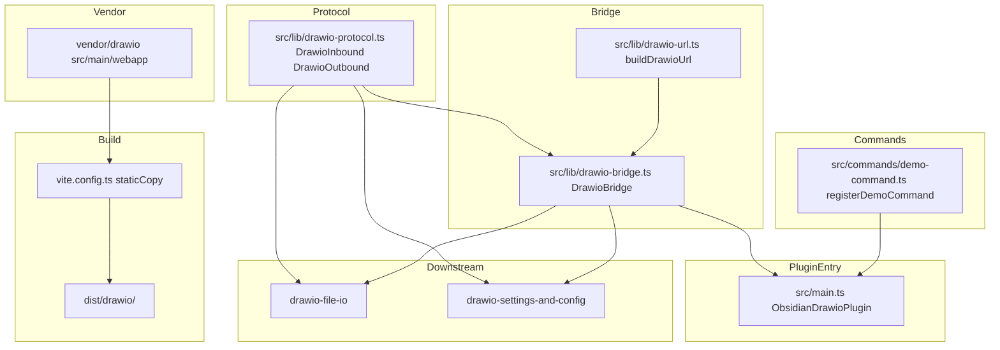
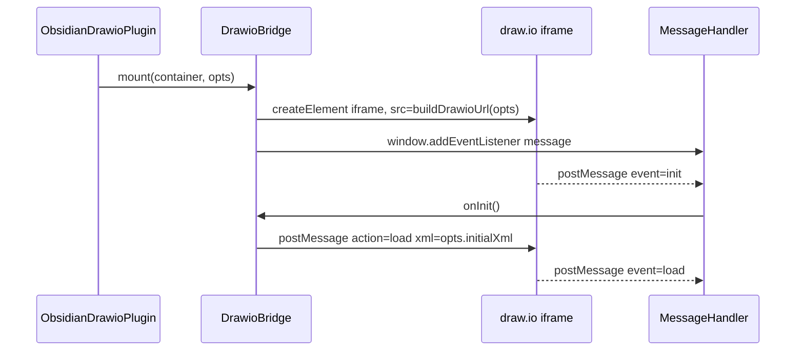
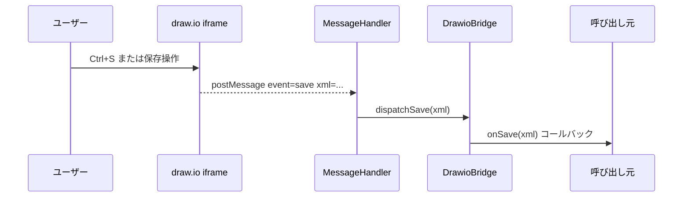
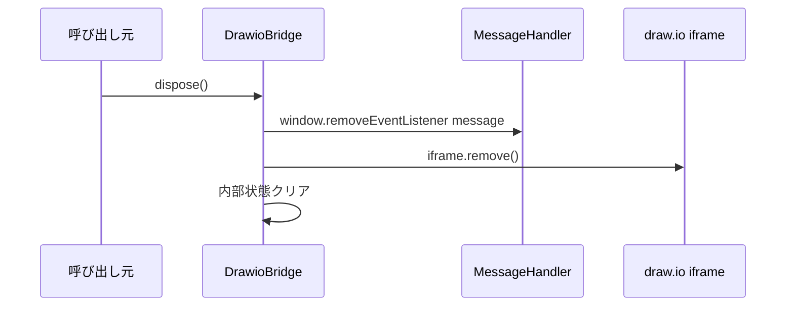

# Design Document: drawio-embed-bridge

## Overview

`drawio-embed-bridge` は、draw.io webapp を Obsidian プラグイン内の iframe として埋め込み、postMessage プロトコルを介して双方向通信するブリッジ層を確立する。draw.io の npm パッケージは存在しないため、`jgraph/drawio` リポジトリを git submodule として取り込み、`src/main/webapp` を production build 時に `dist/drawio/` へコピーする配布パイプラインを設ける。

**目的**: Obsidian プラグインユーザーが draw.io の編集 UI をプラグイン内で利用できるよう、ブリッジ基盤を提供する。  
**ユーザー**: Obsidian デスクトップユーザーおよびプラグイン開発者 (後続 spec の実装者)。  
**影響**: `vite.config.ts` に配布パイプラインを追加し、`src/lib/` に `DrawioBridge` クラスと postMessage 型定義を新設する。既存の `plugin-foundation` 成果物への破壊変更はない。

### Goals

- `vendor/drawio` submodule を追加し、`pnpm build` で `dist/drawio/` に draw.io webapp が含まれる状態を確立する
- `DrawioInbound` / `DrawioOutbound` discriminated union 型を定義し、downstream spec (file-io・settings-and-config) が型安全に postMessage を扱える契約を提供する
- `DrawioBridge` クラスで iframe の生成・メッセージ受信・破棄を高レベル API として提供する
- 固定 XML を表示するデモコマンドで疎通を確認できる状態にする

### Non-Goals

- Vault ファイルの読み書き (drawio-file-io 担当)
- `registerView` / `registerExtensions` (drawio-file-io 担当)
- テーマ追従の UI 実装 (drawio-settings-and-config 担当、本 spec では `setTheme` API のみ)
- Shape libraries の永続化 (drawio-settings-and-config 担当)
- drawio webapp 本体への改造
- Mobile 対応 (`isDesktopOnly: true` で固定)

## Boundary Commitments

### This Spec Owns

- `vendor/drawio` git submodule の追加 (`.gitmodules`、コミット固定ポリシー)
- `vite.config.ts` への drawio webapp コピー設定 (production build 時のみ)
- `src/lib/drawio-protocol.ts`: `DrawioInbound` / `DrawioOutbound` discriminated union 型定義 (共有契約)
- `src/lib/drawio-bridge.ts`: `DrawioBridge` クラス (mount / dispose / postMessage 双方向制御)
- `src/lib/drawio-url.ts`: iframe src URL パラメータ組み立てヘルパー
- `src/commands/demo-command.ts`: 疎通確認用デモコマンド
- `dist/drawio/LICENSE` / `dist/drawio/NOTICE` の同梱
- iframe sandbox 属性・postMessage 受信元検証による CSP 対応

### Out of Boundary

- Vault ファイル I/O・`registerView` (drawio-file-io)
- テーマ追従の実装・shape library 設定 (drawio-settings-and-config)
- PNG / SVG メタデータ抽出 (drawio-file-io)
- Electron main プロセスへの変更
- `PluginSettings` 型へのフィールド追加 (後続 spec が担当)

### Allowed Dependencies

- `plugin-foundation`: `ObsidianDrawioPlugin` クラス (onload/onunload)、`ReactMountManager` (必要に応じて)、`ThemeModule.subscribeThemeChange` (API としてのみ呼び出す)
- `obsidian` npm パッケージ (devDependencies、型定義のみ)
- `vite-plugin-static-copy` (ビルド時のみ、plugin-foundation で導入済み。本 spec では `targets` 配列を拡張するのみで新規 devDep 追加は不要)
- Node.js builtins (ビルドスクリプト内のみ)

### Revalidation Triggers

- `DrawioInbound` / `DrawioOutbound` の型定義変更 → drawio-file-io・drawio-settings-and-config が再検証必要
- `DrawioBridge` の public メソッドシグネチャ変更 → drawio-file-io・drawio-settings-and-config が再検証必要
- `DrawioBridgeOptions` 型の変更 → 全利用 spec が再検証必要
- `vendor/drawio` のコミット更新 → postMessage プロトコルの互換性確認が必要
- `vite.config.ts` の staticCopy 設定変更 → `dist/drawio/` パスを参照している箇所が再検証必要

## Architecture

### Architecture Pattern & Boundary Map



**依存方向**: `Vendor` → `Build` → `dist/drawio/` (runtime)  
`DrawioProtocol` (型のみ) → `DrawioBridge` → `PluginEntry`  
`DrawioProtocol` は downstream spec が直接 import する

### Technology Stack

| 層 | ツール / バージョン | 役割 |
|---|---|---|
| Vendor | `jgraph/drawio` git submodule (タグ固定) | draw.io webapp ソース |
| Build Plugin | `vite-plugin-static-copy` | `dist/drawio/` への webapp コピー |
| Language | TypeScript 6.x (strict) | 型定義・ブリッジ実装 |
| Plugin API | `obsidian` devDependencies | `Plugin`, `ItemView`, `WorkspaceLeaf` 型 |
| Runtime | Obsidian Electron renderer | iframe 読み込みと postMessage 環境 |

## File Structure Plan

### Directory Structure

```
/
├── .gitmodules                          # vendor/drawio submodule 設定
├── vendor/
│   └── drawio/                          # git submodule (jgraph/drawio)
│       └── src/main/webapp/             # draw.io webapp (index.html 等)
├── vite.config.ts                       # staticCopy targets 追加 (変更)
└── src/
    ├── main.ts                          # DemoCommand 登録を追加 (変更)
    ├── lib/
    │   ├── drawio-protocol.ts           # DrawioInbound / DrawioOutbound 型定義 (新規)
    │   ├── drawio-bridge.ts             # DrawioBridge クラス (新規)
    │   └── drawio-url.ts               # buildDrawioUrl ヘルパー (新規)
    └── commands/
        └── demo-command.ts             # registerDemoCommand (新規)
```

### Modified Files

- `vite.config.ts` — `viteStaticCopy` の `targets` に `vendor/drawio/src/main/webapp/**` → `drawio` を追加
- `src/main.ts` — `registerDemoCommand` 呼び出しを `onload()` に追加
- `.gitmodules` — `vendor/drawio` submodule エントリを追加 (新規ファイル)

## System Flows

### iframe 初期化フロー



### 保存フロー



### dispose フロー



## Requirements Traceability

| 要件 | 概要 | コンポーネント | インターフェース |
|------|------|--------------|----------------|
| 1.1-1.6 | vendor/drawio submodule と配布パイプライン | VendorSubmodule, ViteConfig | — |
| 2.1-2.6 | DrawioInbound / DrawioOutbound 型定義 | DrawioProtocol | DrawioInbound, DrawioOutbound |
| 3.1-3.16 | DrawioBridge クラス (load / replaceContent / setLibraries 含む) | DrawioBridge | DrawioBridgeService |
| 4.1-4.4 | URL パラメータ組み立て | DrawioUrl | buildDrawioUrl |
| 5.1-5.4 | Obsidian プロトコル疎通 | DrawioBridge | mount() |
| 6.1-6.4 | 疎通確認用デモコマンド | DemoCommand | registerDemoCommand |
| 7.1-7.7 | cleanup・審査要件準拠・Apache-2.0 表記・submodule pinning | DrawioBridge, DemoCommand, VendorSubmodule | dispose(), README, .gitmodules |

## Components and Interfaces

### コンポーネントサマリー

| コンポーネント | 層 | 役割 | 要件カバレッジ | 主要依存 (P0/P1) | Contracts |
|---|---|---|---|---|---|
| VendorSubmodule | Vendor | drawio webapp の取り込み | 1 | git, vite-plugin-static-copy (P0) | — |
| DrawioProtocol | Protocol | postMessage 型定義 (共有契約) | 2 | TypeScript (P0) | State |
| DrawioUrl | Bridge | URL パラメータ組み立て | 4 | — | Service |
| DrawioBridge | Bridge | iframe 管理・postMessage 双方向制御 | 3, 5, 7 | DrawioProtocol (P0), DrawioUrl (P0), obsidian (P1) | Service, Event |
| DemoCommand | Commands | 疎通確認コマンド | 6 | DrawioBridge (P0), obsidian (P0) | Service |

---

### Protocol 層

#### DrawioProtocol

| フィールド | 詳細 |
|---|---|
| Intent | draw.io ↔ host 間の postMessage を型安全に表現する discriminated union 型定義を提供する。依存なしの純粋型モジュール |
| 要件 | 2.1, 2.2, 2.3, 2.4, 2.5, 2.6 |

**Responsibilities & Constraints**

- `DrawioInbound` を `event` フィールドで識別する discriminated union として定義する
- `DrawioOutbound` を `action` フィールドで識別する discriminated union として定義する
- `any` 型を使用しない。不明ペイロードは `unknown` または具体型で表現する
- このモジュールは実装を持たず型定義のみ。実行時依存はゼロ

**Dependencies**

- 依存なし (型定義のみ)

**Contracts**: Service [ ] / API [ ] / Event [ ] / Batch [ ] / State [x]

##### State Management

```typescript
// src/lib/drawio-protocol.ts

export type DrawioInboundInit = {
  event: 'init';
};

export type DrawioInboundLoad = {
  event: 'load';
  xml: string;
};

export type DrawioInboundAutosave = {
  event: 'autosave';
  xml: string;
};

export type DrawioInboundSave = {
  event: 'save';
  xml: string;
  exit?: boolean;
};

export type DrawioInboundExport = {
  event: 'export';
  data: string;
  format: string;
  message: DrawioOutboundExport;
};

export type DrawioInboundExit = {
  event: 'exit';
};

export type DrawioInboundDialog = {
  event: 'dialog';
  title?: string;
  message: string;
  button?: string;
  modified?: boolean;
};

export type DrawioInboundPrompt = {
  event: 'prompt';
  title: string;
  value?: string;
};

export type DrawioInbound =
  | DrawioInboundInit
  | DrawioInboundLoad
  | DrawioInboundAutosave
  | DrawioInboundSave
  | DrawioInboundExport
  | DrawioInboundExit
  | DrawioInboundDialog
  | DrawioInboundPrompt;

export type DrawioOutboundLoad = {
  action: 'load';
  xml: string;
  autosave?: 0 | 1;
};

export type DrawioOutboundMerge = {
  action: 'merge';
  xml: string;
};

export type DrawioOutboundConfigure = {
  action: 'configure';
  config: Record<string, unknown>;
};

export type DrawioOutboundLayout = {
  action: 'layout';
  layouts: unknown[];
};

export type DrawioOutboundExport = {
  action: 'export';
  // 'xmlpng' / 'xmlsvg' は drawio embed 標準の mxfile-埋め込み export format。drawio-file-io が lossless 保存に使用する。
  format: 'png' | 'svg' | 'xml' | 'pdf' | 'xmlpng' | 'xmlsvg';
  xml?: string;
  spin?: string;
  scale?: number;
  border?: number;
};

export type DrawioOutbound =
  | DrawioOutboundLoad
  | DrawioOutboundMerge
  | DrawioOutboundConfigure
  | DrawioOutboundLayout
  | DrawioOutboundExport;
```

---

### Bridge 層

#### DrawioUrl

| フィールド | 詳細 |
|---|---|
| Intent | draw.io iframe に渡す URL クエリパラメータを組み立てる純粋関数ヘルパーを提供する |
| 要件 | 4.1, 4.2, 4.3, 4.4 |

**Responsibilities & Constraints**

- `embed=1` と `proto=json` を常に含める
- 副作用なしの純粋関数として実装する

**Dependencies**

- 依存なし

**Contracts**: Service [x] / API [ ] / Event [ ] / Batch [ ] / State [ ]

##### Service Interface

```typescript
// src/lib/drawio-url.ts

export interface DrawioUrlOptions {
  spin?: boolean;
  libraries?: boolean;
  noSaveBtn?: boolean;
  noExitBtn?: boolean;
  lang?: string;
  extraParams?: Record<string, string>;
}

export function buildDrawioUrl(basePath: string, opts?: DrawioUrlOptions): string;
// basePath: 'app://...' or 'file://...' への drawio index.html パス
// 戻り値: クエリパラメータを付与した完全 URL 文字列
// デフォルト: lang='ja', embed=1, proto=json を含む
```

- Preconditions: `basePath` は有効な URL 文字列
- Postconditions: 戻り値は `embed=1&proto=json` を常に含む
- Invariants: 副作用なし、同一引数で常に同一結果を返す

#### DrawioBridge

| フィールド | 詳細 |
|---|---|
| Intent | draw.io iframe の生成・postMessage 双方向制御・破棄を管理するブリッジクラスを提供する |
| 要件 | 3.1〜3.16, 5.1, 5.2, 5.3, 5.4, 7.2, 7.5 |

**Responsibilities & Constraints**

- `mount()` で `document.createElement('iframe')` を使用し `innerHTML` を禁止する
- `window.addEventListener('message', ...)` の受信元を `event.source === iframe.contentWindow` で検証する
- `dispose()` で listener の解除と iframe の DOM 除去を確実に行う
- `init` イベント受信後に `load` アクションを返す初期化フロー
- `sandbox="allow-scripts allow-same-origin allow-downloads"` を設定する

**Dependencies**

- Inbound: `ObsidianDrawioPlugin` (onload/onunload 経由の mount/dispose 呼び出し) (P0)
- Outbound: `drawio-protocol.ts` — `DrawioInbound` / `DrawioOutbound` 型 (P0)
- Outbound: `drawio-url.ts` — `buildDrawioUrl` (P0)
- External: `obsidian` — `App` 型 (`getResourcePath` のため) (P1)
- External: `window.addEventListener` / `window.removeEventListener` — postMessage 受信 (P0)

**Contracts**: Service [x] / API [ ] / Event [x] / Batch [ ] / State [x]

##### Service Interface

```typescript
// src/lib/drawio-bridge.ts

import type { App } from 'obsidian';
import type { DrawioInbound, DrawioOutbound, DrawioUrlOptions } from './drawio-protocol.ts';

export interface DrawioBridgeCallbacks {
  onSave?: (xml: string) => void;
  onAutosave?: (xml: string) => void;
  onExport?: (data: string, format: string) => void;
  onExit?: () => void;
}

export interface DrawioBridgeMountOptions extends DrawioUrlOptions {
  initialXml?: string;
  callbacks?: DrawioBridgeCallbacks;
}

// 'xmlpng' / 'xmlsvg' は mxfile XML を PNG/SVG バイナリに埋め込む drawio embed 標準 format (drawio-file-io 用)
export type DrawioExportFormat = 'png' | 'svg' | 'xml' | 'pdf' | 'xmlpng' | 'xmlsvg';
export type DrawioThemeMode = 'light' | 'dark' | 'kennedy' | 'atlas' | 'min' | 'dark';
// 'light'/'dark' は obsidian テーマ → drawio `ui` 値 への logical alias。
// downstream (settings spec) で具体マッピング (`light` → `kennedy`, `dark` → `dark`) を確定する。

export interface DrawioBridge {
  mount(container: HTMLElement, opts: DrawioBridgeMountOptions): void;
  dispose(): void;

  // 安定 API (downstream spec から呼ばれる)
  load(xml: string): void;                                  // 初期化時の図注入 (action=load)
  replaceContent(xml: string): void;                        // ライブ更新時の図差し替え (action=merge or load+autosave=1)
  requestSave(): void;                                      // 保存要求 (drawio 内の Save ボタン相当)
  requestExport(format: DrawioExportFormat): void;          // export 要求。結果は callbacks.onExport で受領
  setTheme(theme: 'light' | 'dark'): void;                  // configure アクションで ui を切替 (settings spec が呼ぶ)
  setLibraries(libs: ReadonlyArray<{ title: string; entries: unknown[] }>): void;
                                                             // shape libraries 注入 (settings spec が呼ぶ)
  sendMessage(msg: DrawioOutbound): void;                   // 任意の outbound 送信用 escape hatch

  readonly isMounted: boolean;
}

export function createDrawioBridge(app: App): DrawioBridge;
```

- Preconditions: `mount()` 呼び出し時、`container` は DOM に attach されていること
- Postconditions: `dispose()` 後は `isMounted === false`、iframe は DOM から除去済み
- Invariants: `mount()` の重複呼び出しは既存 iframe を dispose してから再 mount する

##### Event Contract

- 受信イベント: `window.message` を購読し、`event.source === iframe.contentWindow` で送信元を絞り込む。`event.origin` 文字列比較は `app://` / `file://` の差で不安定なため**使わない**
- 送信: `iframe.contentWindow.postMessage(JSON.stringify(msg), '*')`
  - `targetOrigin='*'` を使う理由: drawio webapp は `app://` または `file://` で配信され、receiver 側の origin が静的に決まらない。同一プロセス内 iframe の `contentWindow` 参照を保持しているため、targetOrigin による情報漏洩リスクは限定的 (postMessage 内容は draw.io 図 XML / 設定で機密性は低い)。代替案 (`event.origin` を init 時に capture して再利用) は CSP 違反時に一致しないリスクがあり却下
- ペイロードは `DrawioInbound` / `DrawioOutbound` を `proto=json` (JSON 文字列) でシリアライズ
- inbound ハンドラは `JSON.parse` 失敗時に warn ログを出して return (堅牢化)

##### State Management

- State model: `{ iframe: HTMLIFrameElement | null, messageHandler: EventListener | null, callbacks: DrawioBridgeCallbacks }`
- Persistence: メモリのみ (DrawioBridge インスタンスのライフタイム)
- Concurrency: 単一スレッド (Obsidian Electron renderer)

**Implementation Notes**

- Integration: `app.vault.adapter.getResourcePath('drawio/index.html')` で `app://` URL を取得し `buildDrawioUrl` に渡す
- Validation: `setTheme()` は `configure` アクションで drawio の `ui` 設定を更新する (drawio-settings-and-config が実装するまでは stub でも可)
- Cleanup 順序 (`dispose()`):
  1. `window.removeEventListener('message', handler)` でリスナー解除
  2. callbacks 参照をクリア (`this.callbacks = {}`) — listener 経由のリーク防止
  3. `this.iframe.src = 'about:blank'` で contentWindow を強制ナビゲーション (postMessage チャネル切断)
  4. `this.iframe.remove()` で DOM から除去
  5. `this.iframe = null` / `this.messageHandler = null` で参照クリア
- Risks: `getResourcePath` が返す `app://` URL で CSP 違反が発生する場合、コンソール警告を出力し `file://` フォールバックを試みる (詳細は Security Considerations / Risks セクション)

---

### Commands 層

#### DemoCommand

| フィールド | 詳細 |
|---|---|
| Intent | 固定 XML を draw.io iframe に表示して疎通を確認するデモコマンドを提供する |
| 要件 | 6.1, 6.2, 6.3, 6.4 |

**Responsibilities & Constraints**

- `ObsidianDrawioPlugin.onload()` から呼び出される `registerDemoCommand(plugin)` 関数として実装する
- Obsidian の `addCommand()` を使用し、`onunload()` での自動解除を機構として利用する
- リーフを開き、`DrawioBridge.mount()` で iframe を表示し、固定 XML を注入する
- リーフが閉じられたとき (`ItemView.onClose()` または `WorkspaceLeaf` の unload 時) に `DrawioBridge.dispose()` を呼ぶ

**Dependencies**

- Inbound: `ObsidianDrawioPlugin.onload()` (P0)
- Outbound: `DrawioBridge` (P0)
- External: `obsidian` — `Plugin`, `ItemView`, `WorkspaceLeaf` (P0)

**Contracts**: Service [x] / API [ ] / Event [ ] / Batch [ ] / State [ ]

##### Service Interface

```typescript
// src/commands/demo-command.ts

import type { Plugin } from 'obsidian';

export const DEMO_VIEW_TYPE = 'drawio-demo';

export function registerDemoCommand(plugin: Plugin): void;
// plugin.addCommand で "Open drawio demo" を登録する
// コマンド実行時に新しいリーフを開き DrawioBridge を mount する
// リーフ close 時に DrawioBridge.dispose() を確実に呼ぶ
```

**Implementation Notes**

- Risks: `ItemView` の `onClose()` が常に呼ばれる保証はない。`plugin.registerDomEvent` や leaf の `detach` イベントでの補完的 cleanup を検討する

---

### Build 層

#### VendorSubmodule (設定)

**Responsibilities & Constraints**

- `git submodule add https://github.com/jgraph/drawio.git vendor/drawio` で追加
- submodule を特定タグ/コミットに固定し再現性を確保する
- `vite.config.ts` の `viteStaticCopy` に以下を追加する:
  ```typescript
  {
    src: 'vendor/drawio/src/main/webapp/**',
    dest: 'drawio',
  }
  ```
- production build 時のみコピー。watch モードでは `dist/drawio` への symlink で代替する
- `vendor/drawio/LICENSE` と `vendor/drawio/NOTICE` を `dist/drawio/` に含めるため追加の target エントリを設ける

## Data Models

### Domain Model

postMessage プロトコルの型定義が本 spec の中核データモデルである。

```
DrawioInbound (event 識別子)
  ├── DrawioInboundInit       { event: 'init' }
  ├── DrawioInboundLoad       { event: 'load', xml: string }
  ├── DrawioInboundAutosave   { event: 'autosave', xml: string }
  ├── DrawioInboundSave       { event: 'save', xml: string, exit?: boolean }
  ├── DrawioInboundExport     { event: 'export', data: string, format: string, message: DrawioOutboundExport }
  ├── DrawioInboundExit       { event: 'exit' }
  ├── DrawioInboundDialog     { event: 'dialog', ... }
  └── DrawioInboundPrompt     { event: 'prompt', ... }

DrawioOutbound (action 識別子)
  ├── DrawioOutboundLoad      { action: 'load', xml: string, autosave?: 0 | 1 }
  ├── DrawioOutboundMerge     { action: 'merge', xml: string }
  ├── DrawioOutboundConfigure { action: 'configure', config: Record<string, unknown> }
  ├── DrawioOutboundLayout    { action: 'layout', layouts: unknown[] }
  └── DrawioOutboundExport    { action: 'export', format: 'png'|'svg'|'xml'|'pdf'|'xmlpng'|'xmlsvg', ... }
```

## Error Handling

### Error Strategy

- CSP 違反で iframe がスクリプトをブロックした場合: コンソール警告を出力し、`file://` フォールバックを試みる
- `getResourcePath()` が失敗した場合: エラーを `console.error` でログし、iframe を生成しない
- `postMessage` 送信時に `iframe.contentWindow` が null の場合: 警告ログのみで例外を throw しない
- `dispose()` が複数回呼ばれた場合: 冪等に処理し、2回目以降は no-op とする

### Error Categories

- **System Error**: `getResourcePath` の失敗、CSP 違反 → `console.error` でログ、graceful degradation
- **Runtime Error**: postMessage 送信時の null contentWindow → 警告ログ、操作をスキップ
- **State Error**: 未 mount 状態での API 呼び出し → 警告ログ、no-op

## Testing Strategy

### ビルド検証

- `pnpm build` 後に `dist/drawio/index.html` が存在することを確認
- `dist/drawio/LICENSE` が存在することを確認
- `dist/main.js` が `dist/drawio/` への参照を含まないこと (ランタイム依存なし)

### 単体検証

- `buildDrawioUrl()` が `embed=1&proto=json` を常に含むことを確認
- `buildDrawioUrl()` でデフォルト `lang=ja` が設定されることを確認
- `DrawioInbound` discriminated union が `event` フィールドで正しく型絞り込みできることを TypeScript コンパイルで確認
- `DrawioBridge.dispose()` が複数回呼ばれても例外を throw しないことを確認

### 統合検証 (手動)

- Obsidian Desktop でデモコマンドを実行し draw.io 編集 UI が iframe に表示されることを確認
- 固定 XML を渡したとき図形が正しく描画されることを確認
- リーフを閉じたとき iframe が DOM から除去されていることを確認
- `isMounted` フラグが mount/dispose で正しく更新されることを確認

## Optional Sections

### Risks

| Risk | 影響 | Mitigation |
|---|---|---|
| Obsidian Electron renderer の CSP が `app://` 配信スクリプトをブロックする | drawio iframe が起動せず init イベントが届かない | (1) `app://` URL を第一案、(2) `file://` フォールバック、(3) `iframe.sandbox` で必要最小権限のみ付与、(4) 実機スパイクで疎通確認をタスク 6.2 で必須化 |
| `webSecurity: false` を要求される事態 (上記 mitigation でも解決しない場合) | Electron アプリ全体のセキュリティが下がる | 採用しない方針。代替として Obsidian 提供の `app://` プロトコルハンドラに乗る (registerProtocol は不要) |
| `event.origin` 比較を使うと `app://`/`file://` で不安定 | 受信元検証バイパスの恐れ | `event.source === iframe.contentWindow` の参照比較に統一 (Decision に記載済) |
| postMessage 送信時 `targetOrigin='*'` で情報漏洩 | 同一 process 内 iframe にしか届かないため低リスク | ペイロードに認証情報を含めない契約 (DrawioOutbound 型で機密フィールド禁止) |
| `vendor/drawio` のサイズ (~50MB) が `pnpm dev` を遅くする | DX 悪化 | production build のみコピー、watch モードは symlink。`shallow=true` を `.gitmodules` に設定し `pnpm install` の clone コストを削減 |
| upstream drawio の postMessage プロトコル破壊変更 | bridge が突然動作しない | submodule を**特定タグ** (例: `v24.7.17`) に固定。`git submodule update --remote` を CI/pnpm install で**自動実行しない**。プロトコル変更時のみ手動で SHA を bump し regression テストを実施 |
| Obsidian community plugin 審査での Apache-2.0 表記漏れ | リジェクト | README に "Bundles draw.io (Apache-2.0)" 明記、`dist/drawio/LICENSE` / `dist/drawio/NOTICE` 同梱を tasks に組み込み (タスク 1.2, 6.2, 6.3) |
| `dispose()` が複数回呼ばれる / mount 前に呼ばれる | 例外 | 冪等化 (Error Handling 参照) |

### Security Considerations

- **postMessage 受信元検証**: `event.source === iframe.contentWindow` で検証し、`'*'` を受け入れない
- **innerHTML 禁止**: `document.createElement` のみ使用。Obsidian 審査要件への準拠
- **外部 CDN 禁止**: draw.io webapp はローカルの `vendor/drawio` から配布。外部スクリプトロードなし
- **iframe sandbox**: `allow-scripts allow-same-origin allow-downloads` のみを許可し、`allow-forms` や `allow-popups` は原則不要
- **Apache-2.0 ライセンス**: `dist/drawio/LICENSE` / `dist/drawio/NOTICE` を同梱する

### Migration Strategy

- `vendor/drawio` submodule は一度追加後、`git submodule update --remote` を明示的に実行しない限りバージョンが変わらない
- draw.io のメジャーバージョンアップ時は postMessage プロトコルの互換性を確認してから submodule コミットを更新する
- ロールバック: `git revert` または submodule コミットを以前の SHA に戻すことで対応可能
