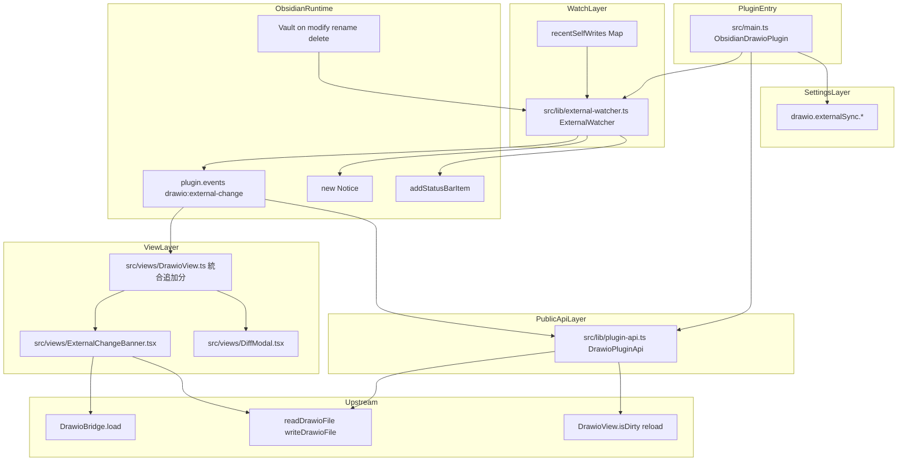
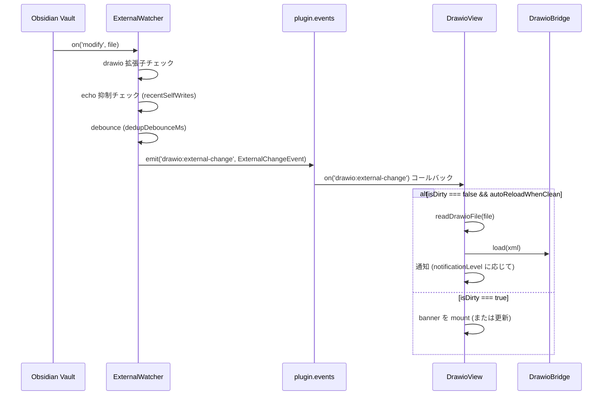
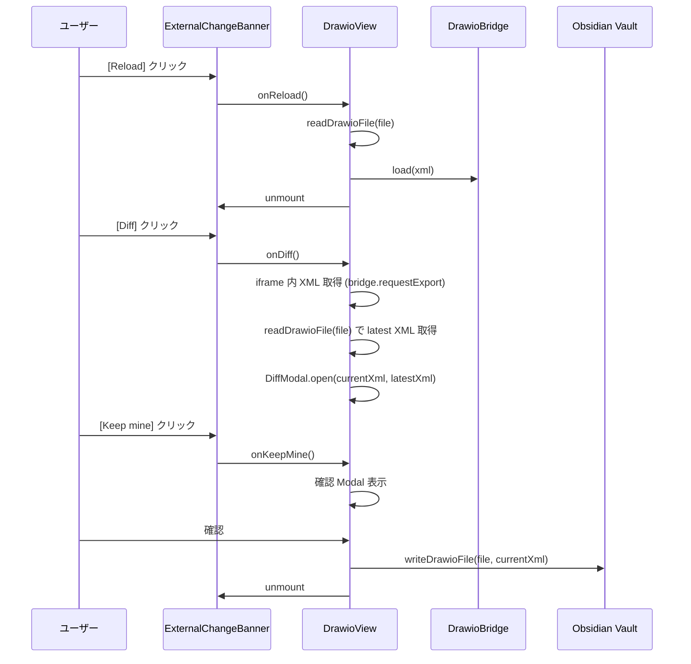
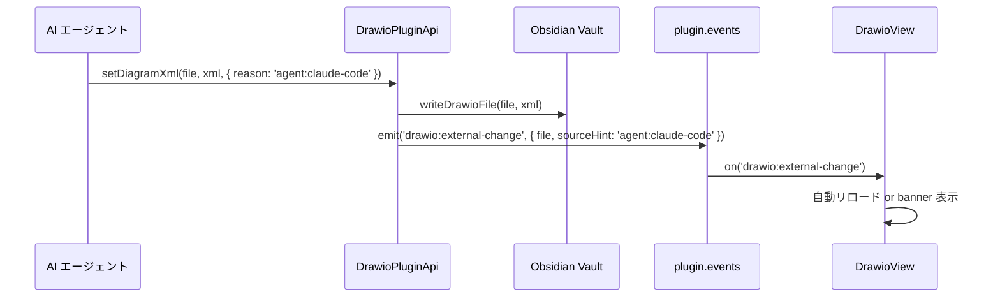

# 設計ドキュメント: drawio-external-sync

## 概要

`drawio-external-sync` は、Obsidian Vault 内の drawio ファイルが Obsidian 外部 (AI エージェント / CLI / Git sync / drawio-desktop 等) から変更された場合に検知・通知・リロード・衝突解消を行うレイヤーを実装する。

**目的**: AI エージェントが図を更新するワークフローにおいて、DrawioView が古い XML を上書きしてしまう破壊を防止し、外部変更を安全に取り込む UX を提供する。  
**ユーザー**: Obsidian デスクトップユーザー (通知・衝突解消 UI の利用者) および AI エージェント (Public API を介して図を更新するスクリプト・Claude Code 等)。  
**影響**: `plugin-foundation` の `ObsidianDrawioPlugin` にイベントバス・Public API・コマンド登録を追加し、`DrawioView` (drawio-file-io) に外部変更購読・banner mount を追加し、`DrawioSettings` (drawio-settings-and-config) に `externalSync` 名前空間を拡張する。

### Goals

- 外部変更を Vault イベントで正確に検知し echo 抑制・dedup を適用する
- DrawioView の dirty 状態に応じた自動リロード / 衝突解消 UI を提供する
- 3 段階通知 (statusbar / Notice / banner) を `notificationLevel` で制御できる
- AI エージェント向けの安定した Public API (version: 1) を `app.plugins.plugins['obsidian-drawio'].api` で公開する

### Non-Goals

- 3-way merge / セマンティック XML diff
- drawio iframe 内 visual diff overlay
- リアルタイム共同編集 (CRDT)
- Git 統合
- クラウドストレージ独自 API
- Mobile 対応 (`isDesktopOnly: true` で固定)
- AI エージェント側のロジック (本 spec は hook 露出のみ)

---

## バウンダリコミットメント

### This Spec Owns

- `src/lib/external-watcher.ts` — `ExternalWatcher` クラス (Vault イベント購読・echo 抑制・dedup・event bus emit)
- `src/lib/plugin-api.ts` — `DrawioPluginApi` クラス (getDiagramXml / setDiagramXml / requestReload / subscribe)
- `src/views/ExternalChangeBanner.tsx` — action banner React コンポーネント
- `src/views/DiffModal.tsx` — テキスト diff Modal (Obsidian `Modal` + React)
- `src/views/DrawioView.ts` への追加分 — `drawio:external-change` 購読・banner mount・rename/delete 対応
- `src/main.ts` への追加分 — ExternalWatcher 初期化・Public API 登録・コマンド登録・onunload cleanup
- `src/lib/settings.ts` への追加分 — `ExternalSyncSettings` 型・`drawio.externalSync` フィールド

### Out of Boundary

- `DrawioBridge.load(xml)` の実装 (drawio-embed-bridge が定義済み)
- `readDrawioFile` / `writeDrawioFile` の実装 (drawio-file-io が定義済み)
- `DrawioView.isDirty` / `DrawioView.reload()` の基本実装 (drawio-file-io が定義済み)
- 設定 UI の描画 (`<section data-spec="external-sync">` 予約のみ、UI は drawio-settings-and-config が実装)
- Vault ファイル読み書きの低レベル実装

### Allowed Dependencies

- `plugin-foundation`: `ObsidianDrawioPlugin`, `PluginSettings` / `DrawioSettings`, `ReactMountManager`
- `drawio-embed-bridge`: `DrawioBridge.load(xml)`, `DrawioBridge.isMounted`
- `drawio-file-io`: `DrawioView.isDirty`, `DrawioView.reload()`, `readDrawioFile`, `writeDrawioFile`, `DRAWIO_VIEW_TYPE`
- `drawio-settings-and-config`: `DrawioSettings` 型への `externalSync` フィールド追加 (本 spec が実施)
- `obsidian` devDependencies: `Vault`, `TFile`, `Notice`, `Modal`, `Plugin`, `Events`
- `@codemirror/merge` (already external in rollupOptions) — Diff Modal の mergeView

### Revalidation Triggers

- `DrawioView.isDirty` / `DrawioView.reload()` シグネチャ変更 → ExternalWatcher・DrawioView 統合部が再検証必要
- `DrawioBridge.load(xml)` シグネチャ変更 → DrawioView 統合部が再検証必要
- `readDrawioFile` / `writeDrawioFile` シグネチャ変更 → ExternalWatcher・Public API が再検証必要
- `DrawioSettings` 型の破壊変更 → ExternalSyncSettings 統合が再検証必要
- `ExternalChangeEvent` 型の変更 → Public API の `subscribe` consumer が再検証必要
- `plugin.api` の公開シグネチャ変更 (version 1 → 2) → AI エージェント側スクリプトが再検証必要
- **可視 UI 文字列の追加・変更時** (`external-watcher.ts` / `ExternalChangeBanner.tsx` / `DiffModal.tsx` 等本 spec 所有ファイルの UI 文言): plugin-i18n が管理する `src/lib/i18n/locales/{ja,en}.ts` を同時更新し、`pnpm verify:i18n` (または同等の検証スクリプト) を通すこと。新規ハードコード文字列はリリース前に必ず `t()` 化する。

---

## アーキテクチャ

### アーキテクチャパターン & バウンダリマップ



**依存方向**: `ObsidianRuntime` → `WatchLayer` → `EventBus` → `ViewLayer` / `PublicApiLayer`  
`PluginEntry` がすべてを初期化し `onunload` で破棄する

### テクノロジースタック

| 層 | ツール / バージョン | 役割 |
|---|---|---|
| Language | TypeScript 6.x (strict) | 型安全な実装 |
| UI Framework | React 19 + ReactMountManager | Banner / DiffModal の createRoot 管理 |
| Diff | `@codemirror/merge` (external) | mergeView による行 diff 表示 |
| Plugin API | `obsidian` devDependencies | Vault, TFile, Notice, Modal, Events |
| Event Bus | `obsidian Events` (`plugin.events`) | `drawio:external-change` の pub/sub |
| Build | Vite build.lib (CJS) | 既存スタックに準拠 |

---

## ファイル構成

### ディレクトリ構造

```
src/
├── main.ts                              # ExternalWatcher・PluginApi 初期化・コマンド登録・cleanup 追加 (変更)
├── lib/
│   ├── external-watcher.ts             # ExternalWatcher クラス (新規)
│   ├── plugin-api.ts                   # DrawioPluginApi クラス (新規)
│   └── settings.ts                     # ExternalSyncSettings 型・drawio.externalSync 追加 (変更)
└── views/
    ├── DrawioView.ts                   # drawio:external-change 購読・banner mount 追加 (変更)
    ├── ExternalChangeBanner.tsx        # action banner React コンポーネント (新規)
    └── DiffModal.tsx                   # Diff Modal (Obsidian Modal + React) (新規)
```

### 変更ファイル

- `src/main.ts` — `onload()` に ExternalWatcher 生成・PluginApi 生成 (`this.api = ...`)・"Refresh diagram from disk" コマンド登録・`onunload()` に watcher.dispose() 追加
- `src/lib/settings.ts` — `DrawioSettings` に `externalSync: ExternalSyncSettings` フィールドを追加、`DEFAULT_DRAWIO_SETTINGS` を更新
- `src/views/DrawioView.ts` — `onLoadFile` 時に `drawio:external-change` を購読、banner mount/unmount ロジック追加、`onClose` / `onUnloadFile` の cleanup に banner unmount を追加

---

## システムフロー

### 外部変更検知・通知フロー



### 衝突解消フロー



### Public API フロー



---

## 要件トレーサビリティ

| 要件 | 概要 | コンポーネント | インターフェース |
|------|------|--------------|----------------|
| 1.1–1.6 | 外部変更検知・echo 抑制・dedup | ExternalWatcher | WatcherService |
| 2.1–2.4 | event bus 伝播 | ExternalWatcher, plugin.events | ExternalChangeEvent |
| 3.1–3.4 | 自動リロード | DrawioView (統合追加分) | reload(), isDirty |
| 4.1–4.5 | 3 段階通知 | ExternalWatcher, DrawioView | Notice, StatusBar, Banner |
| 5.1–5.7 | 衝突解消 UI (Banner) | ExternalChangeBanner, DrawioView | BannerService |
| 6.1–6.5 | Diff Modal | DiffModal | ModalService |
| 7.1–7.3 | rename / delete 対応 | DrawioView (統合追加分) | Vault rename/delete |
| 8.1–8.8 | Public API | DrawioPluginApi | DrawioPublicApi |
| 9.1–9.4 | 設定スキーマ | SettingsModule (追加) | ExternalSyncSettings |
| 10.1–10.3 | Obsidian コマンド | ObsidianDrawioPlugin (追加) | addCommand |
| 11.1–11.4 | リソース管理・cleanup | ExternalWatcher, DrawioView, DiffModal | dispose, unmount |

---

## コンポーネントとインターフェース

### コンポーネントサマリー

| コンポーネント | 層 | 役割 | 要件カバレッジ | 主要依存 (P0/P1) | Contracts |
|---|---|---|---|---|---|
| ExternalWatcher | Lib | Vault イベント購読・echo 抑制・dedup・event bus emit | 1, 2, 4, 11 | obsidian Vault (P0), plugin.events (P0) | Service, Event, State |
| DrawioPluginApi | Lib | Public API (getDiagramXml / setDiagramXml / requestReload / subscribe) | 8 | readDrawioFile/writeDrawioFile (P0), DrawioView (P0) | Service, API |
| ExternalSyncSettings (追加) | Lib | 設定スキーマ定義・デフォルト値 | 9 | DrawioSettings (P0) | State |
| DrawioView (統合追加分) | Views | event bus 購読・自動リロード・banner mount | 3, 4, 5, 7, 11 | ExternalWatcher (P0), DrawioBridge (P0) | Event, State |
| ExternalChangeBanner | Views | React action banner (Reload/Diff/Keep mine) | 5 | ReactMountManager (P0) | Service |
| DiffModal | Views | Obsidian Modal + React diff UI | 6 | ReactMountManager (P0), @codemirror/merge (P1) | Service |
| ObsidianDrawioPlugin (追加分) | Plugin Entry | 初期化・コマンド・Public API 登録・cleanup | 10, 11 | ExternalWatcher (P0), DrawioPluginApi (P0) | Service |

---

### Lib 層

#### ExternalWatcher

| フィールド | 詳細 |
|---|---|
| Intent | Vault の `modify` / `rename` / `delete` イベントを購読し、self-write echo 抑制・dedup を適用して `drawio:external-change` を emit する |
| 要件 | 1.1, 1.2, 1.3, 1.4, 1.5, 1.6, 2.1, 2.2, 2.3, 2.4, 4.1, 4.2, 11.1, 11.3 |

**責務と制約**

- drawio 拡張子 (`.drawio`, `.drawio.svg`, `.drawio.png`) のみ対象にする
- `modify` イベント受信時: `recentSelfWrites` Map に `path → timestamp` が `echoSuppressionMs` 以内で存在する場合は無視する
- `modify` イベントの dedup: 同一 path の直近イベントから `dedupDebounceMs` 経過後に処理する (clearTimeout + setTimeout パターン)
- `rename` / `delete` イベントは echo 抑制対象外として必ず処理する
- `registerSelfWrite(path)` を呼ぶと `path → Date.now()` を記録し、`echoSuppressionMs` 後に自動削除する
- `dispose()` で Vault イベントリスナーと debounce timer をすべて解除する
- 設定値は `getSettings()` コールバックで毎回取得し、インスタンス生成時にキャッシュしない

**依存関係**

- Inbound: `ObsidianDrawioPlugin.onload()` — 生成・dispose (P0)
- Outbound: `plugin.events.trigger('drawio:external-change', event)` (P0)
- External: Obsidian `Vault` — on/off (P0)
- External: `addStatusBarItem()` — statusbar 通知 (P1)
- External: `new Notice(msg)` — notice 通知 (P1)

**Contracts**: Service [x] / Event [x] / State [x]

##### Service Interface

```typescript
// src/lib/external-watcher.ts

import type { Plugin, TFile, Vault } from 'obsidian';
import type { DrawioSettings } from './settings.ts';

export interface ExternalChangeEvent {
  file: TFile;
  mtime: number;
  sourceHint?: string;
}

export interface ExternalWatcher {
  registerSelfWrite(path: string): void;
  dispose(): void;
}

export function createExternalWatcher(
  plugin: Plugin,
  vault: Vault,
  getSettings: () => DrawioSettings,
): ExternalWatcher;
```

- Preconditions: `plugin` は load 済みであること
- Postconditions: `dispose()` 後はすべての Vault イベントリスナーが解除される
- Invariants: `registerSelfWrite` は冪等。同一 path の重複呼び出しは最新タイムスタンプで上書きする

##### Event Contract

- 発行イベント: `plugin.events.trigger('drawio:external-change', ExternalChangeEvent)`
- Vault subscribe: `vault.on('modify', ...)` / `vault.on('rename', ...)` / `vault.on('delete', ...)`
- `dispose()` 時に `vault.off(...)` で解除する

##### State Management

- State: `recentSelfWrites: Map<string, number>` (path → timestamp)
- State: `pendingDebounce: Map<string, ReturnType<typeof setTimeout>>`
- Persistence: メモリのみ (ExternalWatcher インスタンスのライフタイム)
- Concurrency: 単一スレッド (Obsidian Electron renderer)

**実装ノート**

- Integration: `plugin.registerEvent` ではなく `vault.on` / `vault.off` を直接使い、`dispose()` で確実に解除する
- Validation: rename イベントの `oldPath` を DrawioView への通知に含める
- Risks: Obsidian が同一書き込みに対して複数回 modify を発火する場合がある。debounce で吸収する

---

#### DrawioPluginApi

| フィールド | 詳細 |
|---|---|
| Intent | AI エージェントが `app.plugins.plugins['obsidian-drawio'].api` 経由で drawio ファイルを操作できる Public API を提供する |
| 要件 | 8.1, 8.2, 8.3, 8.4, 8.5, 8.6, 8.7, 8.8 |

**責務と制約**

- `getDiagramXml`: `readDrawioFile` を呼び出し XML を返す。View が開いている場合は bridge 経由の live XML を優先する
- `setDiagramXml`: `writeDrawioFile` でファイルに書き込み、`externalWatcher.registerSelfWrite` で echo 抑制を回避しないようにする (API 経由は意図的な変更として通知する)。その後 `plugin.events.trigger('drawio:external-change', ...)` で通知する
- `requestReload`: 対象ファイルを開いている DrawioView を見つけ `reload()` を呼ぶ
- `subscribe`: `plugin.events.on('drawio:external-change', listener)` のラッパー。戻り値は unsubscribe 関数
- `version: 1` を readonly として公開する
- `onunload()` 後の呼び出しは `isDead` フラグで reject / no-op にする

**依存関係**

- Inbound: AI エージェント / 外部スクリプト (P0)
- Outbound: `readDrawioFile` / `writeDrawioFile` (drawio-file-io) (P0)
- Outbound: `plugin.events` — subscribe / trigger (P0)
- Outbound: `app.workspace` — アクティブな DrawioView 探索 (P1)

**Contracts**: Service [x] / API [x] / Event [x]

##### Service Interface

```typescript
// src/lib/plugin-api.ts

import type { TFile } from 'obsidian';
import type { ExternalChangeEvent } from './external-watcher.ts';

export interface DrawioPublicApi {
  readonly version: 1;
  getDiagramXml(file: TFile): Promise<string>;
  setDiagramXml(file: TFile, xml: string, opts?: { reason?: string }): Promise<void>;
  requestReload(file: TFile): Promise<void>;
  subscribe(listener: (event: ExternalChangeEvent) => void): () => void;
}

export function createDrawioPluginApi(
  plugin: import('obsidian').Plugin,
  externalWatcher: ExternalWatcher,
): DrawioPublicApi;
```

- Preconditions: plugin は load 済みであること
- Postconditions: `setDiagramXml` 後に `getDiagramXml` を呼ぶと書き込んだ XML が返る
- Invariants: `version` は変更しない。メジャー互換破壊時は新しいプロパティを追加する

---

#### ExternalSyncSettings (設定スキーマ追加)

| フィールド | 詳細 |
|---|---|
| Intent | `DrawioSettings` の `externalSync` 名前空間を定義し、ExternalWatcher・DrawioView 統合・通知の動作を設定可能にする |
| 要件 | 9.1, 9.2, 9.3, 9.4 |

**Contracts**: State [x]

##### State Management

```typescript
// src/lib/settings.ts への追加

export type ExternalSyncNotificationLevel = 'silent' | 'statusbar' | 'notice' | 'banner';

export interface ExternalSyncSettings {
  autoReloadWhenClean: boolean;
  notifyOnExternalChange: boolean;
  notificationLevel: ExternalSyncNotificationLevel;
  echoSuppressionMs: number;
  dedupDebounceMs: number;
}

export const DEFAULT_EXTERNAL_SYNC_SETTINGS: ExternalSyncSettings = {
  autoReloadWhenClean: true,
  notifyOnExternalChange: true,
  notificationLevel: 'banner',
  echoSuppressionMs: 300,
  dedupDebounceMs: 100,
};

// DrawioSettings への追加フィールド (drawio-settings-and-config spec が定義した DrawioSettings を拡張)
// DrawioSettings.externalSync: ExternalSyncSettings
```

---

### Views 層

#### DrawioView (統合追加分)

| フィールド | 詳細 |
|---|---|
| Intent | `drawio:external-change` を購読し、dirty 状態に応じて自動リロードまたは banner mount を行う |
| 要件 | 3.1, 3.2, 3.3, 3.4, 4.1, 4.2, 4.3, 5.1, 5.7, 7.1, 7.2, 7.3, 11.2 |

**責務と制約**

- `onLoadFile()` 時に `plugin.events.on('drawio:external-change', ...)` を購読し、`onUnloadFile()` / `onClose()` で解除する
- `drawio:external-change` コールバック内で `event.file.path === this.file.path` を確認してから処理する
- dirty でない場合: `autoReloadWhenClean` が true なら `await this.reload(this.file)` (drawio-file-io が提供する `DrawioView.reload(file, options?)`) を呼び出す。`reload` は内部で `readDrawioFile` → `bridge.load` → `currentFormat` / `currentCompressed` / `_isDirty` / `_lastXml` 更新を一括で行う。`bridge.load` 直接呼びは内部状態 (`_lastXml`, `currentFormat`) を更新せず後続 save と矛盾を生むため禁止
- `reload()` が `DrawioDirtyReloadError` (drawio-file-io が export) を reject した場合 (race で dirty に変わったケース) は banner フローへフォールバックする
- dirty の場合: banner を mount (既存 banner があれば更新)。banner の `[Reload]` は `await this.reload(this.file, { force: true })` を呼ぶ
- rename イベント: `this.file` を新 TFile に更新する
- delete イベント: View を閉じ Notice を発火する
- `getExternalChangeEventRef` (EventRef) を保持し cleanup で確実に解除する

**実装ノート**

- Integration: `banner` は `createRoot` で `this.containerEl` 内の専用 `div` にマウントする
- Validation: banner の unmount は `onClose` と `onUnloadFile` の両方で呼ぶ (冪等に動作する)
- Risks: `onLoadFile` が複数回呼ばれた場合に subscribe が重複しないよう、購読前に既存 EventRef を解除する

---

#### ExternalChangeBanner

| フィールド | 詳細 |
|---|---|
| Intent | 外部変更衝突時に DrawioView 内に表示する action banner React コンポーネント |
| 要件 | 5.1, 5.2, 5.3, 5.4, 5.5, 5.6, 5.7 |

**責務と制約**

- `[Reload]` / `[Diff]` / `[Keep mine]` の 3 ボタンを提供する
- `innerHTML` を使用せず `createElement` / React JSX のみで実装する
- `onReload` / `onDiff` / `onKeepMine` コールバックを props として受け取る

**Contracts**: Service [x]

##### Service Interface

```typescript
// src/views/ExternalChangeBanner.tsx

export interface ExternalChangeBannerProps {
  sourceHint?: string;
  onReload: () => Promise<void>;
  onDiff: () => void;
  onKeepMine: () => void;
}

export function ExternalChangeBanner(props: ExternalChangeBannerProps): React.ReactElement;
```

---

#### DiffModal

| フィールド | 詳細 |
|---|---|
| Intent | 現在 iframe 内 XML と Vault 最新 XML の行 diff を表示する Obsidian Modal (React 製) |
| 要件 | 6.1, 6.2, 6.3, 6.4, 6.5 |

**責務と制約**

- Obsidian の `Modal` を継承し `onOpen()` で React root を mount、`onClose()` で unmount する
- `@codemirror/merge` が利用可能な場合は mergeView を使用。`import()` で遅延ロードする
- mergeView が利用不可な場合は行単位の簡易 diff にフォールバックする
- `[Reload]` / `[Keep mine]` のアクションボタンを提供する

**Contracts**: Service [x]

##### Service Interface

```typescript
// src/views/DiffModal.tsx

import { Modal, type App } from 'obsidian';

export class DiffModal extends Modal {
  constructor(
    app: App,
    currentXml: string,
    latestXml: string,
    onReload: () => Promise<void>,
    onKeepMine: () => void,
  );
  onOpen(): void;
  onClose(): void;
}
```

- Preconditions: `currentXml` / `latestXml` は有効な XML 文字列
- Postconditions: `onClose()` 後は React root が unmount されている
- Invariants: `innerHTML` 使用禁止

---

### Plugin Entry 層 (追加分)

#### ObsidianDrawioPlugin (追加コード)

| フィールド | 詳細 |
|---|---|
| Intent | ExternalWatcher・DrawioPluginApi を初期化し、コマンドを登録し、`onunload()` でクリーンアップする |
| 要件 | 10.1, 10.2, 10.3, 11.1, 11.3 |

**Contracts**: Service [x]

##### Service Interface

```typescript
// src/main.ts への追加

import type { DrawioPublicApi } from './lib/plugin-api.ts';

export default class ObsidianDrawioPlugin extends Plugin {
  settings: PluginSettings;
  api: DrawioPublicApi; // 既存フィールドに追加
  // ...
}
```

**実装ノート**

- `onload()` 内で `this.api = createDrawioPluginApi(this, externalWatcher)` を実行する
- `onunload()` 内で `externalWatcher.dispose()` を呼ぶ
- "Refresh diagram from disk" コマンドは `this.addCommand({ id: 'refresh-diagram', ... })` で登録する
- `this.api` は `app.plugins.plugins['obsidian-drawio'].api` として外部からアクセスできる

---

## データモデル

### ドメインモデル

```
ExternalChangeEvent
  ├── file: TFile         (変更されたファイル)
  ├── mtime: number       (変更時刻 ms)
  └── sourceHint?: string (変更元ヒント 例: 'agent:claude-code')

ExternalSyncSettings (DrawioSettings.externalSync に永続化)
  ├── autoReloadWhenClean: boolean     (既定: true)
  ├── notifyOnExternalChange: boolean  (既定: true)
  ├── notificationLevel: 'silent'|'statusbar'|'notice'|'banner' (既定: 'banner')
  ├── echoSuppressionMs: number        (既定: 300)
  └── dedupDebounceMs: number          (既定: 100)

DrawioPublicApi (version: 1)
  ├── getDiagramXml(file): Promise<string>
  ├── setDiagramXml(file, xml, opts?): Promise<void>
  ├── requestReload(file): Promise<void>
  └── subscribe(listener): () => void
```

### ExternalWatcher 内部状態

```typescript
{
  recentSelfWrites: Map<string, number>; // path → timestamp
  pendingDebounce: Map<string, ReturnType<typeof setTimeout>>; // path → timer
  statusBarItem: HTMLElement | null;     // addStatusBarItem の戻り値
}
```

---

## エラーハンドリング

### エラー戦略

- `readDrawioFile` 失敗時: `console.error` でログし `new Notice('ダイアグラムの読み込みに失敗しました')` を表示する。自動リロードをスキップし banner を表示してユーザーに手動対応を委ねる
- `writeDrawioFile` 失敗時 (Keep mine): `console.error` でログし `new Notice(...)` を表示する
- DiffModal の `@codemirror/merge` import 失敗: `console.warn` し行 diff にフォールバックする
- `ExternalWatcher.dispose()` 複数回呼び出し: 冪等に動作し例外を throw しない
- Public API が `onunload()` 後に呼ばれた場合: reject (Promise) または no-op で応答し、例外を throw しない
- banner が既に存在する状態で新たな外部変更が届いた場合: 既存 banner を更新し重複生成しない

### エラーカテゴリ

- **System Error**: Vault I/O 失敗 → `console.error` + `Notice`
- **State Error**: 未 mount / 解放済みのコンポーネントへの呼び出し → no-op + `console.warn`
- **Dependency Error**: `@codemirror/merge` 利用不可 → フォールバック + `console.warn`

---

## テスト戦略

### 単体テスト

- `ExternalWatcher`: `registerSelfWrite` 後 `echoSuppressionMs` 以内の modify イベントが無視されることを確認
- `ExternalWatcher`: dedup debounce により複数の modify イベントが 1 回に集約されることを確認
- `ExternalWatcher`: rename / delete イベントが echo 抑制をバイパスして処理されることを確認
- `ExternalSyncSettings`: `DEFAULT_EXTERNAL_SYNC_SETTINGS` のデフォルト値が期待通りであることを確認
- `DrawioPublicApi`: `onunload` 後の呼び出しが reject / no-op となることを確認

### 統合テスト (手動)

- Obsidian Desktop で `.drawio` ファイルを開いた状態で外部から CLI で XML を書き換えると通知 + 自動リロードが発生することを確認
- isDirty 状態 (iframe 内編集あり) で外部変更が来ると banner が表示されることを確認
- `[Diff]` ボタンで DiffModal が開き差分が表示されることを確認
- `[Keep mine]` で確認 Modal を経てファイルが上書きされることを確認
- `[Reload]` で最新 XML が iframe に反映されることを確認
- `app.plugins.plugins['obsidian-drawio'].api.setDiagramXml(file, xml)` で View が更新されることを確認
- ファイルが削除されると View が閉じ Notice が表示されることを確認
- プラグインアンロード後に Vault イベントリスナーが残っていないことを確認

---

## セキュリティ考慮事項

- `innerHTML` 禁止: Banner / DiffModal はすべて React / `createElement` で実装する
- Public API の入力 `xml` は型でのみ検証し、XSS は drawio iframe の sandbox で防ぐ (`allow-scripts allow-same-origin` のみ)
- `sourceHint` は表示用の文字列のみ。スクリプトとして実行しない
- Vault 外パスへの書き込みは `writeDrawioFile` (drawio-file-io) の TFile 制約で防ぐ

## マイグレーション戦略

- `DrawioSettings` に `externalSync` フィールドを追加する場合、`migrateSettings` (drawio-settings-and-config) でバージョン分岐を追加し `DEFAULT_EXTERNAL_SYNC_SETTINGS` で補完する
- `DrawioPublicApi.version: 1` を維持する。後方互換破壊時は `version: 2` を別プロパティとして追加し旧版を残す
