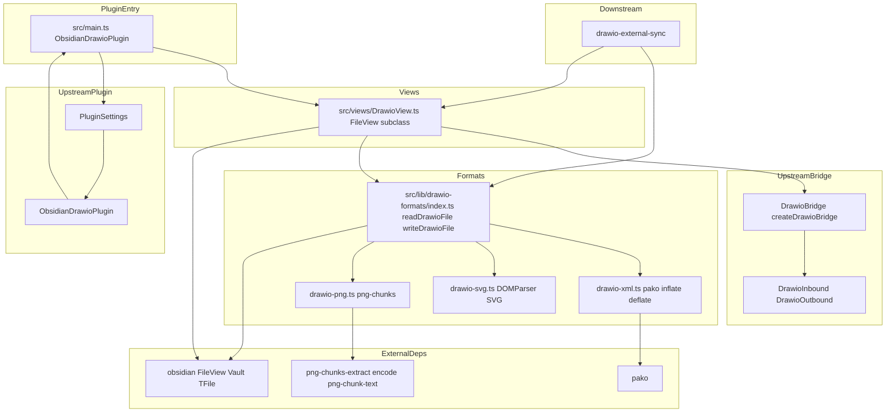
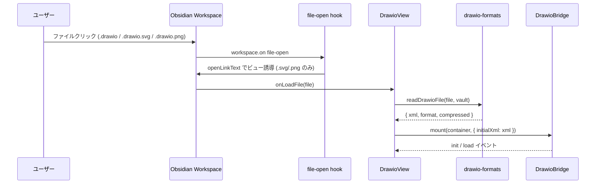
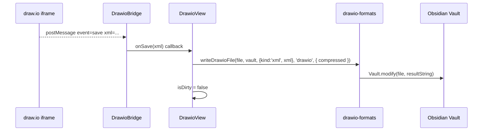
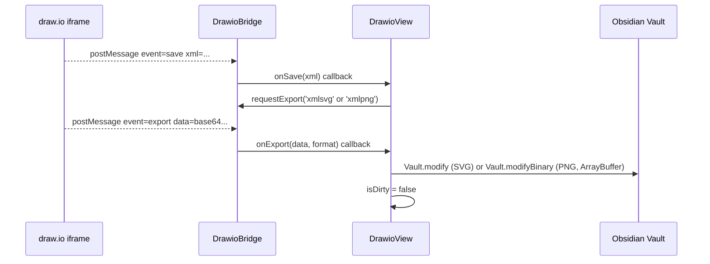

# Design Document: drawio-file-io

## Overview

`drawio-file-io` は Obsidian Vault 内の `.drawio` / `.drawio.svg` / `.drawio.png` ファイルを draw.io エディタで開いて編集・保存できる `FileView` サブクラス (`DrawioView`) と、3 形式の読み書きを担う純粋関数ライブラリを提供する。

**Purpose**: Vault 内 drawio ファイルのライフサイクル全体（登録・読み込み・編集・保存）を Obsidian 内で完結させ、外部アプリへの離脱を不要にする。  
**Users**: Obsidian Desktop ユーザー（閲覧・編集）と後続 spec の実装者（`drawio-external-sync` などが純粋関数 API を利用する）。  
**Impact**: `plugin-foundation` の `ObsidianDrawioPlugin.onload()` に `registerView` / ファイルオープン hook を追加し、`src/views/` と `src/lib/drawio-formats/` に新規ファイルを作成する。既存 `DrawioBridge` への破壊変更はない。

### Goals

- 3 形式の往復可能な読み書きを実装する（XML 圧縮維持 / SVG content 属性・mxfile 子要素 / PNG zTXt mxfile チャンク）
- `DrawioView` が draw.io エディタを iframe で表示し、保存イベントを受けて Vault に書き戻せる状態を確立する
- `readDrawioFile` / `writeDrawioFile` を `drawio-external-sync` が再利用できる形で公開する
- PNG / SVG が画像としても有効であることを保証する

### Non-Goals

- drawio webapp / iframe 自体の構築（drawio-embed-bridge 担当）
- 設定 UI（drawio-settings-and-config 担当）
- per-diagram 設定永続化（drawio-settings-and-config 担当）
- `.vsdx` などの追加形式
- 図のサムネイル生成
- 外部変更検知ロジック本体（drawio-external-sync 担当）

## Boundary Commitments

### This Spec Owns

- `src/views/DrawioView.ts` — `FileView` サブクラス（onLoadFile / onUnloadFile / isDirty / reload）
- `src/lib/drawio-formats/drawio-xml.ts` — `.drawio` reader/writer（pako 圧縮判定・inflate/deflate）
- `src/lib/drawio-formats/drawio-svg.ts` — `.drawio.svg` reader/writer（SVG content 属性・mxfile 子要素）
- `src/lib/drawio-formats/drawio-png.ts` — `.drawio.png` reader/writer（png-chunks-extract / png-chunk-text）
- `src/lib/drawio-formats/index.ts` — `readDrawioFile` / `writeDrawioFile` 公開 API（純粋関数）
- `src/main.ts` への `registerView` / `file-open` hook 追加（グルーコード）
- `src/lib/settings.ts` への `openDrawioPng`, `openDrawioSvg`, `preserveCompression` フィールド追加（**legacy トップレベルとして追加**。`drawio-settings-and-config` spec の `migrateSettings` が後段で `drawio.openDrawioSvg` / `drawio.openDrawioPng` / `drawio.compression` 名前空間に吸収する。本 spec の DrawioView は `settings.drawio.openDrawioSvg` / `settings.drawio.openDrawioPng` / `settings.drawio.compression` (= `preserveCompression` の継承先) を読み出すこと)
- `pako` / `png-chunks-extract` / `png-chunks-encode` / `png-chunk-text` の依存追加

### Out of Boundary

- `DrawioBridge` の実装・改変（drawio-embed-bridge）
- 設定 UI の実装（drawio-settings-and-config）
- 外部変更検知・reload 呼び出しロジック（drawio-external-sync）
- Vault 外の PNG / SVG の整合性検証

### Allowed Dependencies

- `plugin-foundation`: `ObsidianDrawioPlugin`, `PluginSettings` (拡張のみ), `ReactMountManager`
- `drawio-embed-bridge`: `DrawioBridge` (createDrawioBridge), `DrawioInbound`, `DrawioOutbound`, `DrawioInboundExport`, `DrawioBridgeCallbacks`
- `obsidian` devDependencies: `FileView`, `TFile`, `Vault`, `WorkspaceLeaf`, `Plugin`, `Notice`
- `pako` (runtime bundle)
- `png-chunks-extract`, `png-chunks-encode`, `png-chunk-text` (runtime bundle)

### Required Upstream Changes (coordinated with drawio-embed-bridge)

This spec assumes a small, additive change to `drawio-embed-bridge` (which is already approved at `tasks-generated`):

- `DrawioOutboundExport.format` (in `src/lib/drawio-protocol.ts`) and the `DrawioBridge.requestExport` parameter shall be extended to the union `'png' | 'svg' | 'xml' | 'pdf' | 'xmlpng' | 'xmlsvg'`. `'xmlpng'` / `'xmlsvg'` are the standard drawio embed export formats that round-trip the editable mxfile XML inside the exported PNG/SVG binary.
- This change is **purely additive** (new union members, no behavioural change to existing members) and is therefore compatible with bridge's `Revalidation Triggers` (no other downstream consumer is broken).
- The bridge spec's `tasks.md` will gain a small follow-up task; the file-io spec's `tasks.md` declares an explicit `_Depends:_` marker on it so implementation order is enforced.

### Revalidation Triggers

- `DrawioBridge` の public API 変更 → `DrawioView` が再検証必要
- `DrawioInboundExport` / `DrawioOutbound` 型の変更 → `DrawioView` の save handler が再検証必要
- `PluginSettings` 型の破壊変更 → 本 spec のフィールド定義が再検証必要
- `readDrawioFile` / `writeDrawioFile` のシグネチャ変更 → `drawio-external-sync` が再検証必要
- `DrawioView.isDirty` / `DrawioView.reload` のシグネチャ変更 → `drawio-external-sync` が再検証必要
- **可視 UI 文字列の追加・変更時** (本 spec 所有ファイルの Notice / モーダル / エラー文言): plugin-i18n が管理する `src/lib/i18n/locales/{ja,en}.ts` を同時更新し、`pnpm verify:i18n` (または同等の検証スクリプト) を通すこと。新規ハードコード文字列はリリース前に必ず `t()` 化する。

## Architecture

### Architecture Pattern & Boundary Map



**依存方向**: `ExternalDeps` → `Formats` → `DrawioView` → `PluginEntry`  
`DrawioBridge` (bridge 層) は横断的に `DrawioView` から利用する

### Technology Stack

| 層 | ツール / バージョン | 役割 | 備考 |
|---|---|---|---|
| Plugin View | `obsidian` FileView | Vault ファイルを表示するビュー基底クラス | devDependencies |
| Format: XML | `pako` (MIT) | deflate/inflate、`.drawio` 圧縮 XML の読み書き | runtime bundle |
| Format: PNG | `png-chunks-extract` + `png-chunks-encode` + `png-chunk-text` (MIT) | PNG チャンク操作 | runtime bundle |
| Format: SVG | DOMParser (Web API) | SVG の content 属性 / mxfile 子要素解析 | ランタイム標準、追加依存なし |
| Language | TypeScript 6.x strict | 型定義、verbatimModuleSyntax | 既存スタック |

## File Structure Plan

### Directory Structure

```
src/
├── main.ts                              # registerView / file-open hook 追加 (変更)
├── views/
│   └── DrawioView.ts                   # FileView サブクラス (新規)
└── lib/
    ├── settings.ts                     # openDrawioPng / openDrawioSvg / preserveCompression 追加 (変更)
    └── drawio-formats/
        ├── index.ts                    # readDrawioFile / writeDrawioFile 公開 API (新規)
        ├── drawio-xml.ts               # .drawio reader/writer (新規)
        ├── drawio-svg.ts               # .drawio.svg reader/writer (新規)
        └── drawio-png.ts               # .drawio.png reader/writer (新規)
```

### Modified Files

- `src/main.ts` — `registerView('drawio', ...)` と `app.workspace.on('file-open', ...)` hook を `onload()` に追加
- `src/lib/settings.ts` — `PluginSettings` に `openDrawioPng: boolean`, `openDrawioSvg: boolean`, `preserveCompression: boolean` を追加し、`DEFAULT_SETTINGS` を更新
- `package.json` — `pako`, `png-chunks-extract`, `png-chunks-encode`, `png-chunk-text` を dependencies に追加; `@types/pako` を devDependencies に追加

## System Flows

### ファイルオープンフロー



### 保存フロー (.drawio)



### 保存フロー (SVG / PNG)



## Requirements Traceability

| 要件 | 概要 | コンポーネント | インターフェース |
|------|------|--------------|----------------|
| 1.1–1.5 | View 登録 / 拡張子ルーティング | ObsidianDrawioPlugin, DrawioView | registerView, file-open hook |
| 2.1–2.7 | 3 形式ファイル読み込み | DrawioXml, DrawioSvg, DrawioPng, FormatIndex | readDrawioFile |
| 3.1–3.7 | 3 形式ファイル保存 | DrawioView, FormatIndex | writeDrawioFile, requestExport |
| 4.1–4.5 | dirty フラグ / reload API / getCurrentXml / DRAWIO_VIEW_TYPE | DrawioView | isDirty, getCurrentXml, reload, DRAWIO_VIEW_TYPE |
| 5.1–5.5 | 純粋関数 API（view 内 + view 外向け writer） | FormatIndex, DrawioXml, DrawioSvg, DrawioPng | readDrawioFile, writeDrawioFile, writeDrawioSvgWithMxfile, writeDrawioPngWithMxfile |
| 6.1–6.5 | PNG/SVG 画像互換性 + round-trip 整合性 | DrawioPng, DrawioSvg | writeDrawioPngWithMxfile (chunk 保持), writeDrawioSvgWithMxfile (style/defs 保持) |
| 7.1–7.5 | 依存パッケージ追加 + license 互換 | package.json, research.md | — |
| 8.1–8.3 | bridge format upstream coordination | DrawioBridge (extension), DrawioView | requestExport('xmlpng' / 'xmlsvg') |

## Components and Interfaces

### コンポーネントサマリー

| コンポーネント | 層 | 役割 | 要件カバレッジ | 主要依存 (P0/P1) | Contracts |
|---|---|---|---|---|---|
| ObsidianDrawioPlugin (追加分) | Plugin Entry | registerView / file-open hook | 1.1–1.5, 7 | obsidian Plugin (P0) | Service |
| DrawioView | View | FileView サブクラス、mount/save/reload | 1, 3, 4 | DrawioBridge (P0), FormatIndex (P0) | Service, Event, State |
| FormatIndex | Lib | readDrawioFile / writeDrawioFile 公開 API | 2, 3, 5, 6 | DrawioXml, DrawioSvg, DrawioPng (P0) | Service |
| DrawioXml | Lib | .drawio 読み書き (pako) | 2.1, 2.2, 2.7, 3.1, 3.2 | pako (P0) | Service |
| DrawioSvg | Lib | .drawio.svg 読み書き | 2.3, 2.4, 3.3 | DOMParser (P0) | Service |
| DrawioPng | Lib | .drawio.png 読み書き | 2.5, 3.4, 6 | png-chunks-* (P0) | Service |

---

### Plugin Entry 層（追加分）

#### ObsidianDrawioPlugin — 追加コード

| フィールド | 詳細 |
|---|---|
| Intent | `onload()` で DrawioView を登録し、.drawio.svg / .drawio.png のファイルオープン hook を設置する |
| 要件 | 1.1, 1.2, 1.3, 1.4, 1.5 |

**Responsibilities & Constraints**

- `this.registerView('drawio', leaf => new DrawioView(leaf, this))` を `onload()` に追加する
- `this.registerExtensions(['drawio'], 'drawio')` で `.drawio` 拡張子をビューに紐付ける
- `this.app.workspace.on('file-open', ...)` で開かれたファイルの末尾が `.drawio.svg` / `.drawio.png` か判定し、`settings.drawio.openDrawioSvg` / `settings.drawio.openDrawioPng` が true の場合のみ drawio ビューへリダイレクトする (drawio-settings-and-config 適用後の名前空間。settings spec が未適用の段階では `migrateSettings` が legacy トップレベルから補完するため常に `settings.drawio.*` で参照可能)
- `onunload()` での cleanup は Obsidian が `registerView` / `registerExtensions` を自動解除する

**Contracts**: Service [x]

##### Service Interface

```typescript
// src/main.ts (追加部分のみ)

import { DrawioView, DRAWIO_VIEW_TYPE } from './views/DrawioView.ts';

// onload() 内:
this.registerView(DRAWIO_VIEW_TYPE, (leaf) => new DrawioView(leaf, this));
this.registerExtensions(['drawio'], DRAWIO_VIEW_TYPE);
this.registerEvent(
  this.app.workspace.on('file-open', (file) => {
    if (!file) return;
    if (file.name.endsWith('.drawio.svg') && this.settings.drawio.openDrawioSvg) {
      // leaf の view type を drawio に切り替える
    }
    if (file.name.endsWith('.drawio.png') && this.settings.drawio.openDrawioPng) {
      // leaf の view type を drawio に切り替える
    }
  })
);
```

**Implementation Notes**

- `.drawio.svg` / `.drawio.png` のリダイレクトは `leaf.setViewState({ type: DRAWIO_VIEW_TYPE, state: { file: file.path } })` で行う
- `registerEvent` を使うことで `onunload()` での自動解除が保証される

---

### View 層

#### DrawioView

| フィールド | 詳細 |
|---|---|
| Intent | `FileView` サブクラス。ファイルの読み込み・DrawioBridge の mount・保存処理・dirty 管理・reload を担う |
| 要件 | 1.1, 3.1–3.7, 4.1–4.3 |

**Responsibilities & Constraints**

- `getViewType()` は `DRAWIO_VIEW_TYPE = 'drawio'` を返す
- `onLoadFile(file)` で `readDrawioFile(file, this.app.vault)` を呼び、結果を `DrawioBridge.mount` / `DrawioBridge.load` に渡す
- `DrawioBridgeCallbacks.onSave` / `onAutosave` で `_lastXml` を更新し `_isDirty = true` をセット、その後 `writeDrawioFile` を呼ぶ。SVG/PNG の場合は先に `requestExport('xmlsvg' | 'xmlpng')` を呼んで `onExport` を待機する
- `isDirty` は autosave/save イベント受信後に `true`、書き込み成功後に `false` にセットする
- `getCurrentXml()` は `_lastXml`（save/autosave で更新される最新 XML、無ければ初期ロードした XML）を返す
- `reload(file, options?)` は `isDirty === false || options?.force === true` の場合のみ `readDrawioFile` → `DrawioBridge.load(xml)` を実行する。`isDirty === true` で `force` が無い場合は `Error('DrawioDirtyReloadError')` を reject する
- `onUnloadFile()` / `onClose()` で `DrawioBridge.dispose()` を呼び `_isDirty` をリセットする

**Dependencies**

- Inbound: `ObsidianDrawioPlugin` — `onload` から構築 (P0)
- Outbound: `DrawioBridge` (createDrawioBridge) — iframe 管理 (P0)
- Outbound: `FormatIndex` (readDrawioFile / writeDrawioFile) — 読み書き (P0)
- External: `obsidian` FileView, Vault, TFile, WorkspaceLeaf (P0)

**Contracts**: Service [x] / Event [x] / State [x]

##### Service Interface

```typescript
// src/views/DrawioView.ts

import type { TFile, WorkspaceLeaf } from 'obsidian';
import { FileView } from 'obsidian';
import type { ObsidianDrawioPlugin } from '../main.ts';

export const DRAWIO_VIEW_TYPE = 'drawio';

export class DrawioView extends FileView {
  private plugin: ObsidianDrawioPlugin;
  private bridge: DrawioBridge;
  private currentFormat: DrawioFormat | null = null;
  private currentCompressed = false;
  private _isDirty = false;
  private _lastXml: string | null = null;

  constructor(leaf: WorkspaceLeaf, plugin: ObsidianDrawioPlugin);

  getViewType(): string; // returns DRAWIO_VIEW_TYPE
  getDisplayText(): string; // returns file?.basename ?? 'drawio'

  async onLoadFile(file: TFile): Promise<void>;
  async onUnloadFile(file: TFile): Promise<void>;

  get isDirty(): boolean;

  /** drawio-external-sync が外部変更検知時に最新 XML を取得するための hook */
  getCurrentXml(): string | null;

  /** drawio-external-sync が呼び出す reload API。dirty かつ force=false なら DrawioDirtyReloadError */
  async reload(file: TFile, options?: { force?: boolean }): Promise<void>;
}

export class DrawioDirtyReloadError extends Error {
  constructor(message?: string) {
    super(message ?? 'DrawioView is dirty; reload requires { force: true }');
    this.name = 'DrawioDirtyReloadError';
  }
}
```

##### Event Contract

- 購読: `DrawioBridgeCallbacks.onSave(xml)` — draw.io からの save イベント
- 購読: `DrawioBridgeCallbacks.onAutosave(xml)` — draw.io からの autosave イベント
- 購読: `DrawioBridgeCallbacks.onExport(data, format)` — export 完了通知（SVG/PNG 保存時）
- 送信: `DrawioBridge.load(xml)` — 初期/リロード時の XML 送信

##### State Management

- State: `{ currentFormat, currentCompressed, isDirty }`
- Persistence: メモリのみ（DrawioView インスタンスのライフタイム）
- Concurrency: 単一スレッド、保存中に新たな save イベントが来た場合は queue せず最新 XML で上書き

**Implementation Notes**

- SVG/PNG の export 待機は Promise + タイムアウト（10 秒）で実装し、タイムアウト時は `Notice` を表示して失敗を記録する
- `onExport` が期待しないフォーマット（例: `format='xml'`）で呼ばれた場合は無視する
- `onUnloadFile` と `onClose` の両方で dispose を呼ぶが冪等に動作すること（DrawioBridge.dispose() は冪等保証済み）

---

### Lib 層: FormatIndex

#### FormatIndex

| フィールド | 詳細 |
|---|---|
| Intent | `readDrawioFile` / `writeDrawioFile` を公開する純粋関数 API。DrawioView と外部 spec の両方が利用する |
| 要件 | 2.1–2.7, 3.1–3.7, 5.1–5.4, 6.1–6.3 |

**Responsibilities & Constraints**

- ファイル拡張子から形式を判定し、適切な reader/writer を呼ぶ
- DOM / React / DrawioView への依存を持たない純粋関数として実装する
- `readDrawioFile` は常に `{ xml, format, compressed }` を返す（エラー時は fallback）

**Contracts**: Service [x]

##### Service Interface

```typescript
// src/lib/drawio-formats/index.ts

import type { TFile, Vault } from 'obsidian';

export type DrawioFormat = 'drawio' | 'drawio-svg' | 'drawio-png';

export interface ReadDrawioResult {
  xml: string;
  format: DrawioFormat;
  compressed: boolean;
}

export interface WriteDrawioOptions {
  compressed?: boolean;
}

/** drawio から export を経由した結果を Vault に書き込む際のペイロード */
export type WriteDrawioPayload =
  | { kind: 'xml'; xml: string }                  // .drawio
  | { kind: 'svg'; exportedSvg: string }          // .drawio.svg (drawio xmlsvg export)
  | { kind: 'png'; exportedPng: ArrayBuffer };    // .drawio.png (drawio xmlpng export)

export async function readDrawioFile(
  file: TFile,
  vault: Vault,
): Promise<ReadDrawioResult>;

export async function writeDrawioFile(
  file: TFile,
  vault: Vault,
  payload: WriteDrawioPayload,
  format: DrawioFormat,
  options?: WriteDrawioOptions,
): Promise<void>;

// 形式別 pure helper は drawio-external-sync が view 外で呼ぶことを想定し re-export する
export { readDrawioXml, writeDrawioXml } from './drawio-xml.ts';
export { readDrawioSvg, writeDrawioSvgWithMxfile } from './drawio-svg.ts';
export { readDrawioPng, writeDrawioPngWithMxfile } from './drawio-png.ts';
```

- Preconditions: `file` は Vault 内に存在する TFile。`payload.kind` は `format` と一致する (`'drawio' ↔ 'xml'`, `'drawio-svg' ↔ 'svg'`, `'drawio-png' ↔ 'png'`)
- Postconditions: `readDrawioFile` は常に `DrawioFormat` のいずれかを返す（未知の場合は `'drawio'` にフォールバック）
- Invariants:
  - PNG 書き込みは必ず `Vault.modifyBinary(file, ArrayBuffer)` を使用し、string 変換を経由しない
  - SVG / 平文 XML 書き込みは `Vault.modify(file, string)` を使用する
  - `payload.kind` と `format` の不一致は TypeScript 型レベル＋ランタイム early throw で防ぐ

---

### Lib 層: DrawioXml

#### DrawioXml

| フィールド | 詳細 |
|---|---|
| Intent | `.drawio` ファイルの read/write。pako を使った圧縮 XML の inflate/deflate と、平文 XML の pass-through を行う |
| 要件 | 2.1, 2.2, 2.7, 3.1, 3.2 |

**Contracts**: Service [x]

##### Service Interface

```typescript
// src/lib/drawio-formats/drawio-xml.ts

export interface DrawioXmlReadResult {
  xml: string;
  compressed: boolean;
}

export function readDrawioXml(content: string): DrawioXmlReadResult;
// content: Vault.read() で得たテキスト文字列
// compressed: true の場合、<diagram> 内容が Base64+pako 圧縮されていたことを示す

export function writeDrawioXml(xml: string, compressed: boolean): string;
// compressed: true の場合 xml を pako deflateRaw → Base64 → <mxfile><diagram>...</diagram></mxfile> に包む
// compressed: false の場合 xml をそのまま返す
```

**Implementation Notes**

- `readDrawioXml`: まず `xml.trimStart().startsWith('<mxfile')` を確認し、`<diagram` 要素の text content が Base64 文字列か確認する
- `pako.inflateRaw(Uint8Array)` → `TextDecoder` で UTF-8 デコード
- `writeDrawioXml` (compressed): `TextEncoder` → `pako.deflateRaw` → `btoa`

---

### Lib 層: DrawioSvg

#### DrawioSvg

| フィールド | 詳細 |
|---|---|
| Intent | `.drawio.svg` ファイルの XML 抽出。`content` 属性 (Base64 mxfile) と `<mxfile>` 子要素の両系統に対応する |
| 要件 | 2.3, 2.4, 2.7, 3.3 |

**Contracts**: Service [x]

##### Service Interface

```typescript
// src/lib/drawio-formats/drawio-svg.ts

export function readDrawioSvg(svgContent: string): string;
// svgContent: Vault.read() で得た SVG テキスト
// 戻り値: mxfile XML 文字列。抽出失敗時は '<mxGraphModel/>'

export function writeDrawioSvgWithMxfile(
  existingSvg: string,
  newMxfileXml: string,
): string;
// 既存 SVG の `content` 属性 (なければ最後の手段として `<mxfile>` 子要素) のみを差し替えて返す。
// `<style>` / `<defs>` / 他の attribute / 子要素は破壊しない。drawio-external-sync が
// view 外で SVG を更新するときに使う（drawio export を経由しない write 経路）。
// 通常の view 経由 save はこの関数を使わず drawio の `format:'xmlsvg'` export 結果を
// そのまま Vault.modify に書き込む。
```

**Implementation Notes**

- `readDrawioSvg`: DOMParser を使い、`svg.getAttribute('content')` → URL-decode → `atob` → XML 抽出。`content` 属性がない場合は `svg.querySelector('mxfile')` の outerHTML を返す
- `writeDrawioSvgWithMxfile`: DOMParser で SVG を解析 → 既存 `content` 属性があればそれを `btoa(newMxfileXml)` で更新; 無ければ既存 `<mxfile>` 子要素を新しい XML パース結果で置き換え; どちらも無ければ `<svg>` 直下に `<mxfile>` 子要素を追加。`XMLSerializer` で出力

---

### Lib 層: DrawioPng

#### DrawioPng

| フィールド | 詳細 |
|---|---|
| Intent | `.drawio.png` ファイルの zTXt `mxfile` チャンクから XML を抽出する |
| 要件 | 2.5, 2.7, 3.4, 6.1–6.3 |

**Contracts**: Service [x]

##### Service Interface

```typescript
// src/lib/drawio-formats/drawio-png.ts

export function readDrawioPng(buffer: ArrayBuffer): string;
// buffer: Vault.readBinary() で得た ArrayBuffer
// 戻り値: mxfile XML 文字列。チャンクなし時は '<mxGraphModel/>'

export function writeDrawioPngWithMxfile(
  existingPng: ArrayBuffer,
  newMxfileXml: string,
): ArrayBuffer;
// 既存 PNG の `mxfile` キーを持つ tEXt/zTXt チャンクのみを差し替え（無ければ IEND の直前に挿入）
// IHDR, IDAT, IEND, pHYs, sRGB その他のチャンクは byte-for-byte 維持。
// drawio-external-sync が view 外で PNG を更新するときに使う（drawio export を経由しない write 経路）。
// 通常の view 経由 save はこの関数を使わず drawio の `format:'xmlpng'` export 結果 ArrayBuffer を
// そのまま Vault.modifyBinary に書き込む。
```

**Implementation Notes**

- 読み込み: `pngChunksExtract(new Uint8Array(buffer))` → `{ name, data }[]` を走査
- `name === 'zTXt'` または `'tEXt'` かつ `pngChunkText.decode(data).keyword === 'mxfile'` のチャンクを探し、`text` を返す
- drawio の `format:'xmlpng'` export は mxfile チャンク埋め込み済みバイナリを返すため、view 経由 save は `Vault.modifyBinary(exportedBuffer)` を直接呼ぶ
- `writeDrawioPngWithMxfile`: チャンク配列を取得 → 既存 `mxfile` チャンクを `pngChunkText.encode('mxfile', newMxfileXml)` で生成したものに in-place 置換、無い場合は IEND チャンクの直前に挿入 → `pngChunksEncode(chunks)` → `ArrayBuffer` で返す。**チャンク順序は IHDR を先頭、IEND を末尾に固定**

---

## Data Models

### Domain Model

```
DrawioFormat = 'drawio' | 'drawio-svg' | 'drawio-png'

ReadDrawioResult {
  xml: string         // mxfile XML (平文)
  format: DrawioFormat
  compressed: boolean // .drawio のみ有効。圧縮形式だったか
}

WriteDrawioOptions {
  compressed?: boolean  // .drawio 書き込み時の圧縮指定
}
```

### PluginSettings 追加フィールド

```typescript
// src/lib/settings.ts への追加 (legacy トップレベルフィールド)
// plugin-foundation が空 interface で公開する `PluginSettings` を declaration merging で拡張する。
// `[key: string]: unknown` のような index signature は使わない (any 化を招き型補完を弱めるため)。
declare module './settings' {
  interface PluginSettings {
    openDrawioSvg: boolean;    // default: true — .drawio.svg を drawio ビューで開く
    openDrawioPng: boolean;    // default: true — .drawio.png を drawio ビューで開く
    preserveCompression: boolean; // default: true — .drawio の圧縮形式を維持する
  }
}

// DEFAULT_SETTINGS (plugin-foundation で定義) に本 spec のデフォルトをマージする
Object.assign(DEFAULT_SETTINGS, {
  openDrawioSvg: true,
  openDrawioPng: true,
  preserveCompression: true,
} satisfies Pick<PluginSettings, 'openDrawioSvg' | 'openDrawioPng' | 'preserveCompression'>);
```

> 備考: 本 spec が追加するこの 3 フィールドは legacy トップレベルとして残るが、`drawio-settings-and-config` spec の `migrateSettings` がロード時に `drawio.openDrawioSvg` / `drawio.openDrawioPng` / `drawio.compression` 名前空間下に吸収する。コンシューマは migration 後に `settings.drawio.*` を参照する。

## Error Handling

### Error Strategy

- `readDrawioFile` がパース失敗: `{ xml: '<mxGraphModel/>', format: 'drawio', compressed: false }` を返し `console.warn` でログ
- `writeDrawioFile` の Vault I/O 失敗: `console.error` + Obsidian `new Notice('...')` で通知、`_isDirty` を `true` に維持（ユーザが再保存を試みられるように）
- SVG/PNG export タイムアウト（10 秒）: `console.error` + `Notice` 表示、`isDirty` を `true` に維持
- `DrawioBridge.requestExport` に対し期待外の format で `onExport` が呼ばれた場合: 無視してログ
- `Vault.modifyBinary` に string を渡す実装ミスは TypeScript `ArrayBuffer` 型と `WriteDrawioPayload` discriminated union で静的に防ぐ
- `reload` が dirty 状態かつ `force` 未指定で呼ばれた場合: `DrawioDirtyReloadError` を reject; in-memory state は変更しない

### Error Categories

- **System Error**: Vault I/O エラー → `console.error` + `Notice`
- **Parse Warning**: 形式不明 / チャンクなし → fallback XML を使用、`console.warn`
- **Timeout**: SVG/PNG export 未応答 → `Notice` 表示、保存未完了として維持

## Testing Strategy

### 単体テスト

- `readDrawioXml`: 平文 XML・圧縮 Base64 の両パターンで正しい XML と `compressed` フラグを返すことを確認
- `writeDrawioXml`: `compressed: true` で Base64+pako 形式になること、`compressed: false` で平文が返ることを確認
- `readDrawioXml ↔ writeDrawioXml` round-trip: 圧縮入力 → 復元 → 再圧縮の往復で意味的に等価な XML が得られることを確認
- `readDrawioSvg`: `content` 属性あり・`<mxfile>` 子要素あり・両方なしの 3 パターンで正しい XML を返すことを確認
- `writeDrawioSvgWithMxfile`: `<style>` / `<defs>` / 属性を含む SVG に対し、それらが破壊されず `mxfile` だけが置換されることを確認
- `readDrawioPng`: `mxfile` zTXt チャンクを含む PNG バッファから XML を抽出できることを確認
- `writeDrawioPngWithMxfile`: 既存 PNG の IHDR/IDAT/IEND/pHYs 等を byte-for-byte 維持し `mxfile` チャンクのみ差し替わることを確認、IHDR が先頭・IEND が末尾を維持していることを検証

### 統合テスト（手動）

- `.drawio` ファイルをクリックすると drawio ビューが開くことを確認
- `.drawio.svg` ファイルをクリックすると drawio ビューが開き、SVG 内の図形が表示されることを確認
- `.drawio.png` ファイルをクリックすると drawio ビューが開き、PNG 内の図形が表示されることを確認
- 編集後 Ctrl+S で保存し、ファイルサイズ・形式（PNG/SVG）が維持されていることを確認
- 保存後のファイルを `` タグや Obsidian の `![[...]]` 埋め込みで表示できることを確認
- `settings.drawio.openDrawioPng: false` にした場合、`.drawio.png` が組み込み image view で開くことを確認

### ビルド検証

- `pnpm build` 後に `dist/main.js` に `pako`, `png-chunks-extract` が含まれていることを確認（external に含まれていないことを確認）

## Optional Sections

### Security Considerations

- `DOMParser` で SVG を解析する際は DOM への挿入を行わないため XSS リスクはない
- `readDrawioFile` の戻り値 xml はそのまま draw.io iframe に postMessage で送るが、iframe は sandbox 済み
- `innerHTML` 禁止ルールへの準拠: 本 spec のコードは DOM 操作に `createElement` のみ使用する

### Migration Strategy

- `PluginSettings` 型拡張は後方互換あり（`DEFAULT_SETTINGS` にフォールバック）。既存ユーザーの `data.json` に追加フィールドがなくてもデフォルト値で動作する
