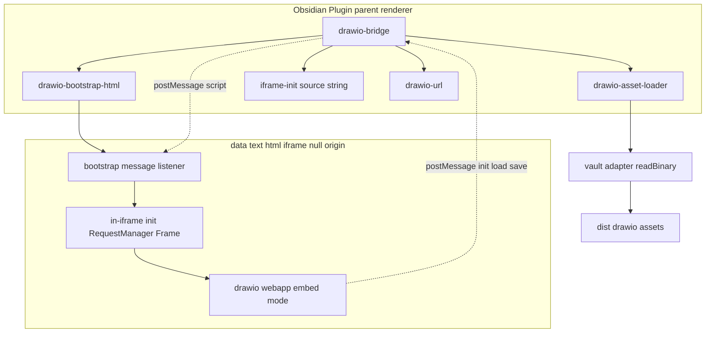
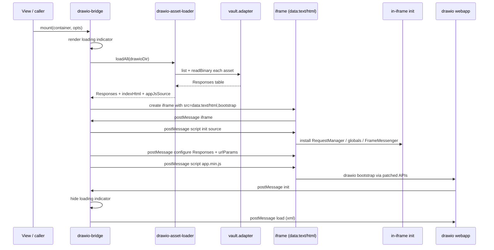
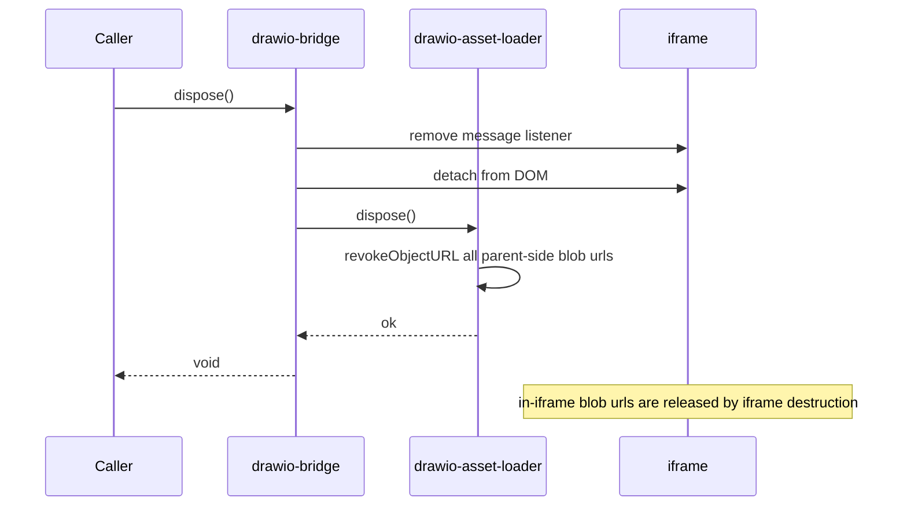
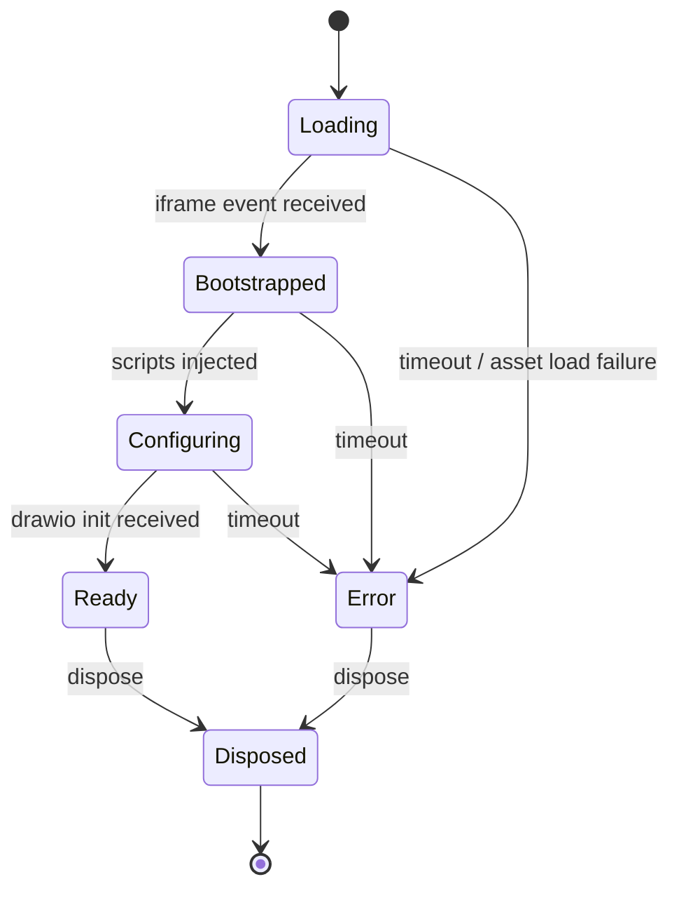

# Design Document: drawio-iframe-resource-serving

## Overview

**Purpose**: 本 spec は、Obsidian デスクトップにおいて drawio embed iframe が必要とする全 sub-resource (HTML / JS / CSS / 画像 / フォント) を確実にロードするためのリソース配信戦略を再設計する。現状の `app://[hash]/.../drawio/index.html` 経由のサブリソース取得は Obsidian 内部の `webRequest` フィルタによってブロックされ、drawio webapp が embed mode として bootstrap できない。本設計では、iframe ソースを `data:text/html,` で構成した最小ブートストラップに置き換え、parent から postMessage で初期化スクリプトと drawio webapp 本体を逐次注入し、in-iframe では DOM API (`HTMLLinkElement`/`HTMLScriptElement`/`HTMLImageElement` の `setAttribute` と `style` Proxy、`XMLHttpRequest.open`) をパッチして全リソース取得を Blob URL に解決する方式を採用する。

**Users**: Obsidian デスクトップ (macOS) で `.drawio` ファイルを編集するエンドユーザー、および iframe 依存の E2E テストを green に保つ品質保証担当が直接の受益者となる。

**Impact**: `src/lib/drawio-bridge.ts` の `mount` / `dispose` 内部の iframe 生成・破棄ロジックが差し替わる。新規に in-iframe 用の独立 Vite エントリ (`src/iframe/init/index.ts`) を導入し、IIFE ビルドした成果物を本体バンドルへ `?raw` で取り込む。公開シンボル (`DrawioBridge` 型、`createDrawioBridge`、`buildDrawioUrl`、各 postMessage イベント・アクション名) は不変。`vite.config.ts` は multi-entry 化と Apache-2.0 NOTICE / CHANGES の追加コピーを行う。`automated-testing` の iframe 依存 3 spec が `test.fixme` を解除した状態で実機 green になる。

### Goals

- iframe 内の drawio webapp が静的・動的を問わず全サブリソースを取得して embed mode の `init` postMessage を parent に到達させる (Requirements 1.1, 1.2)。
- `DrawioBridge` 公開 API および postMessage プロトコル契約を破壊変更しない (Requirements 2.1, 2.2, 2.3)。
- Obsidian Community Plugin Guidelines (innerHTML 禁止 / 外部 CDN 禁止 / `onunload` 完全 cleanup / Apache-2.0 同梱) に適合する (Requirements 3.1〜3.4)。
- iframe 依存 E2E (`drawio-iframe-init` / `three-formats-roundtrip` / `external-sync-reload`) を `test.fixme` 解除して macOS デスクトップで green 化する (Requirements 5.1〜5.3)。

### Non-Goals

- `vendor/drawio` 配下のソース改変。in-iframe からのパッチで対応可能な範囲のみで対処する。
- Mobile / Linux / Windows 対応。manifest が desktop-only 前提のためスコープ外。
- drawio-bridge の postMessage プロトコル契約の変更。event/action 名・payload 形状はすべて維持する。
- `theme-follow` E2E spec の skip 解除。UI セレクタ確定は別 follow-up とする。
- 起動時アセット I/O のキャッシュ機構導入。性能課題が顕在化したら別 spec で扱う (research.md 参照)。

## Boundary Commitments

### This Spec Owns

- iframe ソース構築 (`data:text/html,` 最小ブートストラップ) と postMessage によるスクリプト注入シーケンス。
- in-iframe で動作する初期化コード (DOM API パッチ、`mxLoadResources=false` 等のグローバル設定、Frame messenger) のソース・ビルド・本体バンドルへの取り込み経路。
- parent 側のアセットローダ (`vault.adapter.readBinary` でアセットを読み出し Responses 表を構築する責務)。
- `src/lib/drawio-bridge.ts` の `mount` / `dispose` 経路における iframe 生成・破棄ロジックの内部実装。
- bridge dispose 時に発行済 Blob URL (parent 側および in-iframe 側) を完全に解放する責務。
- ビルド成果物 (`dist/`) における Apache-2.0 ライセンス・NOTICE・CHANGES の同梱方針。
- iframe 依存 E2E (`drawio-iframe-init` / `three-formats-roundtrip` / `external-sync-reload`) の `test.fixme` 解除と緑化検証。

### Out of Boundary

- `DrawioBridge` 公開 API・型定義・postMessage プロトコルの意味的変更。
- `vendor/drawio` 配下のソース改変。
- drawio webapp 内部のパレット / 図形操作の自動化シナリオ。
- `theme-follow` E2E の UI セレクタ確定。
- Mobile / Linux / Windows 動作確認。
- アセット I/O キャッシュ層、外部 HTTP 配信、Service Worker 経由配信。
- 本 spec で導入する in-iframe 初期化コード以外の任意プラグイン拡張 (drawio plugin API 等)。

### Allowed Dependencies

- `obsidian` 公開 API: `App.vault.adapter.readBinary` / `exists` / `list`、`Plugin` ライフサイクル (`onload` / `onunload`)、`normalizePath`。
- 既存 `src/lib/drawio-bridge.ts` の公開シンボル (型定義は変更不可)。
- 既存 `src/lib/drawio-url.ts` の `buildDrawioUrl`。生成したクエリは in-iframe `window.urlParams` に直接設定する形へ転用する。
- Vite 8 の multi-entry ビルド機能、`?raw` import、`vite-plugin-static-copy` (既存)。
- ブラウザ標準 API: `Blob`, `URL.createObjectURL`, `URL.revokeObjectURL`, `postMessage`, `Proxy`, `Reflect`, `XMLHttpRequest`。

### Revalidation Triggers

- `DrawioBridge` interface または callback 型 (`DrawioBridgeCallbacks`) のシグネチャ変更 → drawio-file-io / drawio-settings-and-config / drawio-external-sync の再検証が必要。
- postMessage の event 名 / action 名 / payload 形状の変更 → 同上。
- iframe `sandbox` 属性の構成変更 → drawio-file-io の保存・export 経路の再検証が必要 (`allow-downloads` 撤去等)。
- `vendor/drawio` 同梱バージョンの更新 → in-iframe パッチが想定する DOM API / XHR 経路との互換確認が必要。
- in-iframe 初期化スクリプトのインターフェース (注入順、パッチ対象 API、`Responses` 表のスキーマ) の変更 → bridge 側との同期再確認が必要。
- 起動時アセット I/O の前提変更 (例: 部分ロードへ移行) → E2E のタイムアウト・初期化シーケンスの再調整が必要。

## Architecture

### Existing Architecture Analysis

- `src/lib/drawio-bridge.ts` は `createDrawioBridge(app, pluginDir?)` を公開し、`DrawioBridge` を返す。`mount(container, opts)` 内部で `iframe` 要素を生成し、`app.vault.adapter.getResourcePath(...drawio/index.html)` の戻り値を `src` に設定。`sandbox="allow-scripts allow-same-origin allow-downloads"` を付与。`buildDrawioUrl(basePath, opts)` でクエリ (`embed=1&proto=json` 等) を付与。
- `src/main.ts` は Plugin lifecycle の `onload` / `onunload` を持ち、`disposers` 配列で副作用を逆順 cleanup する既存パターンを採用。新規 cleanup は同パターンに沿う。
- ビルドは `vite.config.ts` で `viteStaticCopy` を用い `vendor/drawio/src/main/webapp/**/*` を `dist/drawio/` に、`vendor/drawio/LICENSE` を `dist/drawio/LICENSE` に配置済。
- Bridge の API 表面は drawio-file-io / drawio-settings-and-config / drawio-external-sync が import している。`DrawioBridge` interface のメソッド集合および `DrawioInbound` / `DrawioOutbound` / `DrawioInboundExport` / `DrawioBridgeCallbacks` 型は変更不可。

### Architecture Pattern & Boundary Map



**Architecture Integration**:
- Selected pattern: `data:text/html,` minimal bootstrap + parent → iframe postMessage script injection + in-iframe DOM API patching for resource interception (research.md の Architecture Pattern Evaluation 参照)。
- Domain/feature boundaries:
  - `drawio-bridge` は orchestration とライフサイクル。iframe DOM の生成・破棄、Frame messenger、postMessage 中継、loading/error 状態管理を担当。
  - `drawio-asset-loader` は parent 側の I/O。`vault.adapter.readBinary` で `dist/drawio/` 配下を列挙・読み出し、Responses 表 (`{ mediaType, href, source }[]`) を構築する。
  - `drawio-bootstrap-html` は `data:text/html,<encoded>` 用の固定テンプレート文字列を生成する純関数。
  - `drawio-url` (既存) は `buildDrawioUrl` 由来クエリを `Record<string, string>` に変換する関数のみ提供。
  - `iframe-init` (新規 entry `src/iframe/init/index.ts`) は in-iframe で動作する初期化コード一式 (RequestManager / Frame / globals / FrameMessenger)。Vite multi-entry で `dist/iframe-init.js` に IIFE ビルド。本体バンドルは `?raw` import で文字列として取り込む。
- Existing patterns preserved: `disposers` 配列による cleanup、Plugin lifecycle、`viteStaticCopy` ベースの asset 同梱、`tsconfig` strict mode と `verbatimModuleSyntax`。
- New components rationale:
  - `drawio-asset-loader.ts` — vault からのバイナリ読み出しと Responses 表構築を集約 (parent 側、Blob URL は発行しない)。
  - `drawio-bootstrap-html.ts` — `data:text/html,<encoded>` 用固定 HTML 文字列を生成する純関数。
  - `src/iframe/init/index.ts` (および分割される `request-manager.ts` / `frame-globals.ts`) — in-iframe コード。本体バンドルとはランタイム文脈が異なるため独立エントリ化。
- Steering compliance: `tech.md` の Type Safety / Oxc ツールチェーン、`structure.md` の `src/lib/` への配置、副作用 import なし。`erasableSyntaxOnly` を尊重し `enum` / `namespace` を使用しない。

### Technology Stack

| Layer | Choice / Version | Role in Feature | Notes |
|-------|------------------|-----------------|-------|
| Frontend / CLI | TypeScript 6 系 (strict + bundler resolution) | iframe 生成 / アセット読み出し / Responses 表構築 / postMessage 中継 / DOM API パッチ | 既存スタック (`tech.md`)。`any` 不可、`enum` 不可。 |
| Backend / Services | — | — | 不要 |
| Data / Storage | Obsidian Vault Adapter (`readBinary`, `list`) | drawio webapp バイナリの列挙と読み出し | `dist/drawio/` 配下に展開済アセット |
| Messaging / Events | `window.postMessage` (JSON) | parent ↔ iframe 通信 (script 注入 / drawio embed プロトコル) | origin `"*"` 送信、`event.source === iframe.contentWindow` で検証 |
| Infrastructure / Runtime | Vite 8 multi-entry + `vite-plugin-static-copy` | 本体バンドル / `dist/iframe-init.js` IIFE / drawio webapp / LICENSE / NOTICE / CHANGES の dist 配置 | manifest は desktop-only |

## File Structure Plan

### Directory Structure

```
src/
├── lib/
│   ├── drawio-bridge.ts            # 既存。mount/dispose 内部実装を差し替え (API は不変)
│   ├── drawio-asset-loader.ts      # NEW。dist/drawio/ を列挙し ArrayBuffer/Text を読み Responses 表を構築
│   ├── drawio-bootstrap-html.ts    # NEW。data:text/html,<encoded> 用最小 HTML を生成する純関数
│   └── drawio-url.ts               # 既存。クエリ生成のみ
├── iframe/
│   └── init/
│       ├── index.ts                # NEW。in-iframe エントリ。Vite multi-entry で IIFE ビルドされる
│       ├── request-manager.ts      # NEW。HTMLLinkElement/Script/Image/Style/XHR をパッチ
│       ├── frame-globals.ts        # NEW。mxLoadResources / mxscript / cookie / localStorage スタブ
│       └── frame-messenger.ts      # NEW。in-iframe 側 postMessage I/O (parent と同じプロトコル)
└── main.ts                         # 修正。bridge 利用箇所の cleanup 経路確認 (実装で必要があれば追記)
vite.config.ts                      # 修正。multi-entry (本体 + iframe-init)、NOTICE/CHANGES.md コピー追加
vendor/drawio/                      # 既存。読み取り専用
tests/e2e/
├── drawio-iframe-init.spec.ts      # 修正。test.fixme 解除
├── three-formats-roundtrip.spec.ts # 修正。test.fixme 解除
└── external-sync-reload.spec.ts    # 修正。test.fixme 解除
```

### Modified Files

- `src/lib/drawio-bridge.ts` — `mount` / `dispose` 内部の iframe 生成・破棄を差し替え。`getResourcePath` 由来の `app://` URL を撤廃し、`drawio-bootstrap-html` で生成した `data:text/html,...` を `iframe.src` に設定する。bootstrap からの `{event:"iframe"}` 受信を契機に in-iframe init source (本体バンドルに `?raw` で含む) と drawio app 本体 (asset-loader 経由で読出) を `{action:"script", script:...}` で順次注入する。`event.source === iframe.contentWindow` で全受信メッセージを検証。loading indicator と error 表示の状態機械を保持。`dispose` で asset-loader の cleanup と Blob URL revoke、message listener 解除、iframe DOM 切離しを行う。公開シンボル不変。
- `src/main.ts` — 既存の `disposers` パターンを維持。bridge 自体の cleanup は内部に閉じるため main.ts 側の追加変更は最小限 (実装中に必要が判明したら追記)。
- `vite.config.ts` — `build.rollupOptions.input` を multi-entry 化し、本体エントリ (`src/main.ts` 相当) と `src/iframe/init/index.ts` の 2 本を出力。in-iframe エントリは `format: 'iife'`、`output.entryFileNames: 'iframe-init.js'`。`viteStaticCopy` の対象に `vendor/drawio/NOTICE` を `dist/drawio/NOTICE` として追加し、本 spec で生成する `dist/drawio/CHANGES.md` (改変点記述) も同位置にコピー。本体バンドルは `?raw` import で `dist/iframe-init.js` を文字列として取り込めるよう、ビルド順序を「iframe-init → 本体」とする。
- `tests/e2e/drawio-iframe-init.spec.ts` / `three-formats-roundtrip.spec.ts` / `external-sync-reload.spec.ts` — `test.fixme` を `test` に置換。残存コメント (`FIXME: drawio iframe sub-resource ブロック`) を削除し、必要なら待機の見直し。

## Requirements Traceability

| Requirement | Summary | Components | Interfaces | Flows |
|-------------|---------|------------|------------|-------|
| 1.1 | 全サブリソース (静的・動的) のロード成功 | drawio-bridge, drawio-asset-loader, drawio-bootstrap-html, iframe-init/request-manager | `AssetLoader.loadAll`, `buildBootstrapHtml`, `RequestManager.interceptRequests` | iframe 起動シーケンス |
| 1.2 | `init` postMessage 到達 | drawio-bridge, iframe-init/frame-messenger | `DrawioBridge.mount`, `FrameMessenger` | iframe 起動シーケンス |
| 1.3 | サブリソース失敗時のエラー表示と cleanup 維持 | drawio-bridge, iframe-init/request-manager | `DrawioBridge.mount` の `error` 状態経路 | エラー表示シーケンス |
| 1.4 | MIME type 正しい配信 | drawio-asset-loader, iframe-init/request-manager | `Responses` 表 (`mediaType`) | — |
| 2.1 | API シグネチャ互換 | drawio-bridge | `DrawioBridge` interface 全メソッド | — |
| 2.2 | postMessage 契約維持 | drawio-bridge, iframe-init/frame-messenger | `DrawioInbound` / `DrawioOutbound` 型 | — |
| 2.3 | 既存テスト互換 | drawio-bridge | 既存ユニットテスト | — |
| 3.1 | innerHTML 禁止遵守 | drawio-bridge, drawio-bootstrap-html | `iframe.src = data:text/html,...`、`document.createElement` のみ | — |
| 3.2 | 外部 CDN 不使用 | drawio-asset-loader, iframe-init/request-manager | `vault.adapter.readBinary` のみ、`Responses` 表非ヒット時は警告のみ | — |
| 3.3 | onunload 完全 cleanup | drawio-bridge, drawio-asset-loader | `DrawioBridge.dispose`, `AssetLoader.dispose` | dispose シーケンス |
| 3.4 | Apache-2.0 同梱 | vite.config.ts (LICENSE/NOTICE/CHANGES) | ビルド成果物 | — |
| 4.1 | 配布物に必要全アセット同梱 | vite.config.ts, drawio-asset-loader | `viteStaticCopy` 設定 | — |
| 4.2 | ネットワークなしで起動可能 | drawio-asset-loader, iframe-init/request-manager | `vault.adapter.readBinary` のみ、外部 fallback 禁止 | — |
| 4.3 | vendor バージョン識別保持 | vite.config.ts | `dist/drawio/VERSION` | — |
| 5.1 | `drawio-iframe-init` E2E green | E2E spec, drawio-bridge | Playwright spec | — |
| 5.2 | `three-formats-roundtrip` E2E green | E2E spec, drawio-bridge | Playwright spec | — |
| 5.3 | `external-sync-reload` E2E green | E2E spec, drawio-bridge | Playwright spec | — |
| 5.4 | `theme-follow` は対象外 | — | — | — |
| 6.1 | `init` 未到達時のエラー表示 | drawio-bridge | mount 内タイムアウト経路 | エラー表示シーケンス |
| 6.2 | ロード中の進行表示 | drawio-bridge | mount 中の loading indicator 要素 | iframe 起動シーケンス |
| 6.3 | エラー状態でのファイル close 時 cleanup | drawio-bridge, drawio-asset-loader | `DrawioBridge.dispose` | dispose シーケンス |

## System Flows

### iframe 起動シーケンス (Requirements 1.1, 1.2, 6.2)



### dispose シーケンス (Requirements 3.3, 6.3)



### エラー表示シーケンス (Requirements 1.3, 6.1)



## Components and Interfaces

| Component | Domain/Layer | Intent | Req Coverage | Key Dependencies (P0/P1) | Contracts |
|-----------|--------------|--------|--------------|--------------------------|-----------|
| drawio-bridge | lib (orchestration) | iframe 生成・破棄、script 注入オーケストレーション、postMessage 中継、loading/error 状態管理 | 1.1, 1.2, 1.3, 2.1, 2.2, 2.3, 3.1, 3.3, 6.1, 6.2, 6.3 | drawio-asset-loader (P0), drawio-bootstrap-html (P0), iframe-init source (P0), drawio-url (P1) | Service, State |
| drawio-asset-loader | lib (I/O) | webapp アセットの列挙・読み出し、Responses 表 (`{mediaType, href, source}[]`) と `indexHtml`・`appJsSource` の供給 | 1.1, 1.4, 3.2, 3.3, 4.1, 4.2 | vault.adapter (P0) | Service |
| drawio-bootstrap-html | lib (pure) | `data:text/html,<encoded>` 用最小 HTML 文字列生成 | 1.1, 3.1 | — | Service |
| iframe-init/request-manager | iframe (in-iframe) | HTMLLinkElement/Script/Image/Style/XHR をパッチして相対 URL を Responses 表に基づき Blob URL に解決 | 1.1, 1.4, 3.2, 4.2 | Responses, ブラウザ DOM API (P0) | Service |
| iframe-init/frame-globals | iframe (in-iframe) | `mxLoadResources=false`、`mxscript`、`document.cookie`、`localStorage` のスタブ化、`window.urlParams` 設定 | 1.1, 3.1 | window globals (P0) | State |
| iframe-init/frame-messenger | iframe (in-iframe) | parent ↔ iframe の postMessage 入出力、`event.source` 検証 | 1.2, 2.2, 6.1 | window.postMessage (P0) | Event |
| iframe-init (entry) | iframe (build) | 上記 in-iframe モジュールを束ねた IIFE エントリ。本体バンドルへ `?raw` 文字列として取り込む | 1.1, 3.1 | Vite multi-entry (P0) | Batch |
| vite static copy | build | webapp / LICENSE / NOTICE / CHANGES / VERSION の dist 配置 | 3.4, 4.1, 4.3 | vite-plugin-static-copy (P0) | Batch |
| iframe E2E specs | tests | iframe 依存 E2E の green 化 | 5.1, 5.2, 5.3 | Playwright (P0) | — |

### lib (orchestration)

#### drawio-bridge

| Field | Detail |
|-------|--------|
| Intent | iframe 生成・破棄、script 注入オーケストレーション、postMessage 中継、loading/error 状態管理 |
| Requirements | 1.1, 1.2, 1.3, 2.1, 2.2, 2.3, 3.1, 3.3, 6.1, 6.2, 6.3 |

**Responsibilities & Constraints**
- 公開型 (`DrawioBridge`, `DrawioInbound`, `DrawioOutbound`, `DrawioInboundExport`, `DrawioBridgeCallbacks`, `DrawioUrlOptions` 経由のオプション) は変更しない。
- `mount` 内部で loading indicator を表示し、`AssetLoader.loadAll` → `buildBootstrapHtml` → `iframe.src = "data:text/html,..."` → `{event:"iframe"}` 受信 → `{action:"script", script: initSource}` 注入 → `{action:"configure", responses, urlParams}` 注入 → `{action:"script", script: appJsSource}` 注入 → drawio `{event:"init"}` 受信 → loading 解除、の順に進める。
- 各段で個別タイムアウト (default 5s/段、合計 15s 上限) を持ち、超過時は error 状態に遷移する。
- 受信メッセージは `event.source === iframe.contentWindow` で検証する。`event.origin` 文字列比較は行わない (`data:` は origin `null`)。
- `dispose` で iframe DOM・message listener・asset-loader をすべて解放する。

**Dependencies**
- Inbound: `src/main.ts` の `createDrawioBridge` 呼び出し (P0)。
- Outbound: `drawio-asset-loader` (P0)、`drawio-bootstrap-html` (P0)、in-iframe init source の `?raw` import (P0)、`drawio-url` (P1)。
- External: `obsidian` の `App` (P0)、ブラウザ `postMessage` / DOM API (P0)。

**Contracts**: Service [x] / API [ ] / Event [ ] / Batch [ ] / State [x]

##### Service Interface

```typescript
// 既存の公開シンボルは変更不可
export interface DrawioBridge {
  mount(container: HTMLElement, opts?: DrawioBridgeMountOptions): void;
  dispose(): void;
  load(xml: string, opts?: { autosave?: boolean }): void;
  replaceContent(xml: string): void;
  requestSave(opts?: { exit?: boolean }): void;
  requestExport(format: DrawioExportFormat, opts?: DrawioExportOptions): void;
  setTheme(theme: DrawioTheme): void;
  setLibraries(libraries: readonly string[]): void;
  sendMessage(msg: DrawioOutbound): void;
  readonly isMounted: boolean;
}

export type CreateDrawioBridge = (
  app: App,
  pluginDir?: string
) => DrawioBridge;
```

- Preconditions: `App` は Obsidian の `App` インスタンス。`pluginDir` 省略時はデフォルト解決を使用 (既存挙動維持)。
- Postconditions: `mount` 完了後、parent は drawio iframe からの `init` postMessage を受信できる。`dispose` 後に `isMounted === false`。
- Invariants: `dispose` 呼出後に内部 Blob URL がブラウザ memory に残らない。

##### State Management

- 状態: `idle` → `loading` → `bootstrapped` → `configuring` → `ready` または `error` → `disposed`。
- 永続化: なし (単一 mount セッション内)。
- 並行性: 同一 bridge インスタンスは同時に 1 mount のみ。多重 `mount` 呼び出しは既存挙動に従い直前の iframe を dispose してから再 mount。

**Implementation Notes**
- Integration: `src/main.ts` および drawio-file-io / drawio-settings-and-config / drawio-external-sync の既存呼び出しを維持。
- Validation: 既存ユニットテスト (API 契約) が green であること。`event.source === iframe.contentWindow` 検証で他 iframe のメッセージを誤受信しないこと。各段階のタイムアウトが期待通りに `error` へ遷移すること。
- Risks: `data:` iframe の `contentWindow` は src 設定直後 `about:blank` を経るため、`{event:"iframe"}` 受信を script 注入のトリガに用いる必要がある (parent 側の `setTimeout` 駆動は不可)。

### lib (I/O)

#### drawio-asset-loader

| Field | Detail |
|-------|--------|
| Intent | webapp アセットを列挙・読み出し、Responses 表・index.html・app.min.js テキストを供給する |
| Requirements | 1.1, 1.4, 3.2, 3.3, 4.1, 4.2 |

**Responsibilities & Constraints**
- 読み出し対象: `<pluginDir>/drawio/` 配下の必要アセット (`index.html` / `js/**` / `styles/**` / `images/**` / `resources/**` / `mxgraph/**` / `shapes/**` / `stencils/**` のうち drawio webapp が要求するもの)。`vault.adapter.list` で再帰列挙し、ファイル拡張子に基づき `mediaType` を決定。
- 読み出し元は Obsidian Vault Adapter のみ。外部 HTTP / `fetch` は使用しない。
- `Responses` 表は `{ mediaType: string; href: string; source: string }[]`。バイナリ (`image/*`, `font/*`) は base64 化、テキスト (`text/javascript`, `text/css`, `text/html`, `image/svg+xml`, `application/xml`) は UTF-8 文字列のまま。`mediaType` は `;base64` サフィックスでバイナリを示す (in-iframe 側 RequestManager と互換)。
- `indexHtml` と `appJsSource` (`js/app.min.js` 等の drawio app 本体) は別フィールドで返す。前者は bootstrap HTML 生成、後者は postMessage 注入用。
- parent 側では Blob URL は発行しない (Blob URL の発行は in-iframe RequestManager の責務)。

**Dependencies**
- Inbound: drawio-bridge (P0)。
- Outbound: `obsidian` の `App.vault.adapter.list` / `readBinary` / `read` (P0)。
- External: ブラウザ `btoa` / `TextDecoder` (P0)。

**Contracts**: Service [x] / API [ ] / Event [ ] / Batch [ ] / State [ ]

##### Service Interface

```typescript
export interface DrawioResponseEntry {
  readonly mediaType: string; // e.g. "text/javascript", "image/png;base64"
  readonly href: string;       // relative path, e.g. "js/main.js"
  readonly source: string;     // utf-8 text or base64 string
}

export interface DrawioAssetBundle {
  readonly responses: readonly DrawioResponseEntry[];
  readonly indexHtml: string;
  readonly appJsSource: string;
}

export interface DrawioAssetLoader {
  loadAll(): Promise<DrawioAssetBundle>;
  dispose(): void;
}

export type CreateDrawioAssetLoader = (
  adapter: DataAdapter,
  drawioDir: string
) => DrawioAssetLoader;
```

- Preconditions: `drawioDir` は `dist/drawio/` 配下に展開された vendor アセットを含むディレクトリへの vault 相対パス。`normalizePath` で正規化済。
- Postconditions: `loadAll` 完了時、`responses` に必要アセットが入り、`indexHtml` と `appJsSource` が文字列で取得できる。
- Invariants: `dispose` 後に保持していた一時バッファを解放する (Blob URL は持たないため revoke 不要)。

**Implementation Notes**
- Integration: drawio-bridge から mount 開始時に呼ばれる。
- Validation: 読み込みに失敗したアセットは `Promise.reject` ではなく `loadAll` の結果に `errors` を含める形で伝搬し、bridge 側がエラー UI に切り替える (Requirement 1.3)。`appJsSource` が空文字なら error 扱い。
- Risks: アセット数が多いため `Promise.all` で並列読出。ファイル一覧は再帰列挙だが、対象ディレクトリが過剰に深い場合の打ち切り条件は実装フェーズで決定。

### lib (pure)

#### drawio-bootstrap-html

| Field | Detail |
|-------|--------|
| Intent | `data:text/html,<encoded>` 用の最小 HTML 文字列を生成する純関数。中身は parent からの最初の postMessage を受信して `<script>` を head に挿入するリスナのみ |
| Requirements | 1.1, 3.1 |

**Responsibilities & Constraints**
- 入力なし (固定テンプレート) または `bootstrapEventName: string` のみ。出力は `string`。
- 戻り値の HTML は `<script>` 内で次を行う:
  1. `window.parent` に対し `postMessage` で `{event: "iframe"}` を送出。
  2. `window.addEventListener("message", ...)` で `{action: "script", script: <source>}` を受け取り、`document.createElement('script')` + `script.text = source` + `document.head.appendChild` で実行する。
  3. listener は永続。在野の追加スクリプト注入が継続できるよう `removeEventListener` は行わない (in-iframe init 自身が後段の handler を別途登録する)。
- bootstrap HTML にはユーザ入力を一切混ぜない。`encodeURIComponent` でエンコードし `data:text/html,...` に連結する。
- 関数は副作用なし (純関数)。

**Dependencies**
- Inbound: drawio-bridge (P0)。
- Outbound: なし。
- External: なし (ブラウザ API は呼ばない、戻り値を bridge が `iframe.src` に設定)。

**Contracts**: Service [x]

##### Service Interface

```typescript
export type BuildBootstrapHtml = () => string;
```

- Preconditions: なし。
- Postconditions: 戻り値はそのまま `data:text/html,<encodeURIComponent(returnValue)>` の形で `iframe.src` に渡せる HTML 文字列。
- Invariants: 同一引数 (引数なし) で常に同一文字列を返す。

**Implementation Notes**
- Integration: drawio-bridge `mount` 内で 1 回呼ぶだけ。
- Validation: ユニットテストで「`{event:"iframe"}` を `window.parent.postMessage` で送出する」「`message` listener が `{action:"script"}` を受け取り `<script>` を head に追加する」を文字列マッチで検証。
- Risks: bootstrap 文字列が `data:` URL の最大長 (Chromium で十分大きいが理論上限あり) を超えないようテンプレートはミニマムに保つ。

### iframe (in-iframe)

#### iframe-init/request-manager

| Field | Detail |
|-------|--------|
| Intent | 静的・動的問わず iframe 内のリソース取得 API をパッチし、相対 URL を Responses 表に基づき Blob URL に解決する |
| Requirements | 1.1, 1.4, 3.2, 4.2 |

**Responsibilities & Constraints**
- パッチ対象:
  - `HTMLLinkElement.prototype.setAttribute("href", ...)` および `href` プロパティ setter
  - `HTMLScriptElement.prototype.setAttribute("src", ...)` および `src` プロパティ setter
  - `HTMLImageElement.prototype.setAttribute("src", ...)` および `src` プロパティ setter
  - `HTMLElement.prototype.style` の Proxy 化により `url(...)` を含む CSS 値を傍受
  - `XMLHttpRequest.prototype.open(method, url, ...)` の URL 引数
- URL 判定:
  - `app://` / `data:` / `https?:` / `//` は素通し。
  - `#default#VML` 等の特殊識別子は素通し。
  - その他の相対 URL は Responses 表で照合。`mediaType` がバイナリ (`;base64`) の場合 source 長 1024 未満なら `data:` URL、それ以上なら `URL.createObjectURL` で Blob URL を生成しキャッシュ。
  - 表に存在しない URL は `console.warn` のみで握りつぶす (実機で発覚した時に追跡できるようにするため、外部 fallback は行わない)。
- パッチ済 Blob URL は `Map<originalHref, blobUrl>` でキャッシュ。dispose 時 (iframe 破棄時) に同 Map の値を `URL.revokeObjectURL` で解放する手段は in-iframe からは限定的だが、iframe 全体が DOM から外れて GC されればブラウザが回収するため明示 revoke は best-effort で行う。

**Dependencies**
- Inbound: iframe-init/index.ts (P0)。
- Outbound: window globals (P0)。
- External: `Blob`, `URL.createObjectURL`, `URL.revokeObjectURL`, `Proxy`, `Reflect` (P0)。

**Contracts**: Service [x]

##### Service Interface

```typescript
export interface RequestManager {
  interceptRequests(): void;
  /** best-effort: 発行済 Blob URL を revoke する */
  dispose(): void;
}

export type CreateRequestManager = (
  responses: readonly DrawioResponseEntry[]
) => RequestManager;
```

- Preconditions: `responses` は parent から `{action:"configure"}` で受け取った Responses 表。
- Postconditions: `interceptRequests` 呼出後、上記 5 経路すべてが Responses 表ベースで解決される。
- Invariants: 既存ハンドラ (drawio webapp が後から追加するもの含む) は破壊せず、setAttribute/setter のチェーンを経由する。

**Implementation Notes**
- Integration: iframe-init `index.ts` のエントリで `RequestManager.interceptRequests()` を最初に呼ぶ。
- Validation: ユニットテストは jsdom + manual mock で `link.setAttribute('href', 'js/main.js')` が `setAttribute` 内で Responses 由来 Blob URL に書換わることを検証。
- Risks: パッチが drawio webapp の prototype 拡張順序に依存する。`interceptRequests` を drawio app 本体注入より前に必ず実行する。

#### iframe-init/frame-globals

| Field | Detail |
|-------|--------|
| Intent | `mxLoadResources=false`、`mxscript` 上書き、`document.cookie` / `localStorage` スタブ化、`window.urlParams` 設定 |
| Requirements | 1.1, 3.1 |

**Responsibilities & Constraints**
- `Object.defineProperty` で `window.mxLoadResources = false`、`window.mxscript = loadScript`、`window.isLocalStorage = false`、`window.urlParams = <provided>` を設定。
- `document.cookie` を `value: ""` にスタブ (drawio が `data:` 由来の `null` origin で cookie 読込時に throw しないようにする)。
- `localStorage` を no-op オブジェクトに置換 (`getItem` / `setItem` / `removeItem` が console.warn のみ)。

##### Service Interface

```typescript
export interface InstallFrameGlobalsInput {
  urlParams: Readonly<Record<string, string>>;
  loadScript: (src: string, onLoad?: () => void) => void;
}

export type InstallFrameGlobals = (input: InstallFrameGlobalsInput) => void;
```

**Implementation Notes**
- Integration: `RequestManager.interceptRequests()` の直後、drawio app 本体注入の直前に呼ぶ。
- Validation: `window.mxLoadResources === false` / `typeof window.mxscript === 'function'` / `window.urlParams.embed === '1'` を smoke で確認。
- Risks: `Object.defineProperty` で `configurable: false` を設定すると後段で書換不可になる。default の `configurable: true` のみを使い、drawio webapp が同名グローバルに再代入する場合に備える。

#### iframe-init/frame-messenger

| Field | Detail |
|-------|--------|
| Intent | parent ↔ iframe の postMessage 入出力を抽象化し、`event.source` 検証を一元化する |
| Requirements | 1.2, 2.2, 6.1 |

**Responsibilities & Constraints**
- in-iframe 側: `window.addEventListener("message", ...)` で受信し JSON.parse、`event.source !== window.parent` のものは黙ってドロップ。送信は `window.parent.postMessage(JSON.stringify(msg), "*")`。
- parent 側 messenger は drawio-bridge 内部に閉じる (新規ファイルにはしない)。

##### Service Interface (in-iframe 側)

```typescript
export interface IframeFrameMessenger<TIn, TOut> {
  send(msg: TOut): void;
  /** 受信 handler を 1 つ登録する。複数登録は内部で配列にする */
  onMessage(handler: (msg: TIn) => void): () => void;
  destroy(): void;
}
```

**Implementation Notes**
- Integration: iframe-init/index.ts が起動時に 1 つだけ生成。`{action:"script"}` / `{action:"configure"}` / drawio embed プロトコル (load/save 等) すべてを同 messenger で処理する。
- Validation: smoke で送受信一往復が成立すること。
- Risks: drawio webapp が `window.opener` に対しても postMessage する場合は無視する (本 spec 範囲ではない)。

### iframe (build)

#### iframe-init (entry)

- `src/iframe/init/index.ts` がエントリ。`request-manager.ts` / `frame-globals.ts` / `frame-messenger.ts` を import し、起動シーケンス (RequestManager 起動 → bootstrap listener 上書き → parent からの `configure` 受信待ち → `urlParams` / Responses 反映 → 完了) を実行する。
- Vite multi-entry で `format: 'iife'`、`output.entryFileNames: 'iframe-init.js'`、`output.dir: 'dist'`。
- 本体バンドルは `import iframeInitSource from "../../dist/iframe-init.js?raw"` (相対パスは実装で決定) で文字列として取り込み、postMessage で iframe へ注入する。

### build

#### vite static copy

- 既存 `vite-plugin-static-copy` 設定を拡張し、`vendor/drawio/NOTICE` を `dist/drawio/NOTICE` に、本 spec で生成する `dist/drawio/CHANGES.md` (改変点記述) を追加コピー。`vendor/drawio/VERSION` は既存コピー対象に含まれるか確認し、なければ明示追加。

### tests

#### iframe E2E specs

- `tests/e2e/drawio-iframe-init.spec.ts`、`three-formats-roundtrip.spec.ts`、`external-sync-reload.spec.ts` の `test.fixme` を `test` に変更。
- 既存 `automated-testing` の `Drawio Frame Helper` を継続利用 (DOM + postMessage `init` の両方が確認できるまで待機する既存挙動を維持)。
- `theme-follow` は本 spec の合否判定対象に含めない (Requirement 5.4)。

## Error Handling

### Error Strategy

- アセット読み込み失敗 (`vault.adapter.list` / `readBinary` 例外、`appJsSource` 空) → bridge を `error` 状態に遷移させ、container 内に通知を表示。`onError` callback (既存型) が定義されていれば呼び出す (既存挙動の範囲)。
- 各段タイムアウト (`{event:"iframe"}` 5s / `init` 5s / 全体 15s) 超過 → 同上。
- 受信メッセージが `event.source !== iframe.contentWindow` → 黙ってドロップ。
- in-iframe RequestManager で Responses 非ヒット時 → 警告ログのみで握りつぶし、外部 fallback は行わない (オフライン要件 Requirement 4.2 の遵守)。

### Error Categories and Responses

- **User Errors**: 該当なし (本 spec はユーザ入力を扱わない)。
- **System Errors**: アセット読み込み失敗 / `init` 未到達 → loading 表示を停止しエラーメッセージを表示。`dispose` 経路で完全 cleanup。
- **Business Logic Errors**: 該当なし。

### Monitoring

- Obsidian の `console` に `drawio-bridge:` プレフィックス付きで失敗パスをログ。in-iframe 側は `drawio-frame:` プレフィックスでログ出力。Obsidian デスクトップでは DevTools を開けばユーザが確認可能。

## Testing Strategy

### Unit Tests

1. `drawio-bootstrap-html.buildBootstrapHtml` の戻り値が `{event:"iframe"}` を `window.parent.postMessage` する script を含むことを検証 (Requirement 1.1, 3.1)。
2. `drawio-asset-loader.loadAll` がバイナリファイルを base64、テキストファイルを UTF-8 として `Responses` に格納することを検証 (Requirement 1.4)。
3. `iframe-init/request-manager` の `resolveResourceUrl` が相対 URL を Responses 由来 Blob URL に変換し、外部 URL (`https://...`) を素通しすることを jsdom 環境で検証 (Requirement 1.1, 3.2)。
4. `drawio-bridge` の状態機械が各段タイムアウトで `error` に遷移することを fake timers で検証 (Requirement 6.1)。
5. `drawio-bridge.dispose` 後に内部 message listener と asset-loader が解放されることを検証 (Requirement 3.3)。

### Integration Tests

1. `createDrawioBridge` の `mount` → `dispose` 経路で iframe DOM が container に追加され、dispose 後に削除されることを検証 (Requirement 2.1, 3.3)。
2. mock iframe (`{event:"iframe"}` を即時 reply) に対して bridge が init script → configure → app script の順で `{action:"script"}` / `{action:"configure"}` を送信することを検証 (Requirement 1.2, 2.2)。
3. mock iframe からの `{event:"init"}` 受信で bridge が loading 状態を解除し、その後の `load` 呼び出しが `{action:"load", xml:...}` を送信することを検証 (Requirement 6.2, 2.2)。

### E2E Tests (Obsidian デスクトップ macOS)

1. `drawio-iframe-init.spec.ts` — `.drawio` を開き drawio iframe の `init` postMessage が parent に到達することを検証 (Requirement 5.1)。
2. `three-formats-roundtrip.spec.ts` — `.drawio` / `.drawio.svg` / `.drawio.png` の各形式で load → save round-trip が成立することを検証 (Requirement 5.2)。
3. `external-sync-reload.spec.ts` — vault 外で書き換えたファイルが iframe にリロードされることを検証 (Requirement 5.3)。

### Performance / Load

- 初回 mount 時間を E2E 上で実測し、Obsidian デスクトップ macOS で 5 秒以内に `init` 受信できることを目標とする。閾値超過が観測されたら research.md の Follow-up に従い遅延ロードを検討。

## Security Considerations

- iframe `sandbox` 属性は既存の `allow-scripts allow-same-origin allow-downloads` を維持する。`allow-same-origin` を保持することで postMessage の `event.source` 比較が同一プロセス内ハンドルで成立する。
- `data:` 由来の iframe origin は `null`。parent ↔ iframe の信頼関係は `event.source === iframe.contentWindow` の比較で確立する。`event.origin` 文字列比較は行わない。
- bootstrap HTML / 注入スクリプトには**ユーザ入力を一切混入させない**。`urlParams` は `buildDrawioUrl` 由来の固定 / 設定値のみ。
- 外部ネットワーク I/O は発生させない。アセットはすべて `vault.adapter` 経由でローカルから読み出す。Responses 非ヒット時の外部 fallback は禁止。
- in-iframe で `localStorage` / `document.cookie` をスタブ化することで drawio webapp による意図しないストレージ書き込みを抑制する。

## Performance & Scalability

- アセットは `Promise.all` で並列読み込み。読み込み件数のオーダーは数百ファイル想定。
- Blob URL は in-iframe 側 RequestManager のキャッシュ (`Map<href, blobUrl>`) のみ。iframe 破棄でブラウザ GC により回収される。明示 `revokeObjectURL` は best-effort で実装。
- 起動時 I/O が問題化したらキャッシュ層 / 部分ロードへの段階的移行を検討する (本 spec 範囲外、research.md Follow-up)。

## Migration Strategy

- 後方互換コードの残置は不要 (`app://` ベースの旧経路は削除)。
- 既存上位 spec の動作確認手順:
  1. `pnpm build && pnpm test` で型チェックと既存ユニットテストが green。`dist/iframe-init.js` が生成されていることを確認。
  2. Obsidian デスクトップ macOS 上で `.drawio` を開き drawio エディタが起動することを確認。
  3. iframe 依存 E2E 3 spec を実行し green を確認。
- ロールバック: bridge 内部実装と vite.config.ts、in-iframe 用ディレクトリの追加のみのため、当該コミットを revert すれば旧挙動に戻る。
