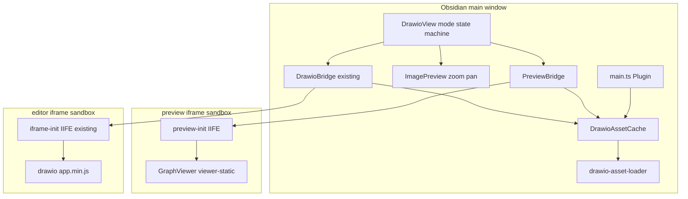
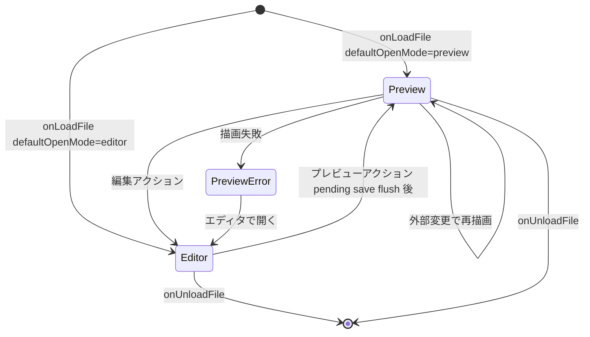
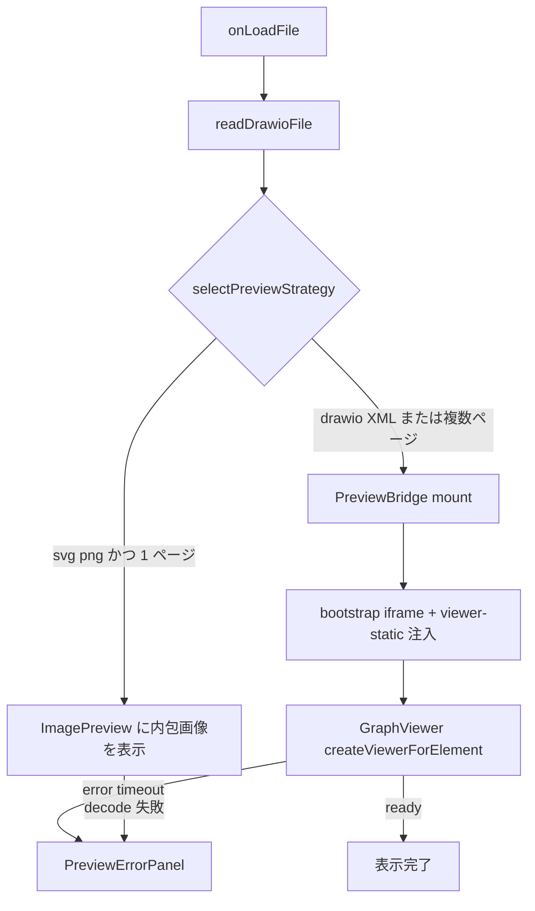
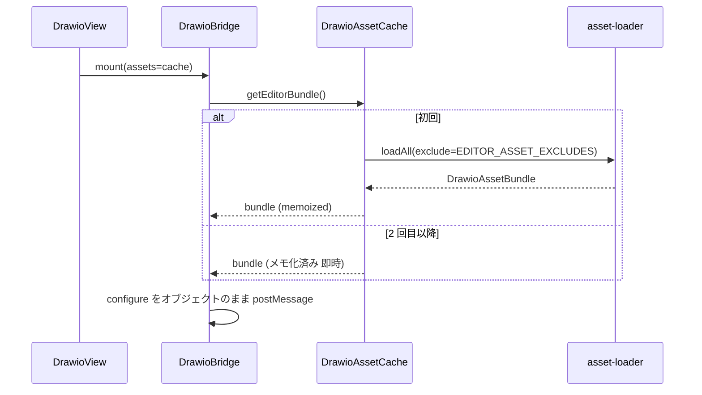

# Technical Design — drawio-preview-mode

## Overview

**Purpose**: 本機能は、draw.io ダイアグラムファイルを開いたときの既定動作を「フルエディタ起動」から「読み取り専用プレビュー表示」へ変更し、閲覧時の待ち時間 (現状: 冷間 5 秒超) とリソース消費 (毎回 149MB のアセット読み込み) を排除する。

**Users**: Obsidian でダイアグラムを閲覧・編集するユーザーが対象。閲覧はプレビューで即座に行い、編集は明示的なモード切替で従来のフルエディタを使う。

**Impact**: 既存の `DrawioView` にモード状態機械 (preview / editor) を導入する。エディタ用アセットの読み込みは新設の `DrawioAssetCache` に集約し、セッション内で再利用する。既存の編集フロー (drawio-bridge / 保存 / 外部同期) の内部挙動は変更しない。

### Goals
- ファイルオープン時にフルエディタを起動せず、拡大縮小・パン・ページ切替可能なプレビューを表示する
- `.drawio.svg` / `.drawio.png` は内包画像で即時表示、`.drawio` (XML) は GraphViewer で描画するハイブリッド方式
- エディタ用アセットのセッションキャッシュと不要アセット除外により、エディタ起動 (初回・2 回目以降) を高速化する
- 既定表示モードを設定で切替可能にする (既定: プレビュー)

### Non-Goals
- 設定画面全体の再構築 (別 spec `settings-ui-refresh` が担当)
- Markdown ノート埋め込みプレビュー (`drawio-embed.ts`) の変更
- iframe からのオンデマンドアセット供給プロトコル (research.md に将来課題として記録)
- drawio エディタ本体・保存形式・外部同期仕様の変更

## Boundary Commitments

### This Spec Owns
- `DrawioView` の表示モード状態機械 (preview ↔ editor) と遷移 UI (ビューヘッダアクション / コマンド / ダブルクリック)
- プレビュー描画の 2 経路: 画像プレビュー (svg/png) と GraphViewer プレビュー (XML)、およびその戦略選択ロジック
- `DrawioAssetCache` (エディタバンドル + viewer スクリプトのセッションキャッシュ、除外マニフェスト、single-flight)
- 親→iframe メッセージの structured clone 受理拡張 (frame-messenger)
- 設定フィールド `defaultOpenMode` のデータモデルとマイグレーション

### Out of Boundary
- 設定画面のレイアウト・スタイル刷新 (settings-ui-refresh spec)
- `drawio-formats` の読み書き仕様、外部同期 (external-watcher) のイベント仕様
- drawio 本体 (vendor) の改変
- 編集モード中の保存・autosave・banner 挙動 (既存実装を呼び出すのみ)

### Allowed Dependencies
- `drawio-formats.readDrawioFile` (形式判定と XML 抽出) — 既存契約のまま利用
- `plugin.events` の `drawio:external-change` イベント — 既存契約のまま購読
- `buildBootstrapHtml` + script 注入機構 — preview-frame でも再利用
- `i18n` / `settings` / `theme` 基盤

### Revalidation Triggers
- `DrawioBridgeMountOptions` / `DrawioAssetBundle` の契約形状変更
- `drawio:external-change` イベントペイロード変更
- 設定スキーマ (`DrawioSettings`) の構造変更
- dist/drawio のディレクトリ構成変更 (除外マニフェストの前提が崩れる)
- 本 spec 側からの通知: 親→iframe メッセージのオブジェクト受理拡張と除外マニフェストは `drawio-iframe-resource-serving` の契約に対する加法的変更であり、同 spec の Revalidation Triggers に該当する (キャッシュ導入自体は同 spec research.md の Follow-up を実体化するもの)

## Architecture

### Existing Architecture Analysis
- `DrawioView` (FileView) が `createDrawioBridge` を直接マウントし、bridge が毎回 `createDrawioAssetLoader.loadAll()` で全アセットを読む
- iframe 側は bootstrap HTML → iframe-init IIFE 注入 → configure (全 responses) → app.min.js 注入 → App.main() の順で起動
- request-manager は同期 URL 解決を前提とするため、アセットは事前一括供給が必須 (この前提は維持する)

### Architecture Pattern & Boundary Map



**Architecture Integration**:
- Selected pattern: 既存の bridge パターン (parent-side lifecycle owner + bootstrap iframe + script 注入) を preview にも適用した相似形。プレビューは編集の縮小版として同じ語彙で扱う
- Domain boundaries: モード判断は View、描画は各 bridge / コンポーネント、アセット I/O は Cache に分離。bridge は Cache を「provider」として注入され、自前でディスクを読まない
- Existing patterns preserved: bridge 状態機械 (idle→loading→ready|error→disposed)、bootstrap HTML、request-manager の同期解決、外部変更イベント購読
- New components rationale: `DrawioAssetCache` はアセット I/O の唯一の所有者となり要件 5.x を一点で満たす。`PreviewBridge` はエディタ bridge を汚染せずプレビュー専用ライフサイクルを持つ
- Steering compliance: TypeScript strict / `import type` / feature-first 配置 / oxlint 基準を維持

### Dependency Direction

```
settings/types → lib (drawio-formats, zoom-pan, preview-mode, drawio-asset-loader)
  → drawio-asset-cache → bridges (drawio-bridge, preview-bridge)
  → views (preview components, DrawioView) → main.ts
iframe/* (init, preview) は独立ランタイム: src/lib からの import 禁止 (既存規約)
```
左から右へのみ import を許可する。逆方向はレビューでエラー扱い。

### Technology Stack

| Layer | Choice / Version | Role in Feature | Notes |
|-------|------------------|-----------------|-------|
| Viewer runtime | drawio `viewer-static.min.js` (vendored, dist 同梱済) | XML プレビューの描画・zoom/pan/ページ切替 | 新規依存なし。既存 dist に含まれる |
| UI | React 19 (既存) | 画像プレビュー・ツールバー・エラー表示 | reactMountManager 経由 (既存パターン) |
| Build | Vite 8 IIFE エントリ追加 (`vite.preview-init.config.ts`) | preview iframe 内 init スクリプトのビルド | `vite.iframe-init.config.ts` の相似形 |
| Test | vitest + jsdom / Playwright (既存) | ユニット・E2E | 新規依存なし |

## File Structure Plan

### New Files
```
src/
├── lib/
│   ├── drawio-asset-cache.ts      # セッションキャッシュ + 除外マニフェスト + single-flight (要件 5.x)
│   ├── preview-bridge.ts          # viewer iframe の親側ライフサイクル (mount/load/dispose)
│   ├── preview-mode.ts            # selectPreviewStrategy / countDiagramPages 純関数
│   └── zoom-pan.ts                # 画像プレビューの座標変換純関数 (clamp/fit/transform)
├── iframe/
│   └── preview/
│       └── index.ts               # preview iframe 内 init IIFE (GraphViewer 起動 + load 受信)
├── views/
│   └── preview/
│       ├── ImagePreview.tsx       # svg/png 画像プレビュー (zoom/pan UI 含む)
│       └── PreviewErrorPanel.tsx  # 描画失敗時のエラー + 「エディタで開く」導線 (要件 1.5)
vite.preview-init.config.ts        # preview-init.js の IIFE ビルド設定
```

### Modified Files
- `src/lib/settings.ts` — `DrawioSettings.defaultOpenMode: "preview" | "editor"` 追加、`migrateSettings` で補完 (既定 `"preview"`)
- `src/lib/drawio-asset-loader.ts` — `exclude?: (href: string) => boolean` オプション追加 (列挙段階でスキップ)
- `src/lib/drawio-bridge.ts` — mount 時のアセット取得を注入された `DrawioAssetProvider` 経由に変更 (後方互換: 未指定時は従来ローダ)。configure/script メッセージをオブジェクト送信に変更
- `src/iframe/init/frame-messenger.ts` — 受信データの `typeof` 判定でオブジェクト直接受理
- `src/views/DrawioView.ts` — モード状態機械、プレビューのマウント/破棄、遷移アクション、プレビュー中の外部変更追従、pending save flush
- `src/main.ts` — `DrawioAssetCache` の所有と dispose、モード切替コマンド登録
- `src/views/SettingsTab.ts` — `defaultOpenMode` ドロップダウン 1 項目の最小追加 (実装時メモ: settings-ui-refresh spec の Setting API 再構築に同梱して提供された。本 spec 側の追加作業は不要となった)
- `src/lib/i18n.ts` — 新規 UI 文言キー
- `styles.css` — プレビューコンテナ / ツールバー / エラーパネルのスタイル
- `package.json` — build スクリプトに preview-init ビルド追加

## System Flows

### 表示モード状態機械 (DrawioView)



- 遷移中は必ず旧モードの資源 (preview iframe / editor bridge) を dispose してから新モードをマウントする (同時マウント禁止)
- Editor→Preview は保存 Promise チェーンの完了を待ってからファイルを再読込して描画する (要件 3.3, 3.4)

### プレビュー初期表示 (ハイブリッド戦略)



- `selectPreviewStrategy` は format と抽出済み XML の `<diagram>` 数から `image` / `graph-viewer` を決定する。svg/png の内包画像は現在ページのみのレンダリングであるため、複数ページ時は GraphViewer 経路でページ切替 (要件 2.4) を保証する

### エディタアセット取得 (キャッシュ)



- 並行 mount (複数ビュー同時オープン) は同一 Promise を共有する (single-flight)。ロード失敗時はメモを破棄し次回リトライ可能にする (要件 5.3)

## Requirements Traceability

| Requirement | Summary | Components | Interfaces | Flows |
|-------------|---------|------------|------------|-------|
| 1.1 | 既定でプレビュー表示 | DrawioView | `onLoadFile` モード決定 | 状態機械 |
| 1.2 | svg/png は内包画像表示 | preview-mode, ImagePreview | `selectPreviewStrategy` | 初期表示 |
| 1.3 | XML は描画表示 | PreviewBridge, preview-init | `PreviewBridge.mount` | 初期表示 |
| 1.4 | 設定でエディタ直接起動 | DrawioView, settings | `defaultOpenMode` | 状態機械 |
| 1.5 | 描画失敗時のエラー + 導線 | PreviewErrorPanel | `onOpenEditor` callback | 初期表示 |
| 2.1-2.2 | ズーム・パン | ImagePreview + zoom-pan / GraphViewer toolbar | `ZoomPanState` | — |
| 2.3 | 初期フィット表示 | zoom-pan (`fitToContainer`) / GraphViewer | — | — |
| 2.4 | ページ切替 | preview-init (toolbar `pages`) + preview-mode | `countDiagramPages` | 初期表示 |
| 2.5 | プレビューは読み取り専用 | PreviewBridge, ImagePreview | 書き込み API を持たない構造 | — |
| 3.1 | 編集アクションで遷移 | DrawioView, main.ts (command) | view actions / command | 状態機械 |
| 3.2 | エディタ起動中ローディング | DrawioBridge (既存) | 既存 loading indicator | — |
| 3.3-3.4 | プレビュー復帰 + save flush | DrawioView | `pendingSaves` チェーン | 状態機械 |
| 3.5 | 編集モードの既存挙動維持 | DrawioBridge (無変更部分) | 既存契約 | — |
| 4.1-4.3 | プレビュー外部変更追従 | DrawioView (`onExternalChange` preview 分岐) | `drawio:external-change` | — |
| 5.1 | プレビューはエディタアセット非読込 | PreviewBridge, DrawioAssetCache | `getViewerScript` のみ使用 | 初期表示 |
| 5.2 | エディタアセット再利用 | DrawioAssetCache | `getEditorBundle` memoize | キャッシュ |
| 5.3 | キャッシュ不能時のフォールバック | DrawioAssetCache | 失敗時メモ破棄 + リトライ | キャッシュ |
| 5.4 | unload で解放 | main.ts, DrawioAssetCache | `dispose()` | — |
| 6.1-6.3 | 既定モード設定 | settings, SettingsTab (最小追加) | `defaultOpenMode` | — |

## Components and Interfaces

| Component | Domain/Layer | Intent | Req Coverage | Key Dependencies | Contracts |
|-----------|--------------|--------|--------------|------------------|-----------|
| DrawioAssetCache | lib | アセット I/O の唯一の所有者・セッションキャッシュ | 5.1-5.4 | asset-loader (P0), DataAdapter (P0) | Service |
| PreviewBridge | lib | viewer iframe のライフサイクル管理 | 1.3, 2.4, 2.5, 5.1 | DrawioAssetCache (P0), bootstrap-html (P0) | Service, Event |
| preview-init | iframe runtime | iframe 内で GraphViewer を起動 | 1.3, 2.1-2.4 | viewer-static (P0) | Event |
| preview-mode | lib | 表示戦略の純関数選択 | 1.2, 1.3, 2.4 | drawio-formats (P1) | Service |
| zoom-pan | lib | 画像プレビューの座標変換純関数 | 2.1-2.3 | なし | Service |
| ImagePreview | views | svg/png のズーム・パン付き表示 | 1.2, 2.1-2.3, 2.5 | zoom-pan (P0) | State |
| PreviewErrorPanel | views | 描画失敗時の UI | 1.5 | i18n (P2) | State |
| DrawioView (mod) | views | モード状態機械と遷移 | 1.1, 1.4, 3.x, 4.x | 上記全部 | State |
| DrawioBridge (mod) | lib | アセット provider 注入 + オブジェクト送信 | 3.2, 3.5, 5.2 | DrawioAssetCache (P0) | Service |
| settings (mod) | lib | `defaultOpenMode` データモデル | 1.4, 6.1-6.3 | なし | State |

### lib layer

#### DrawioAssetCache

| Field | Detail |
|-------|--------|
| Intent | エディタバンドルと viewer スクリプトをセッション内で 1 度だけ読み込み、以後メモリから供給する |
| Requirements | 5.1, 5.2, 5.3, 5.4 |

**Responsibilities & Constraints**
- エディタバンドル (`DrawioAssetBundle`) と viewer スクリプト (string) の遅延ロード + メモ化。並行要求は single-flight
- ロード時に除外マニフェスト `EDITOR_ASSET_EXCLUDES` を適用 (詳細は Supporting References)
- ロード失敗時はメモを破棄し、次回呼び出しで再試行する (要件 5.3)
- `dispose()` で全メモを解放 (要件 5.4)。`invalidate()` は将来の手動更新用

**Dependencies**
- Outbound: `createDrawioAssetLoader` — ディスク読込の実体 (P0)
- Outbound: `app.vault.adapter` — viewer スクリプト読込 (P0)

**Contracts**: Service [x]

##### Service Interface
```typescript
export interface DrawioAssetProvider {
  loadAll(): Promise<DrawioAssetBundle>;
}

export interface DrawioAssetCache extends DrawioAssetProvider {
  /** エディタバンドル (除外マニフェスト適用済み)。メモ化 + single-flight */
  loadAll(): Promise<DrawioAssetBundle>;
  /** viewer-static.min.js のソース文字列 + iframe-init 相当の最小注入情報 */
  getViewerScript(): Promise<string>;
  /** メモを破棄 (次回アクセスで再ロード) */
  invalidate(): void;
  /** 全資源解放。以後の呼び出しは invalidate 済みとして再ロード */
  dispose(): void;
}

export function createDrawioAssetCache(
  adapter: DataAdapter,
  pluginDir: string,
): DrawioAssetCache;
```
- Preconditions: pluginDir 配下に dist/drawio が配備済み
- Postconditions: 同一インスタンスへの並行 `loadAll()` はディスク読込を 1 回に多重化する
- Invariants: dispose 後の呼び出しは例外にせず再ロードで応える (プラグイン再有効化の安全性)

**Implementation Notes**
- Integration: main.ts が生成・保持し、`DrawioView` 経由で両 bridge に注入。`onunload` で `dispose()`
- Validation: 単体テストで single-flight (同時 2 呼び出しでローダ 1 回)、失敗→リトライ、除外適用を検証
- Risks: メモリ常駐 ~110MB (エディタ使用時のみ)。research.md の Decision 参照

#### PreviewBridge

| Field | Detail |
|-------|--------|
| Intent | viewer iframe を bootstrap し GraphViewer で XML を描画する親側ライフサイクル |
| Requirements | 1.3, 2.4, 2.5, 5.1 |

**Responsibilities & Constraints**
- 状態機械: `idle → loading → ready | error → disposed` (drawio-bridge と同じ語彙)
- bootstrap HTML iframe を生成し、`preview-init.js` と viewer スクリプトを script メッセージで注入、`{action:"render", xml, config}` で描画指示
- 読み取り専用: ファイル書き込みに至る API を一切持たない (要件 2.5 の構造的保証)
- 外部変更時の更新は再マウント (research.md Decision 参照)

**Dependencies**
- Outbound: DrawioAssetCache.getViewerScript (P0) / buildBootstrapHtml (P0)
- Inbound: DrawioView — mount/dispose 呼び出し (P0)

**Contracts**: Service [x] / Event [x]

##### Service Interface
```typescript
export interface PreviewBridgeCallbacks {
  onReady?: () => void;
  onError?: (reason: string) => void;
}

export interface PreviewBridgeMountOptions {
  xml: string;
  /** GraphViewer graphConfig に渡す表示設定 (toolbar トークン等) */
  callbacks?: PreviewBridgeCallbacks;
}

export interface PreviewBridge {
  mount(container: HTMLElement, opts: PreviewBridgeMountOptions): void;
  dispose(): void;
  readonly isMounted: boolean;
}

export function createPreviewBridge(cache: DrawioAssetCache): PreviewBridge;
```
- Preconditions: container は DOM 接続済み
- Postconditions: ready 後、iframe 内に zoom / pages toolbar 付きの GraphViewer が表示される
- Invariants: mount 中の再 mount は先に内部 dispose する (drawio-bridge と同じ)

##### Event Contract
- 受信 (iframe→親, JSON 文字列): `{event:"preview-ready"}` / `{event:"preview-error", reason}`
- 送信 (親→iframe, structured clone オブジェクト): `{action:"script", script}` / `{action:"render", xml, config}`
- タイムアウト: bootstrap 5s / render 10s。超過で `onError`

**Implementation Notes**
- Integration: GraphViewer の `data-mxgraph` config は `{xml, toolbar: "pages zoom layers", "toolbar-nofullscreen": true, nav: true, resize: false, "auto-fit": true}` を基準に実装時調整。preview-init は既存 `frame-globals` の installFrameGlobals を流用し、加えて viewer-static が参照する `window.DRAWIO_BASE_URL` を設定する
- Validation: E2E で toolbar 表示・ズーム・複数ページ切替を確認
- Risks: sandbox iframe 内での GraphViewer 動作は E2E で早期検証。失敗時は PreviewErrorPanel へフォールバック (要件 1.5)。viewer-static は基本図形を同梱するが、拡張 stencil セット (aws 等) は遅延 XHR されるため viewer iframe では解決されず簡略表示になる — v1 の既知制限とし、正確な表示が必要な場合は「エディタで開く」導線で補完 (research.md 参照)

#### preview-mode (純関数)

```typescript
export type PreviewStrategy = "image" | "graph-viewer";
/** svg/png かつ単一ページのときのみ "image"。それ以外は "graph-viewer" */
export function selectPreviewStrategy(format: DrawioFormat, xml: string): PreviewStrategy;
/** mxfile 内の diagram 要素数を返す。パース不能時は 1 */
export function countDiagramPages(xml: string): number;
```

#### zoom-pan (純関数)

```typescript
export interface ZoomPanState {
  scale: number;      // clamp: [0.1, 10]
  translateX: number;
  translateY: number;
}
export function fitToContainer(content: Size, container: Size): ZoomPanState;
export function zoomAt(state: ZoomPanState, factor: number, originX: number, originY: number): ZoomPanState;
export function panBy(state: ZoomPanState, dx: number, dy: number): ZoomPanState;
```
- ImagePreview はホイール (修飾キー) / ピンチ (ctrlKey 付き wheel) / ドラッグ / ズームボタンをこの純関数群にマップし、CSS transform で適用する (要件 2.1-2.3)

### views layer

#### DrawioView (modification)

| Field | Detail |
|-------|--------|
| Intent | モード状態機械の所有者。プレビュー/エディタの排他マウントと遷移 |
| Requirements | 1.1, 1.4, 3.1, 3.3, 3.4, 4.1-4.3 |

**Responsibilities & Constraints**
- `mode: "preview" | "editor"` を保持。`onLoadFile` で `settings.drawio.defaultOpenMode` から初期モード決定
- 遷移 UI: `addAction` によるビューヘッダのトグルアイコン (pencil / eye)、コマンド 2 種 (main.ts 登録)、プレビューコンテナのダブルクリック
- Editor→Preview: 進行中の保存 (`handleSave` / export roundtrip) を Promise チェーン `pendingSaves` として追跡し、完了を await → `readDrawioFile` で再読込 → プレビュー描画 (要件 3.3, 3.4)
- プレビュー中の外部変更: modify → 再描画 (dirty 概念なし・無条件)、rename → file 追跡、delete → 通知 + detach (要件 4.1-4.3)。編集モード中は既存分岐を変更しない
- 破棄規律: モード切替と `onUnloadFile` で旧モード資源 (preview iframe / editor bridge / React mount) を必ず dispose
- 編集意図が明示的な導線 (「draw.io で編集」コンテキストメニュー / 新規ダイアグラム作成) は `defaultOpenMode` に依らずエディタ直開きとする (`openInDrawioView(file, { mode: "editor" })`)。通常のファイルオープンのみ既定表示モードに従う (実装時 UX 決定)

**Contracts**: State [x]

##### State Management
- State model: `mode` + `pendingSaves: Promise<void>` (チェーン) + 各 bridge 参照 (排他)
- Concurrency strategy: 遷移操作は in-flight 遷移中は無視 (`transitioning` フラグ)。二重マウント禁止

**Implementation Notes**
- Integration: 既存の `onLoadFile` のエディタマウント部分を `mountEditor()` に抽出し、`mountPreview()` と対称にする
- Validation: jsdom 統合テストでモード遷移・save flush・外部変更分岐を検証
- Risks: 保存が export roundtrip (svg/png) の場合、完了は `handleExportResult` の書込完了。roundtrip 全体を pendingSaves に含めること

#### ImagePreview / PreviewErrorPanel (summary only)
- `ImagePreview`: props `{ src: string; onRequestEdit: () => void }`。`app.vault.getResourcePath(file)` が返す URL を `` に直接指定する (ファイル内容の再読込・Blob URL 管理は不要。URL にはバージョンクエリが付与されるため外部変更時は src 差し替えで再描画)。zoom-pan 純関数で操作し、ズームボタン (in/out/fit/100%) を持つ
- `PreviewErrorPanel`: props `{ message: string; onOpenEditor: () => void }`。要件 1.5 の導線

### settings

- `DrawioSettings` に `defaultOpenMode: DrawioOpenMode` (`"preview" | "editor"`) を追加。`DEFAULT_DRAWIO_SETTINGS.defaultOpenMode = "preview"`
- `DrawioSettings` に `previewBackground: string` (CSS color 値) を追加。既定 `"#ffffff"` (要件 6.4-6.5)。`migrateSettings` は非文字列・空文字を既定値に補完。SettingsTab には `addColorPicker` の行を 1 つ追加する (settings-ui-refresh が確立した Setting API 構造への加法的追加)
- 適用先: ImagePreview のコンテナ背景 / preview iframe の body 背景 (render config で background を渡す)。変更はプレビューの (再) マウント時に反映 (要件 6.6)
- **プレビューの表示領域** (要件 2.6): プレビューコンテナ (画像経路・viewer iframe 経路とも) は `contentEl` の幅・高さ 100% を占有する。エディタ経路が行っている `contentEl` の padding 除去・height 100% 設定と同等の処理をプレビューマウント時にも行う
- `migrateSettings`: 有効値以外・欠損は `"preview"` に補完。`settingsVersion` は 2 のまま (加法的変更)
- SettingsTab には既存パターンで最小のドロップダウン 1 項目のみ追加 (UI 刷新は settings-ui-refresh の所掌)

## アセット段階配信 (追補: 2026-07-19 OOM 対策)

**問題**: エディタ起動時にアセット一式 (~110MB 相当の文字列群) を単一 postMessage で iframe へ転送すると、renderer RSS が 1 遷移あたり約 +550MB スパイクし、実運用セッションでは renderer OOM によりアプリごとクラッシュする (実測値と切り分けは research.md 参照。structured clone / JSON 文字列のどちらでも発生し、送信形式は主因ではない)。

**対策 (要件 5.5, 5.6)**:
- **チャンク分割配信**: bridge は responses を単一メッセージで送らず、上限サイズ (目安 8MB) のチャンク列 `{action:"assets", entries, group, final}` として送信する
- **iframe 側の Blob 化 (コア=即時 / テール=遅延)**: コア群はチャンク受信のたびに即座に Blob / Blob URL へ変換しソース文字列を破棄する (起動時に必ず materialize されるため)。テール群はチャンク受信時には文字列のまま保持し、**アクセス時に初めて Blob 化して直後にソース文字列を破棄する** (lazy materialize)。未使用アセットの Blob を先行実体化すると恒常 RSS が増加し絶対ピークを悪化させることが実測で判明したため (research.md 追記参照)
- **コア/テール 2 群配信**: 起動に必須のコア群 (styles/css/img/images/resources/mxgraph 等) を先行配信し、コア完了通知後に CSS 注入 → app.min.js 注入 → App.main() を実行。重量テール群 (stencils/shapes/templates/math4/plugins/mermaid) は `{event:"init"}` 後にバックグラウンドで逐次配信する
- **瞬間スパイクの構造的抑止**: チャンク上限 (~8MB) により単一メッセージの structured clone 瞬間スパイクはプロトコルレベルで有界。サンプリング計測 (80ms) では旧実装の sub-100ms スパイクを取りこぼすため、有界性は計測ではなくプロトコル構造で保証する
- **配信前アクセスの劣化許容**: テール到着前に該当アセットが参照された場合は既存の warn + passthrough で劣化し、起動は阻害しない (到着後の再参照で解決)
- **theme 適用タイミング**: bridge ready 前の `applyTheme` による "sendMessage() called before mount" warn を解消し、ready 後に適用する
- 検証 (7.2 合否基準の改定): エディタ本体の恒常フットプリント (~+800MB: app.min.js パース + EditorUi 構築) は本対策の対象外であり、絶対値 "+200MB" は不達なので用いない。E2E アサーションは **transient spike (peak − 遷移後 stable) < 200MB** とし、あわせて **旧実装比で stable・絶対ピークが悪化していないこと**を 1 回の比較計測で確認し数値を記録する。`getAppMetrics()` RSS を使用 (`performance.memory` は iframe realm を含まないため禁止)
- 将来課題 (別 spec): フルオンデマンド配信 (research.md の Architecture Pattern Evaluation 参照)

## プレビューのジェスチャ操作 (追補: 2026-07-19 ユーザーフィードバック)

**問題**: GraphViewer プレビュー (XML 経路) は toolbar ボタンによるズームのみで、ピンチ / ホイールズーム / ドラッグパン / 2 本指スクロールパンが効かない (要件 2.7, 2.8 のギャップ)。画像経路 (ImagePreview) は実装済み。

**対策**: preview-init が GraphViewer 生成後に `viewer.graph` (mxGraph API) に対してジェスチャを配線する:
- **ピンチ / 修飾キー+ホイール**: `mxEvent.addMouseWheelListener` 相当で ctrlKey 付き wheel (トラックパッドのピンチは ctrlKey=true の wheel として届く) と修飾キー+ホイールを捕捉し、カーソル位置を基準に `graph.zoomIn/zoomOut` (drawio 本体の cursor-anchored zoom と同様に `graph.view` の translate を補正)
- **ドラッグパン**: mxGraph の `panningHandler` は使わない (キャンバス DOM ごとオフセットするため枠ごと動いて見える)。pointer ドラッグを 2 本指スクロールと同じ `graph.view.setTranslate` の差分移動にマップし、スクロールパンと視覚挙動を完全一致させる (2026-07-21 ユーザーフィードバックによる改定)
- **2 本指スクロール**: 修飾キーなし wheel を `graph.view` の translate 移動 (パン) にマップ。preventDefault でページスクロールを抑止
- ズーム倍率クランプは画像経路と揃える ([0.1, 10] 目安)。toolbar (pages / zoom) は従来どおり併存
- 実装は preview-init 内で完結し、preview-bridge のプロトコル・親側 UI は変更しない。正確な API 名は vendor GraphViewer.js / mxGraph ソースで実装時に確認
- 画像経路は既存実装 (zoom-pan 純関数 + wheel/pointer ハンドラ) を維持し、ジェスチャ挙動 (ピンチ方向・パン方向・倍率感度) を両経路で一致させる

## Error Handling

### Error Strategy
- プレビュー描画失敗 (GraphViewer タイムアウト / 画像 decode 失敗 / readDrawioFile 失敗) → `PreviewErrorPanel` を表示し「エディタで開く」導線を提示 (要件 1.5)。プレビュー失敗がファイル閲覧の完全遮断にならないことを保証
- エディタアセットロード失敗 → 既存の bridge error 表示を維持。キャッシュはメモを破棄し再試行可能に (要件 5.3)
- 遷移中の保存失敗 → 既存の Notice (`notice.saveFailedWithName`) を出しつつ遷移は継続 (データはエディタ側 `_lastXml` に保持されており、プレビューはディスク上の最終保存内容を表示する)
- ログ prefix: 既存規約 (`[drawio-view]` / `[DrawioBridge]`) に合わせ `[drawio-preview]` を使用

## Testing Strategy

### Unit Tests
1. `preview-mode`: 形式×ページ数の戦略選択 (svg 1p→image, svg 2p→graph-viewer, drawio→graph-viewer, パース不能→1 ページ扱い)
2. `zoom-pan`: fit 計算・ズーム原点不変性・clamp 境界
3. `drawio-asset-cache`: single-flight / 失敗後リトライ / 除外マニフェスト適用 / dispose 後再ロード
4. `frame-messenger`: 文字列 JSON とオブジェクトの両受理 (既存テストへ追加)
5. `settings.migrateSettings`: `defaultOpenMode` 欠損・不正値の補完

### Integration Tests (vitest + jsdom)
1. DrawioView: `defaultOpenMode` 別の初期マウント分岐 (bridge をモック)
2. DrawioView: editor→preview 遷移で pendingSaves 完了待ち → 再読込順序
3. DrawioView: プレビュー中 external-change (modify/rename/delete) の分岐

### E2E Tests (Playwright, 既存 e2e-vault 基盤)
1. `.drawio` を開く → GraphViewer プレビュー表示・zoom/pages toolbar 動作・エディタ iframe が生成されないこと (要件 1.1, 2.x, 5.1)
2. 編集アクション → エディタ起動 → 図形追加 → autosave → プレビュー復帰で変更が反映 (要件 3.1, 3.3, 3.4)
3. `.drawio.svg` (単一ページ) → 画像プレビュー即時表示 / 複数ページ `.drawio` → ページ切替 (要件 1.2, 2.4)
4. エディタを閉じて別ファイルで再度エディタ起動 → 2 回目マウントの高速化をログ/計測で確認 (要件 5.2)
5. 既存エディタ E2E (起動・保存・More Shapes) が除外マニフェスト適用後も回帰しないこと

## Performance & Scalability

- 目標: プレビュー初期表示 — svg/png は体感即時 (~100ms 級)、XML は viewer 注入込み ~1s 以内 (冷間)。エディタ 2 回目マウントはディスク I/O ゼロ + JSON stringify/parse ゼロ
- 計測: E2E で `performance.now()` ベースの mount 計測ログを出力し、PR 上で before/after を比較
- スケール: 複数ビュー同時オープンはキャッシュ共有 + single-flight で线形劣化しない

## Supporting References

### EDITOR_ASSET_EXCLUDES (初期マニフェスト)
除外対象 (エディタ実行に構造的に不要と確認済み — research.md 参照):
```
js/integrate.min.js          # Teams 統合ビルド (22MB)
js/viewer.min.js             # スタンドアロン viewer (エディタ iframe では未使用)
js/viewer-static.min.js      # 同上 (プレビューは Cache が別経路で読む)
service-worker.js / service-worker.js.map
workbox-*                    # SW ランタイム (sandbox iframe で無効)
META-INF/ WEB-INF/           # サーバ設定
connect/                     # SaaS コネクタ
*.map                        # sourcemap
```
削減見込み: 約 35-40MB。1 定数に集約し、除外起因の不具合時は該当行の削除だけで revert できること。
