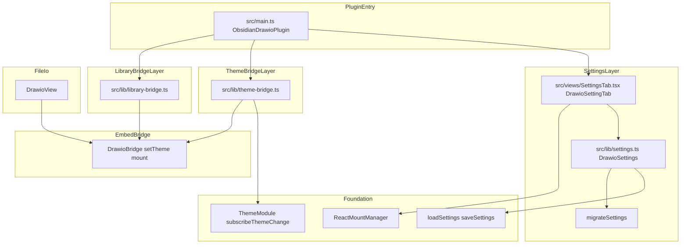
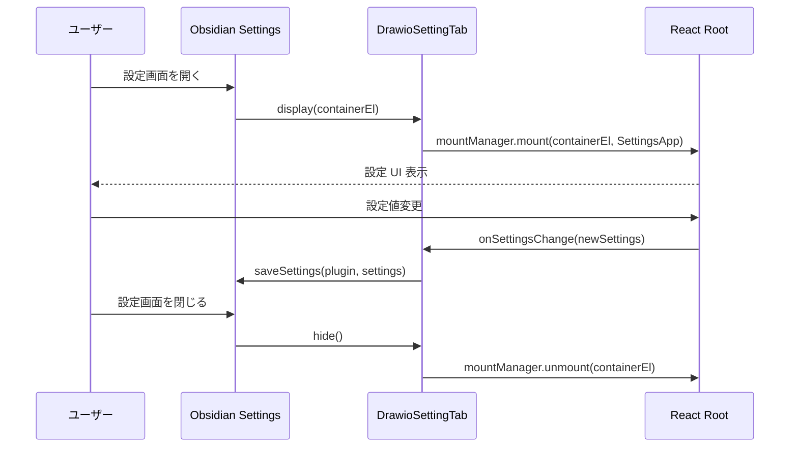
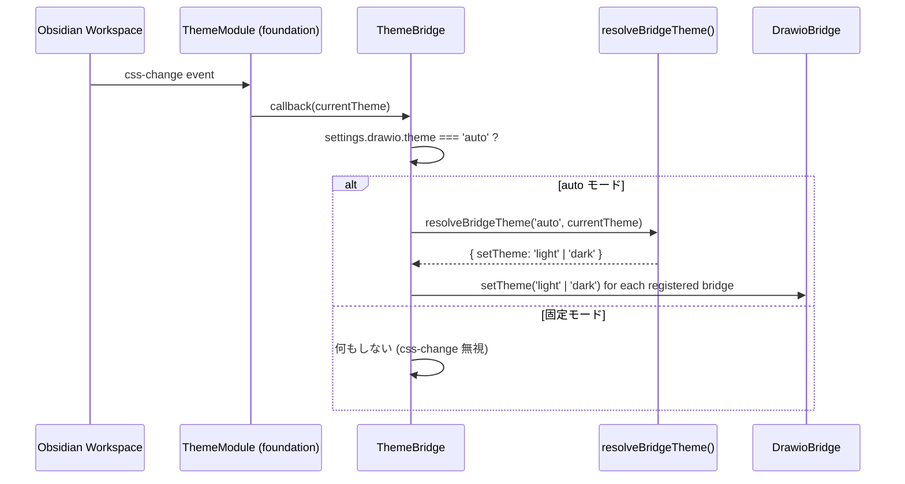
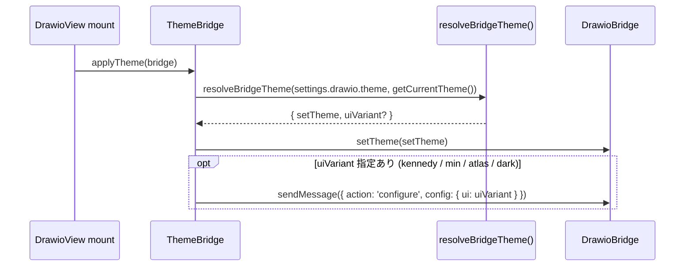

# 設計ドキュメント: drawio-settings-and-config

## 概要

`drawio-settings-and-config` は、Obsidian プラグインユーザーが draw.io ダイアグラムエディタの動作をグローバルに設定できる UI・ロジック層を提供する。`plugin-foundation` の `PluginSettings` を `drawio` 名前空間で拡張し、React 製の `SettingsTab` と Obsidian テーマ追従の配線を実現する。

per-diagram (図ファイル単位) の設定上書き機能はロードマップ判断により本 spec のスコープから撤去された。sidecar `<file>.drawio.json` 案も mxfile 埋め込み案も採用しない。設定はグローバル一元管理に統一する。

**目的**: グローバル設定 UI、テーマ追従を一元提供し、後続の `drawio-external-sync` spec が設定キーを安全に追加できる拡張ポイントも確保する。  
**ユーザー**: Obsidian デスクトップユーザー (設定 UI を利用するエンドユーザー) およびプラグイン開発者 (後続 spec の実装者)。  
**影響**: `src/lib/settings.ts` を拡張し、`src/views/SettingsTab.tsx`・`src/lib/theme-bridge.ts` を新設する。`src/main.ts` には `PluginSettingTab` 登録と `css-change` 購読の追加が必要。**既存の per-diagram 関連実装は撤去対象** (詳細は「Migration / 影響」参照)。

### Goals

- `PluginSettings` の `drawio` 名前空間拡張と `settingsVersion` によるマイグレーション基盤を確立する
- Obsidian 設定画面に React 製 `SettingsTab` を表示し、全設定項目を GUI で操作できるようにする
- Obsidian テーマ変更イベントを DrawioBridge.setTheme() に接続し、リアルタイムに追従させる
- `drawio-external-sync` spec が設定キーを追加できる UI 統合ポイントを確保する

### Non-Goals

- `DrawioBridge` API 自体の追加 (drawio-embed-bridge 担当)
- ファイルフォーマット reader/writer の変更 (drawio-file-io 担当)
- drawio webapp 本体の改造
- PNG / SVG メタデータの仕様策定
- per-diagram 設定上書き / sidecar ファイル / mxfile 埋め込み (本 spec では採用しない)
- クラウド連携・同期
- Mobile 対応

## バウンダリコミットメント

### This Spec Owns

- `src/lib/settings.ts` — `DrawioSettings` 型・`DEFAULT_SETTINGS` の `drawio` 名前空間フィールド・`migrateSettings` 関数
- `src/views/SettingsTab.tsx` — React 製グローバル設定 UI コンポーネント + `DrawioSettingTab` クラス (Obsidian PluginSettingTab サブクラス)
- `src/lib/theme-bridge.ts` — `subscribeThemeChange` を消費して DrawioBridge.setTheme() を呼ぶ配線ロジック
- `src/lib/library-bridge.ts` — `customLibraries` を `DrawioBridge.setLibraries` 用に変換する配線
- `src/main.ts` への変更 — `PluginSettingTab` 登録、テーマ購読の初期化/破棄

### Out of Boundary

- `DrawioBridge.setTheme()` の実装 (drawio-embed-bridge が定義済み)
- `DrawioBridge.setLibraries()` 等の API 追加 (必要なら drawio-embed-bridge へ差し戻し)
- `DrawioView` のライフサイクル管理 (drawio-file-io 担当)
- `drawio-external-sync` の設定スキーマ定義 (external-sync spec が行う。本 spec は UI セクションを予約するのみ)

### Allowed Dependencies

- `plugin-foundation`: `PluginSettings`、`loadSettings`/`saveSettings`、`ReactMountManager`、`ThemeModule.subscribeThemeChange`、`getCurrentTheme`
- `drawio-embed-bridge`: `DrawioBridge.setTheme()`、`DrawioBridge.mount()` オプション (`lang`、`libraries` 等)、`buildDrawioUrl` の `DrawioUrlOptions`
- `obsidian` npm パッケージ (devDependencies、型定義のみ): `PluginSettingTab`、`Notice`、`Plugin`、`Vault`

### Revalidation Triggers

- `PluginSettings` の型定義変更 → 本 spec の設定拡張が再検証必要
- `DrawioBridge.setTheme()` のシグネチャ変更 → `theme-bridge.ts` が再検証必要
- `ReactMountManager` の mount/unmount インターフェース変更 → SettingsTab が再検証必要
- `DrawioUrlOptions` の型変更 → 言語設定・URL 組み立てが再検証必要
- `drawio-external-sync` spec が `DrawioSettings` に新フィールドを追加した場合 → `migrateSettings` に新バージョン分岐を追加する必要がある
- `drawio-file-io` spec が `PluginSettings` に追加した legacy トップレベルフィールド (`openDrawioSvg` / `openDrawioPng` / `preserveCompression`) → 本 spec の `migrateSettings` がそれらを `drawio.*` 名前空間に吸収する責務を持つため、レガシーフィールドの追加・改名・削除があれば再検証必要
- **可視 UI 文字列の追加・変更時** (`SettingsTab.tsx` 等本 spec 所有ファイルのラベル / 説明文 / Notice 文言): plugin-i18n が管理する `src/lib/i18n/locales/{ja,en}.ts` を同時更新し、`pnpm verify:i18n` (または同等の検証スクリプト) を通すこと。新規ハードコード文字列はリリース前に必ず `t()` 化する。

### 上流 spec とのスキーマ統合方針

`drawio-file-io` design.md は `PluginSettings` のトップレベルに `openDrawioSvg` / `openDrawioPng` / `preserveCompression` を追加すると記述しているが、本 spec は `drawio` 名前空間にすべての drawio 関連設定を集約する方針を採る。`migrateSettings` で legacy フィールドを `drawio.*` に吸収する (要件 1.6 / 5.x):

| Legacy トップレベル | 統合先 | 備考 |
|---|---|---|
| `openDrawioSvg: boolean` | `drawio.openDrawioSvg: boolean` | そのまま移動 |
| `openDrawioPng: boolean` | `drawio.openDrawioPng: boolean` | そのまま移動 |
| `preserveCompression: boolean` | `drawio.compression: boolean` | semantics 統合 — `compression: true` = 既定で `.drawio` 圧縮維持/書き出し |

`drawio-file-io` 実装側は本 spec が登場した時点で読み出し時に `settings.drawio.*` を参照する。`drawio-file-io` の対応漏れを防ぐため、本 spec の設計レビュー時に file-io spec への revalidation トリガを発火させる。

## アーキテクチャ

### アーキテクチャパターン & バウンダリマップ



**依存方向**: `Foundation` → `SettingsLayer` / `ThemeBridgeLayer` / `LibraryBridgeLayer` → `PluginEntry`  
`DrawioBridge` は `ThemeBridgeLayer` / `LibraryBridgeLayer` / `DrawioView` が consume する。本 spec は API を呼ぶだけで定義しない。

### テクノロジスタック

| 層 | ツール / バージョン | 役割 |
|---|---|---|
| Language | TypeScript 6.x (strict, no any) | 型安全な実装 |
| UI Framework | React 19 + ReactMountManager | SettingsTab の createRoot 管理 |
| Plugin API | obsidian (devDependencies) | PluginSettingTab, Notice, Vault API |
| Storage | Obsidian data.json (`loadData`/`saveData`) | グローバル設定の永続化 |
| Theme Detection | ThemeModule (plugin-foundation) | css-change 購読・getCurrentTheme() |
| Bridge | DrawioBridge (drawio-embed-bridge) | setTheme() / setLibraries() 呼び出し |

## ファイル構成

### ディレクトリ構造

```
src/
├── main.ts                          # PluginSettingTab 登録・テーマ購読追加 (変更)
├── lib/
│   ├── settings.ts                  # DrawioSettings 型・DEFAULT_SETTINGS 拡張・migrateSettings (変更)
│   ├── theme-bridge.ts              # css-change → DrawioBridge.setTheme 配線 (新規)
│   └── library-bridge.ts            # customLibraries → DrawioBridge.setLibraries 配線 (新規)
└── views/
    └── SettingsTab.tsx              # DrawioSettingTab (PluginSettingTab サブクラス) + React UI (新規)
```

### 変更ファイル

- `src/main.ts` — `onload()` に `DrawioSettingTab` 追加 (`this.addSettingTab`)、`ThemeBridge` 初期化・`onunload()` に dispose 追加
- `src/lib/settings.ts` — `PluginSettings` に `drawio: DrawioSettings` フィールドを追加、`DEFAULT_SETTINGS` 更新、`migrateSettings` 追加

### 撤去対象ファイル / 撤去対象 API

per-diagram 機能撤去に伴い、以下の既存実装は本 spec の改訂で削除する:

- `src/lib/per-diagram-config.ts` (ファイル削除)
- `src/views/DiagramSettingsModal.tsx` (ファイル削除)
- `src/main.ts` の `addCommand("drawio: 図の設定を編集", ...)` 登録 (削除)
- `src/main.ts` の `registerPerDiagramConfigLifecycle(this)` 呼び出し (削除)
- `vault.on('rename')` / `vault.on('delete')` のうち sidecar 同期目的で登録されているものすべて (削除)
- 設定マージ関数 (`getMergedSettings` 等) の per-diagram レイヤ (削除し、グローバル設定直読みに簡略化)
- 上記モジュールに紐づく unit / integration test ファイル (削除)

これらの撤去は tasks.md のクリーンアップタスクで一括して扱う。

## システムフロー

### SettingsTab 表示フロー



### テーマ追従フロー



### Mount 時テーマ初期化フロー



### DrawioTheme → DrawioBridge マッピング表

| `DrawioSettings.theme` | `setTheme` 引数 | `configure.ui` 追加送信 | 備考 |
|---|---|---|---|
| `auto` | `getCurrentTheme()` (`'light'` または `'dark'`) | なし | css-change 購読 |
| `light` | `'light'` | なし | デフォルトの drawio UI (kennedy 相当) |
| `dark` | `'dark'` | なし | drawio dark UI |
| `kennedy` | `'light'` | `'kennedy'` | 明示的に kennedy variant |
| `min` | `'light'` | `'min'` | minimal UI |
| `atlas` | `'light'` | `'atlas'` | atlas UI |

## 要件トレーサビリティ

| 要件 | 概要 | コンポーネント | インターフェース |
|------|------|--------------|----------------|
| 1.1-1.7 | グローバル設定スキーマ | SettingsModule | DrawioSettings, DEFAULT_SETTINGS |
| 2.1-2.13 | SettingsTab UI | DrawioSettingTab, SettingsApp | PluginSettingTab |
| 3.1-3.6 | テーマ追従 | ThemeBridge | subscribeThemeChange, setTheme |
| 4.1-4.3 | 言語・locale 追従 | SettingsModule, DrawioView | DrawioUrlOptions.lang |
| 5.1-5.4 | 設定マイグレーション | SettingsModule | migrateSettings |

## コンポーネントとインターフェース

### コンポーネントサマリー

| コンポーネント | 層 | 役割 | 要件カバレッジ | 主要依存 (P0/P1) | Contracts |
|---|---|---|---|---|---|
| SettingsModule | Lib | 設定型定義・拡張・マイグレーション | 1, 5 | plugin-foundation PluginSettings (P0) | State |
| DrawioSettingTab | Views | Obsidian PluginSettingTab + React マウント管理 | 2 | ReactMountManager (P0), SettingsModule (P0) | Service |
| ThemeBridge | Lib | css-change → DrawioBridge.setTheme 配線 | 3 | ThemeModule (P0), DrawioBridge (P0) | Event |
| LibraryBridge | Lib | customLibraries (Vault 相対パス) を読み込み `DrawioBridge.setLibraries` 用の `{ title, entries }` 配列に変換して bridge へ適用 | 2.3, 2.4 | Obsidian Vault API (P0), DrawioBridge (P0), SettingsModule (P0) | Service |

---

### Lib 層

#### SettingsModule

| フィールド | 詳細 |
|---|---|
| Intent | `PluginSettings` の `drawio` 名前空間を定義し、DEFAULT_SETTINGS と migrateSettings を提供する |
| 要件 | 1.1, 1.2, 1.3, 1.4, 1.5, 5.1, 5.2, 5.3, 5.4 |

**責務と制約**

- `DrawioSettings` interface を定義し、後続 spec (external-sync) が `DrawioSettings` に型安全にフィールドを追加できるよう `Partial` 拡張可能な設計にする
- `PluginSettings` (plugin-foundation が空 interface で公開) を declaration merging で拡張し `drawio: DrawioSettings` フィールドを追加する。`[key: string]: unknown` のような index signature は使わない (any 化を招き型補完を弱めるため)
- `migrateSettings` は `unknown` を受け取り常に `DrawioSettings` を返す; throw しない

**依存関係**

- Inbound: `ObsidianDrawioPlugin.onload()` — loadSettings 呼び出し (P0)
- Outbound: `plugin-foundation` SettingsModule — `loadSettings` / `saveSettings` (P0)

**Contracts**: Service [ ] / API [ ] / Event [ ] / Batch [ ] / State [x]

##### State Management

```typescript
// src/lib/settings.ts への追加

export type DrawioTheme = 'auto' | 'light' | 'dark' | 'kennedy' | 'min' | 'atlas';
export type DrawioLanguage = 'auto' | 'en' | 'ja' | 'zh' | 'de' | 'fr' | 'es' | 'pt' | 'ru' | 'ko' | 'pl' | 'nl' | 'it';
export type DrawioSaveFormat = 'keep' | 'drawio';

export interface DrawioSettings {
  settingsVersion: number;
  theme: DrawioTheme;
  defaultLibraries: string[];
  customLibraries: string[];
  defaultSaveFormat: DrawioSaveFormat;
  compression: boolean;        // 兼 preserveCompression (drawio-file-io legacy 互換)
  math: boolean;
  language: DrawioLanguage;
  grid: boolean;
  ribbonEnabled: boolean;
  openDrawioSvg: boolean;      // drawio-file-io から吸収
  openDrawioPng: boolean;      // drawio-file-io から吸収
}

export const DEFAULT_DRAWIO_SETTINGS: DrawioSettings = {
  settingsVersion: 1,
  theme: 'auto',
  defaultLibraries: ['general'],
  customLibraries: [],
  defaultSaveFormat: 'keep',
  compression: true,           // drawio 既定の圧縮維持を踏襲 (file-io の preserveCompression: true と一致)
  math: false,
  language: 'auto',
  grid: true,
  ribbonEnabled: true,
  openDrawioSvg: true,
  openDrawioPng: true,
};

export function migrateSettings(raw: unknown): DrawioSettings;
// raw が object でない場合は DEFAULT_DRAWIO_SETTINGS を返す
// 各フィールドが期待する型でなければ DEFAULT から補完する
// settingsVersion を最新に更新して返す

// PluginSettings を拡張
// plugin-foundation が空 interface で公開する `PluginSettings` に
// declaration merging で `drawio` フィールドを追加する。
// (`[key: string]: unknown` のような index signature は使わない)
declare module './settings' {
  interface PluginSettings {
    drawio: DrawioSettings;
  }
}

// 内部的に「drawio フィールドが必ず存在する PluginSettings」を表す
// 型エイリアス (本 spec 内コンシューマ向け; 公開 API ではない)。
export type DrawioPluginSettings = PluginSettings & { drawio: DrawioSettings };
```

`PluginSettings` (drawio フィールドを宣言マージ後) は Obsidian の data.json (`plugin.loadData()` / `plugin.saveData()`) に永続化する。本 spec ではこの単一階層しか持たず、ファイル単位の上書きは存在しないため、コンシューマ (drawio-file-io 等) は `settings.drawio.*` を直接参照すれば足りる。

##### external-sync 統合パターン

`drawio-external-sync` spec は `DrawioSettings` を **intersection type** で拡張する。本 spec は型を `interface` (open) で公開し、external-sync 側は declaration merging または専用 interface を経由して拡張する:

```typescript
// drawio-external-sync 側で:
declare module './settings.ts' {
  interface DrawioSettings {
    externalSync?: {
      autoReloadWhenClean: boolean;
      notificationLevel: 'none' | 'notice' | 'status-bar';
    };
  }
}
```

`migrateSettings` は `settingsVersion` 分岐により、external-sync が追加した時点で `version 2` への移行ロジックを external-sync spec が追加する責務を持つ。本 spec は `version 1` までを定義する。

##### resolveBridgeTheme helper

```typescript
// src/lib/settings.ts または src/lib/theme-bridge.ts に同居

export interface ResolvedBridgeTheme {
  setTheme: 'light' | 'dark';
  uiVariant?: 'kennedy' | 'min' | 'atlas' | 'dark';
}

export function resolveBridgeTheme(
  setting: DrawioTheme,
  currentObsidianTheme: 'light' | 'dark',
): ResolvedBridgeTheme;
// マッピング表 (design.md 内) に従って純粋関数として実装。
// uiVariant は設定値が kennedy / min / atlas / dark のときのみ非 undefined。
```

---

#### ThemeBridge

| フィールド | 詳細 |
|---|---|
| Intent | css-change イベントを DrawioBridge.setTheme() に接続する配線ロジック |
| 要件 | 3.1, 3.2, 3.3, 3.4, 3.5, 3.6 |

**責務と制約**

- `settings.drawio.theme === 'auto'` のときのみ `css-change` に反応する
- 固定テーマのときは subscribe 不要だが、mount 時の初回 setTheme() は呼ぶ
- View の登録/解除 API を持ち、アクティブな DrawioBridge の集合を管理する

**依存関係**

- Inbound: `ObsidianDrawioPlugin.onload()` — 初期化 (P0)
- Outbound: `ThemeModule.subscribeThemeChange` (plugin-foundation) — css-change 購読 (P0)
- Outbound: `DrawioBridge.setTheme()` (drawio-embed-bridge) — テーマ更新 (P0)

**Contracts**: Service [x] / API [ ] / Event [x] / Batch [ ] / State [x]

##### Service Interface

```typescript
// src/lib/theme-bridge.ts

import type { Plugin } from 'obsidian';
import type { DrawioBridge } from './drawio-bridge.ts';
import type { DrawioSettings } from './settings.ts';

export interface ThemeBridge {
  registerBridge(bridge: DrawioBridge): void;
  unregisterBridge(bridge: DrawioBridge): void;
  applyTheme(bridge: DrawioBridge): void;
  dispose(): void;
}

export function createThemeBridge(
  plugin: Plugin,
  getSettings: () => DrawioSettings,
): ThemeBridge;
// subscribeThemeChange で css-change を購読
// theme === 'auto' のとき変更時に全登録 bridge に setTheme を呼ぶ
```

##### Event Contract

- 購読イベント: `workspace.on('css-change')` (ThemeModule 経由)
- theme が `auto` 以外の場合は css-change に反応しない
- `dispose()` で EventRef を解除する

##### State Management

- State model: `Set<DrawioBridge>` で登録済み bridge を管理
- Persistence: メモリのみ (Plugin インスタンスのライフタイム)

---

### Views 層

#### DrawioSettingTab

| フィールド | 詳細 |
|---|---|
| Intent | Obsidian PluginSettingTab サブクラスとして React 製設定 UI をマウント/アンマウントする |
| 要件 | 2.1, 2.2, 2.3, 2.4, 2.5, 2.6, 2.7, 2.8, 2.9, 2.10, 2.11, 2.12, 2.13 |

**責務と制約**

- `display(containerEl)` → `mountManager.mount(containerEl, <SettingsApp .../>)`
- `hide()` → `mountManager.unmount(containerEl)` (memory leak 防止)
- `SettingsApp` は React コンポーネント; Obsidian CSS variables を使用し `dangerouslySetInnerHTML` 禁止

**依存関係**

- Inbound: Obsidian runtime (display/hide ライフサイクル) (P0)
- Outbound: `ReactMountManager` (plugin-foundation) — createRoot/unmount (P0)
- Outbound: `SettingsModule` — DrawioSettings 読み書き (P0)

**Contracts**: Service [x] / API [ ] / Event [ ] / Batch [ ] / State [ ]

##### Service Interface

```typescript
// src/views/SettingsTab.tsx

import { PluginSettingTab, type App } from 'obsidian';
import type { ObsidianDrawioPlugin } from '../main.ts';

export class DrawioSettingTab extends PluginSettingTab {
  constructor(app: App, plugin: ObsidianDrawioPlugin);
  display(): void;
  hide(): void;
}
```

**実装ノート**

- Integration: `plugin.addSettingTab(new DrawioSettingTab(app, plugin))` を `onload()` で呼ぶ
- external-sync 設定セクションは `<section data-spec="external-sync">` で予約し、実際の設定コンポーネントは external-sync spec が実装する
- Risks: React 更新が Obsidian のテーマ変更と競合しないよう、`onSettingsChange` で保存後に re-render をトリガーすること

## データモデル

### ドメインモデル

```
PluginSettings (Obsidian data.json に永続化; drawio フィールドは本 spec が宣言マージで追加)
  └── drawio: DrawioSettings
        ├── settingsVersion: number
        ├── theme: DrawioTheme
        ├── defaultLibraries: string[]
        ├── customLibraries: string[]
        ├── defaultSaveFormat: DrawioSaveFormat
        ├── compression: boolean
        ├── math: boolean
        ├── language: DrawioLanguage
        ├── grid: boolean
        └── ribbonEnabled: boolean
```

per-diagram 設定型 (`PerDiagramConfig`) は本 spec の改訂で廃止された。

### 設定マージ優先順位

```
global DrawioSettings > DEFAULT_DRAWIO_SETTINGS
```

`DrawioView` および各 bridge は `settings.drawio.*` を直接参照する。ファイル単位の上書きは存在しない。

### settingsVersion マイグレーション表

| version | 内容 |
|---------|------|
| 0 / undefined | 旧バージョン。全フィールドを DEFAULT で補完 + drawio-file-io legacy フィールド吸収 |
| 1 | 現行スキーマ (本 spec が確立) |
| 2+ | 将来の external-sync spec 等が追加した場合 |

## エラーハンドリング

### エラー戦略

- `migrateSettings` — 型不一致フィールド → DEFAULT 値で補完、throw しない
- React mount/unmount エラー → `console.error` でログし他の root に影響しない
- `LibraryBridge.loadCustomLibraries` — 個別ファイル読み込み失敗 → 当該パスのみ skip し `console.warn`、他のライブラリには影響させない

### エラーカテゴリ

- **System Error**: Vault I/O 失敗 (custom library 読み込み等) → console.error、設定保存自体は続行
- **Data Error**: JSON スキーマ不一致 → DEFAULT 補完 (graceful degradation)
- **Runtime Error**: React mount 失敗 → console.error のみ

## テスト戦略

### 単体テスト

- `migrateSettings(null)` → `DEFAULT_DRAWIO_SETTINGS` を返すこと
- `migrateSettings({ settingsVersion: 0 })` → 全フィールドが DEFAULT で補完されること
- `migrateSettings({ openDrawioSvg: false, preserveCompression: false })` → legacy フィールドが `drawio.*` 配下に吸収され、トップレベルから消えていること
- `resolveBridgeTheme` — マッピング表の全 6 ケース (auto-light, auto-dark, light, dark, kennedy, min, atlas)

### 統合テスト

- `DrawioSettingTab.display()` + `hide()` で React root が正しくマウント/アンマウントされること
- テーマ設定 `auto` のとき css-change イベントで `DrawioBridge.setTheme` が呼ばれること
- テーマ設定 `dark` のとき css-change イベントが無視されること

### 手動検証 (Obsidian Desktop)

- 設定画面を開き全設定項目が表示・変更・保存できること
- 設定画面を閉じて再度開いたとき変更が保持されていること
- Obsidian テーマ切り替え時に draw.io iframe のテーマが追従すること

## セキュリティ考慮事項

- `dangerouslySetInnerHTML` 使用禁止 (Obsidian 審査要件)
- カスタムライブラリパスは Vault 相対パスのみ受け付ける (外部 URL 禁止)
- 永続化される設定 (data.json) には機密情報を含めない

## マイグレーション戦略

### スキーマバージョン

- `settingsVersion` フィールドでスキーマバージョンを識別する
- 将来 external-sync spec が `DrawioSettings` に新フィールドを追加する場合、`migrateSettings` にバージョン分岐を追加し DEFAULT で補完する
- ロールバック: `data.json` を削除すると `DEFAULT_DRAWIO_SETTINGS` で初期化される (データは失われるが安全)

### per-diagram 機能撤去のユーザーデータ影響

- 既存ユーザーの Vault に `<file>.drawio.json` sidecar が残っている可能性があるが、本 spec の改訂後は読み込まれず**無視**される。プラグインから自動削除はしない (Vault 内ファイルへの破壊的操作は避ける)。
- ユーザーは不要な `*.drawio.json` を手動削除できる。リリースノート/CHANGELOG で周知する責務は実装タスクに含める。

---

Last revised: 2026-05-10 — per-diagram 設定機能撤去 (PerDiagramConfigModule / DiagramSettingsModal / sidecar lifecycle 削除、設定マージを global > DEFAULT に簡略化)
