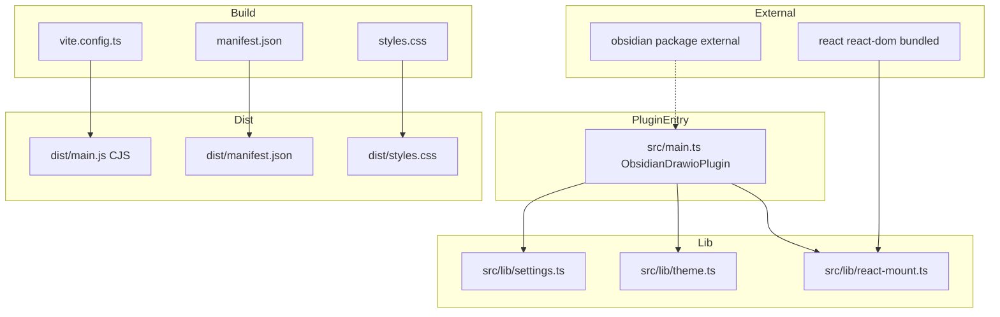
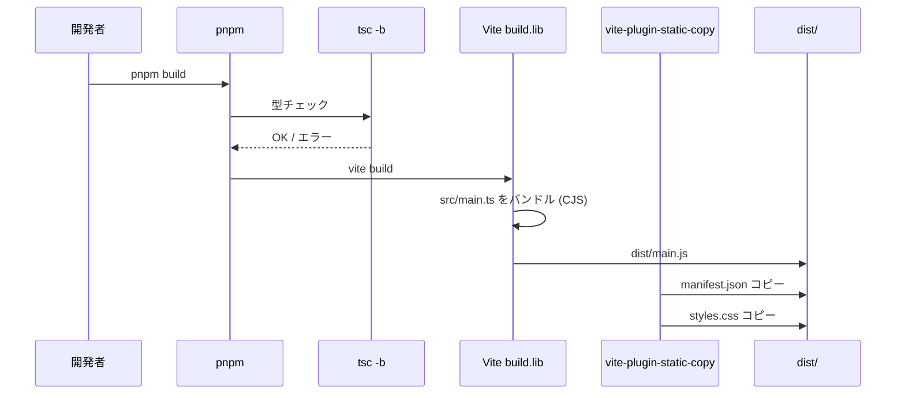
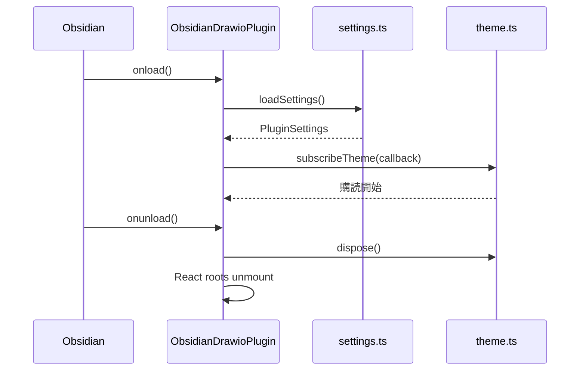

# Design Document: plugin-foundation

## Overview

`plugin-foundation` は Obsidian コミュニティプラグインとして動作する最小基盤を確立する。現在 SPA テンプレート状態のリポジトリを、`pnpm build` で `dist/main.js` (CJS) + `dist/manifest.json` + `dist/styles.css` を生成する Obsidian プラグイン互換ビルドシステムへ変換する。

**対象ユーザー**: Obsidian デスクトップユーザー (プラグイン利用者) とプラグイン開発者。  
**提供価値**: 後続 spec (drawio-embed-bridge、drawio-file-io、drawio-settings-and-config) が共通基盤として利用できる Plugin エントリポイント・設定永続化・テーマ検出・React マウント管理を一元提供する。  
**影響**: 既存の SPA テンプレートファイルをすべて除去し、Obsidian プラグイン向けの構成へ全面置換する。

### Goals

- `pnpm build` で Obsidian が読み込める `dist/` 成果物を生成する
- `pnpm dev` で watch モードが動作し、即座に `dist/` へ反映する
- 後続 spec が安全に拡張できる `PluginSettings` 型、テーマ検出 utility、React マウント utility を提供する
- Obsidian コミュニティプラグイン審査要件 (`innerHTML` 禁止・onunload cleanup) に準拠する

### Non-Goals

- drawio submodule・iframe・postMessage (drawio-embed-bridge 担当)
- `registerView`/`registerExtensions` (drawio-file-io 担当)
- 設定 UI (drawio-settings-and-config 担当)
- Mobile 対応 (`isDesktopOnly: true` で永続的に除外)
- hot-reload (pjeby) 統合

## Boundary Commitments

### This Spec Owns

- `vite.config.ts` の `build.lib` (CJS) 構成と `rollupOptions.external`
- `manifest.json` 雛形 (id・name・version・isDesktopOnly・minAppVersion)
- `styles.css` 出力経路の確立
- `src/main.ts` の `ObsidianDrawioPlugin` クラス (onload/onunload)
- `src/lib/settings.ts` の `PluginSettings` 型・`DEFAULT_SETTINGS`・load/save ヘルパー
- `src/lib/theme.ts` のテーマ取得・変更検知 utility
- `src/lib/react-mount.ts` の React root 管理 wrapper
- 既存 SPA テンプレートファイルの除去
- `package.json`・`tsconfig.json` のプラグイン向け整理

### Out of Boundary

- drawio 統合に関わる一切のロジック
- 設定フィールドの具体的な UI 実装
- `PluginSettings` 型への具体フィールド追加 (後続 spec が担当)
- Community Plugin 申請

### Allowed Dependencies

- `obsidian` npm パッケージ (型定義のみ、devDependencies、バンドルに含めない)
- `react`・`react-dom` (バンドルに含める)
- `vite`・`@vitejs/plugin-react`・`vite-plugin-static-copy` (ビルド時のみ)
- Node.js builtins・`electron` (external、バンドルに含めない)

### Revalidation Triggers

- `PluginSettings` 型の破壊変更 → drawio-settings-and-config が再検証必要
- `ObsidianDrawioPlugin` の public API 変更 → 後続 spec すべてが再検証必要
- `src/lib/theme.ts` のコールバック型変更 → drawio-embed-bridge が再検証必要
- `src/lib/react-mount.ts` の mount/unmount インターフェース変更 → すべての React UI spec が再検証必要

### Stable Public API (後続 spec が依拠する不変インターフェース)

後続 spec は以下の API のみに依存して機能を構築する。これらの shape を破壊的に変更する場合は本 spec を再オープンし、依存する全 spec の再検証を行うこと。

```typescript
// src/lib/settings.ts
export interface PluginSettings {
  // 後続 spec が宣言マージ (`declare module`) または同名 interface 拡張で
  // フィールドを追加できる、開放的な structural shape を維持する。
}
export const DEFAULT_SETTINGS: PluginSettings;
export function loadSettings(plugin: Plugin): Promise<PluginSettings>;
export function saveSettings(plugin: Plugin, settings: PluginSettings): Promise<void>;

// src/lib/theme.ts
export type Theme = 'light' | 'dark';
export function getCurrentTheme(): Theme;
export function subscribeThemeChange(
  plugin: Plugin,
  callback: (theme: Theme) => void,
): () => void; // dispose 関数

// src/lib/react-mount.ts
export interface ReactMountManager {
  mount(container: HTMLElement, component: ReactNode): () => void; // dispose 関数を返す
  unmount(container: HTMLElement): void;
  unmountAll(): void;
}
export function createReactMountManager(): ReactMountManager;

// src/main.ts
export default class ObsidianDrawioPlugin extends Plugin {
  settings: PluginSettings;
  reactMountManager: ReactMountManager; // 後続 spec が直接使用する
  async onload(): Promise<void>;
  onunload(): void;
  saveSettings(): Promise<void>; // this.settings を永続化する糖衣
}
```

注: `mount` の戻り値は `Root` ではなく dispose 関数 (`() => void`)。これにより呼び出し側は `react-dom/client` の `Root` 型に依存せず、解除責務だけを受け取れる。

## Architecture

### Architecture Pattern & Boundary Map



**依存方向**: `External types` → `lib/` → `main.ts` → `dist/`

### Technology Stack

| 層 | ツール / バージョン | 役割 |
|---|---|---|
| Build | Vite 8 + `build.lib` モード | CJS バンドル生成 |
| Build Plugin | `@vitejs/plugin-react` 6.x | JSX → CJS 変換 |
| Build Plugin | `vite-plugin-static-copy` | manifest.json/styles.css を dist/ へコピー |
| Language | TypeScript 6.x (strict) | 型安全な実装 |
| Runtime | React 19 + react-dom | UI コンポーネント管理 (バンドルに含める) |
| Plugin API | `obsidian` (devDependencies) | Obsidian Plugin API 型定義 |
| Linter | oxlint 1.x | コード品質 |
| Formatter | oxfmt 0.48.x | コードフォーマット |

## File Structure Plan

### Directory Structure

```
/
├── manifest.json              # Obsidian プラグインメタデータ (ソース)
├── styles.css                 # プラグインスタイル (ソース、初期は空)
├── vite.config.ts             # Vite build.lib 構成 (全面書き換え)
├── tsconfig.json              # プロジェクト tsconfig (調整)
├── tsconfig.app.json          # アプリ tsconfig (ES2018, CJS 向け調整)
├── package.json               # scripts/deps 整理
├── src/
│   ├── main.ts                # Plugin サブクラスエントリポイント (新規)
│   └── lib/
│       ├── settings.ts        # PluginSettings 型 + load/save ヘルパー (新規)
│       ├── theme.ts           # テーマ検出 utility (新規)
│       └── react-mount.ts     # React root 管理 wrapper (新規)
└── dist/                      # ビルド成果物 (gitignore)
    ├── main.js                # CJS バンドル
    ├── manifest.json          # コピー
    └── styles.css             # コピー
```

### Modified Files

- `vite.config.ts` — SPA 設定から `build.lib` (CJS) + external + static-copy へ全面書き換え
- `tsconfig.app.json` — `target: "ES2018"`、`lib: ["ES2018", "DOM", "DOM.Iterable"]`、`types: ["node"]` を追加。`module` / `moduleResolution` は `bundler` のままで Vite が CJS 変換を担う
- `tsconfig.json` — plugin 向け参照設定に調整 (`tsconfig.node.json` は vite.config.ts 用に残置)
- `package.json` — `dev` script を `vite build --watch` に変更、`obsidian` を devDependencies に追加、`vite-plugin-static-copy` を追加

### Removed Files

- `src/App.tsx`, `src/main.tsx`, `src/App.css`, `src/index.css` — SPA テンプレート
- `src/assets/` — SPA テンプレートアセット
- `index.html` — SPA エントリポイント

## System Flows

### ビルドフロー



### Plugin ライフサイクルフロー



## Requirements Traceability

| 要件 | 概要 | コンポーネント | インターフェース |
|------|------|--------------|----------------|
| 1.1-1.6 | Vite CJS ビルド | ViteConfig | BuildConfig |
| 2.1-2.5 | manifest.json / styles.css | ManifestJson, StylesCss, ViteConfig | StaticCopy |
| 3.1-3.4 | Plugin エントリポイント | ObsidianDrawioPlugin | PluginLifecycle |
| 4.1-4.5 | 設定永続化 | SettingsModule | SettingsService |
| 5.1-5.4 | テーマ検出 | ThemeModule | ThemeService |
| 6.1-6.4 | React マウント管理 | ReactMountModule | ReactMountService |
| 7.1-7.7 | SPA 除去・プロジェクト整理 | ViteConfig, PackageJson, TsConfig | — |

## Components and Interfaces

### コンポーネントサマリー

| コンポーネント | 層 | 役割 | 要件カバレッジ | 主要依存 |
|---|---|---|---|---|
| ViteConfig | Build | CJS バンドル生成・静的ファイルコピー | 1, 2, 7 | vite, vite-plugin-static-copy (P0) |
| ManifestJson | 配布物 | Obsidian プラグインメタデータ | 2 | — |
| ObsidianDrawioPlugin | Plugin Entry | Plugin ライフサイクル管理 | 3 | obsidian Plugin (P0), SettingsModule (P0) |
| SettingsModule | Lib | 設定型定義・load/save | 4 | obsidian Plugin (P0) |
| ThemeModule | Lib | テーマ取得・変更検知 | 5 | obsidian Workspace (P0) |
| ReactMountModule | Lib | React root 管理 | 6 | react-dom (P0) |

### Build 層

#### ViteConfig

| フィールド | 詳細 |
|---|---|
| Intent | Vite を build.lib (CJS) モードで構成し、manifest.json/styles.css を dist/ へコピーする |
| 要件 | 1.1, 1.2, 1.3, 1.4, 1.5, 1.6, 2.2, 2.3, 7.6 |

**Responsibilities & Constraints**

- `build.lib.entry: 'src/main.ts'`、`formats: ['cjs']`、`fileName: () => 'main.js'`
- `rollupOptions.external`: `['obsidian', 'electron', ...builtinModules, ...builtinModules.map(m => 'node:' + m), /@codemirror\/.*/, /@lezer\/.*/]` (Node.js builtins は `node:module` の `builtinModules` 配列で網羅。`node:` prefix も両方カバー)
- `rollupOptions.output.exports: 'default'` を設定し `module.exports = ObsidianDrawioPlugin` 形式で出力する (Obsidian が `require()` した結果を直接 instantiate するため必須)
- `vite-plugin-static-copy` で `manifest.json`・`styles.css` を `dist/` へコピー
- `build.target: 'es2018'`
- React は external にせずバンドルへ含める
- `build.minify: 'esbuild'` (本番のみ)、`sourcemap: 'inline'` で開発時デバッグ可能 (本番では false)
- `build.emptyOutDir: true` で前回成果物を毎回クリア

**Dependencies**

- External: `vite` — ビルドツール (P0)
- External: `@vitejs/plugin-react` — JSX 変換 (P0)
- External: `vite-plugin-static-copy` — 静的ファイルコピー (P0)

**Contracts**: Service [ ] / API [ ] / Event [ ] / Batch [ ] / State [x]

##### Service Interface

```typescript
// vite.config.ts の設定インターフェース (概念)
import { builtinModules } from 'node:module';

interface ViteBuildLibConfig {
  entry: string;          // 'src/main.ts'
  formats: ['cjs'];
  fileName: () => 'main.js';
}

interface ViteRollupExternal {
  external: (string | RegExp)[];
  // [
  //   'obsidian', 'electron',
  //   ...builtinModules,
  //   ...builtinModules.map((m) => `node:${m}`),
  //   /^@codemirror\//, /^@lezer\//,
  // ]
}

interface ViteRollupOutput {
  exports: 'default'; // module.exports = ObsidianDrawioPlugin を保証
}
```

**Implementation Notes**

- Integration: `package.json` の `dev` script は `vite build --watch` に変更
- Risks: Obsidian の CSP が `eval()` 系コードを禁止する可能性。React 本番ビルドは問題なし (開発モードは使わない)

### Plugin Entry 層

#### ObsidianDrawioPlugin

| フィールド | 詳細 |
|---|---|
| Intent | Obsidian Plugin サブクラス。onload/onunload でライフサイクルを管理し、設定・テーマ・React root を初期化/破棄する |
| 要件 | 3.1, 3.2, 3.3, 3.4 |

**Dependencies**

- Inbound: Obsidian runtime — プラグインロード/アンロード (P0)
- Outbound: SettingsModule — 設定 load/save (P0)
- Outbound: ThemeModule — テーマ購読 (P1)
- Outbound: ReactMountModule — React root 管理 (P1)

**Contracts**: Service [x] / API [ ] / Event [ ] / Batch [ ] / State [ ]

##### Service Interface

```typescript
import { Plugin } from 'obsidian';
import type { PluginSettings } from './lib/settings';
import type { ReactMountManager } from './lib/react-mount';

export default class ObsidianDrawioPlugin extends Plugin {
  settings!: PluginSettings;
  reactMountManager!: ReactMountManager;
  // private disposers: Array<() => void> — onload で取得した dispose を蓄積し onunload で順次呼ぶ

  async onload(): Promise<void>;
  onunload(): void;

  /** this.settings を Vault に永続化する糖衣メソッド。後続 spec の SettingTab から呼ばれる */
  async saveSettings(): Promise<void>;
}
```

- onload: `this.settings = await loadSettings(this)` → `this.reactMountManager = createReactMountManager()` → `subscribeThemeChange(this, ...)` を呼び dispose 関数を `this.disposers` に push
- onunload: `this.disposers` を逆順で呼び出し、最後に `this.reactMountManager.unmountAll()` を呼ぶ
- **disposers 登録規約 (後続 spec 共通)**: 後続 spec が生成する `DrawioBridge` インスタンス、`ExternalWatcher`、テーマ購読、ReactRoot などライフタイムが Plugin と一致するすべてのリソースは、生成時に `this.disposers.push(() => instance.dispose())` で本配列に登録すること。これにより `onunload()` が逆順 dispose で確実に cleanup する。`registerView` / `registerExtensions` / `registerEvent` / `addCommand` のように Obsidian Plugin API が自動 cleanup するものは登録不要

**Implementation Notes**

- Integration: `src/main.ts` が CJS エントリとして `export default ObsidianDrawioPlugin`
- Validation: `innerHTML` を一切使用しない (審査要件)
- Risks: `onunload()` での cleanup 漏れは Obsidian のメモリリークに直結する

### Lib 層

#### SettingsModule

| フィールド | 詳細 |
|---|---|
| Intent | `PluginSettings` 型・`DEFAULT_SETTINGS`・loadSettings/saveSettings ヘルパーを提供する |
| 要件 | 4.1, 4.2, 4.3, 4.4, 4.5 |

**Dependencies**

- Inbound: ObsidianDrawioPlugin — load/save 呼び出し (P0)
- External: `obsidian` Plugin.loadData/saveData (P0)

**Contracts**: Service [x] / API [ ] / Event [ ] / Batch [ ] / State [x]

##### Service Interface

```typescript
import type { Plugin } from 'obsidian';

// 後続 spec は同名 interface 宣言またはモジュール宣言マージで
// フィールドを追加する。`[key: string]: unknown` のような index signature は使わない
// (それは "any" 化を招き、型補完を弱めるため)。空 interface のままで宣言マージを許す。
export interface PluginSettings {}

export const DEFAULT_SETTINGS: PluginSettings = {};

export async function loadSettings(plugin: Plugin): Promise<PluginSettings>;
// 実装: const persisted = (await plugin.loadData()) ?? {};
//       return Object.assign({}, DEFAULT_SETTINGS, persisted);

export async function saveSettings(
  plugin: Plugin,
  settings: PluginSettings,
): Promise<void>;
```

- Preconditions: `plugin.loadData()` は `null` を返す可能性がある
- Postconditions: `loadSettings` は常に `PluginSettings` 型のオブジェクトを返す
- Invariants: `DEFAULT_SETTINGS` は破壊変更しない

#### ThemeModule

| フィールド | 詳細 |
|---|---|
| Intent | 現在の Obsidian テーマ (light/dark) 取得と変更検知 utility を提供する |
| 要件 | 5.1, 5.2, 5.3, 5.4 |

**Dependencies**

- Inbound: ObsidianDrawioPlugin — 購読/解除 (P1)
- External: Obsidian Workspace `css-change` event (P0)
- External: `document.body.classList` (P0)

**Contracts**: Service [x] / API [ ] / Event [x] / Batch [ ] / State [ ]

##### Service Interface

```typescript
import type { Plugin } from 'obsidian';

export type Theme = 'light' | 'dark';

export function getCurrentTheme(): Theme;
// 実装: document.body.classList.contains('theme-dark') ? 'dark' : 'light'

export function subscribeThemeChange(
  plugin: Plugin,
  callback: (theme: Theme) => void,
): () => void;
// 実装:
//   const ref = plugin.app.workspace.on('css-change', () => callback(getCurrentTheme()));
//   return () => plugin.app.workspace.offref(ref);
```

##### Event Contract

- 購読イベント: `app.workspace.on('css-change')`
- デリバリ: Obsidian が保証 (best-effort)
- dispose 時に `Workspace.offref(eventRef)` で明示解除する。`plugin.registerEvent` は使わない (Plugin lifetime に縛られず、subscriber が任意のタイミングで解除できるようにするため)

#### ReactMountModule

| フィールド | 詳細 |
|---|---|
| Intent | `createRoot`/`unmount` を管理する薄い wrapper。Plugin の onunload で全 root を確実に破棄する |
| 要件 | 6.1, 6.2, 6.3, 6.4 |

**Dependencies**

- Inbound: ObsidianDrawioPlugin (onunload) および後続 spec の View コンポーネント (P1)
- External: `react-dom/client` createRoot (P0)

**Contracts**: Service [x] / API [ ] / Event [ ] / Batch [ ] / State [x]

##### Service Interface

```typescript
import type { ReactNode } from 'react';

export interface ReactMountManager {
  /**
   * `container` に `component` を mount する。
   * 同一 `container` への重複 mount は既存 root を unmount してから新規 mount する。
   * 戻り値の dispose 関数を呼ぶと該当 root が unmount される。
   */
  mount(container: HTMLElement, component: ReactNode): () => void;
  unmount(container: HTMLElement): void;
  unmountAll(): void;
}

export function createReactMountManager(): ReactMountManager;
```

`Root` 型は内部実装詳細として隠蔽する。後続 spec は dispose 関数だけを扱えばよく、`react-dom/client` への直接依存を持ち込まない。

- Preconditions: `container` は DOM に attach された要素
- Postconditions: `unmountAll()` 後はすべての root が破棄される
- Invariants: 同一 `container` への重複 mount は既存 root を unmount してから新規 mount

##### State Management

- State model: `Map<HTMLElement, Root>` でマウント済み root を管理
- Persistence: メモリのみ (Plugin インスタンスのライフタイムに限定)
- Concurrency: 単一スレッド (Obsidian Electron renderer)

## Data Models

### Domain Model

`PluginSettings` は Obsidian の `loadData`/`saveData` API によって Vault の `.obsidian/plugins/obsidian-drawio/data.json` に JSON 形式で永続化される。

```typescript
// 初期スキーマ。後続 spec は同名 interface 宣言またはモジュール宣言マージで
// フィールドを追加する。`[key: string]: unknown` のような index signature は
// 使わない (any 化を招き型補完を弱めるため)。
export interface PluginSettings {}
```

後続 spec が拡張する例:

```typescript
// 例: drawio-settings-and-config spec が拡張する場合
// src/lib/settings-ext.ts (もしくは当該 spec 内のモジュール)
import type { DrawioSettings } from './drawio-settings';

declare module './settings' {
  interface PluginSettings {
    drawio: DrawioSettings;
  }
}
```

## Error Handling

### Error Strategy

- `loadData()` が null を返した場合: `DEFAULT_SETTINGS` でフォールバック
- `saveData()` が失敗した場合: エラーを console.error でログし、上位に伝播させない (設定 UI は後続 spec が実装)
- React mount/unmount 失敗: エラーを console.error でログし、`unmountAll()` は他の root の unmount を続行する

### Error Categories

- **System Error**: `loadData` / `saveData` の I/O エラー → graceful degradation (DEFAULT_SETTINGS を使用)
- **Runtime Error**: React root の mount エラー → console.error でログ、他 root に影響しない

## Testing Strategy

### ビルド検証

- `pnpm build` が `dist/main.js`・`dist/manifest.json`・`dist/styles.css` を生成することを確認
- `dist/main.js` が CommonJS 形式であることを確認 (`require` / `module.exports` が含まれる)
- `dist/main.js` に `obsidian`・`electron` の `require` 呼び出しが含まれることを確認 (external 動作確認)

### Plugin エントリ検証

- `onunload()` 呼び出し後に ThemeModule のリスナーが解除されていることを確認
- `onunload()` 呼び出し後に ReactMountManager の全 root が unmount されていることを確認

### ユーティリティ単体検証

- `getCurrentTheme()` が `document.body` クラスに応じて `'light'` / `'dark'` を返すことを確認
- `loadSettings()` に `null` を渡すと `DEFAULT_SETTINGS` を返すことを確認
- `ReactMountManager.mount()` → `unmount()` が正常動作することを確認
- 同一コンテナへの重複 mount が既存 root を unmount してから再 mount することを確認

## Optional Sections

### Security Considerations

- `innerHTML` 禁止: Obsidian 審査要件。`ReactMountModule` 経由の `createRoot` を使用すること
- 外部 CDN 禁止: React・その他依存はバンドルに含める。外部スクリプトロード禁止
- `onunload` での完全 cleanup: ThemeModule の EventRef、ReactMountManager の全 root を解除

### License / Attribution

- 本 spec のスコープでは `LICENSE` ファイルの **配置先ディレクトリ準備のみ** を行う。実際のライセンス本文は roadmap 全体決定後に別タスクで配置する (Out of Boundary)。
- drawio webapp (Apache-2.0) の `LICENSE` / `NOTICE` 同梱は `drawio-embed-bridge` spec の責務。

### TypeScript / Build Compatibility Notes

- `erasableSyntaxOnly: true` のため `enum` / `namespace` / `parameter property` は使用禁止。本 spec の実装は型 + interface + const オブジェクトで完結させる。
- `verbatimModuleSyntax: true` のため、型のみの import は必ず `import type { ... }` を使う。
- `tsconfig.app.json` の `module` / `moduleResolution` は `bundler` のままで問題ない (Vite が CJS への変換を担う)。`module: "commonjs"` への変更は不要。
- `tsc -b --noEmit` で型チェック、Vite が emit を担当する責務分離を維持する。

### Migration Strategy

- `src/App.tsx`・`src/main.tsx`・`index.html` 等の SPA ファイルを削除
- `vite.config.ts` を全面書き換え (SPA → lib モード)
- `package.json` の `dev` script を `vite` → `vite build --watch` に変更
- ロールバック: `git revert` で元の SPA テンプレートに戻せる (ただし本 spec の成果物は消失)
